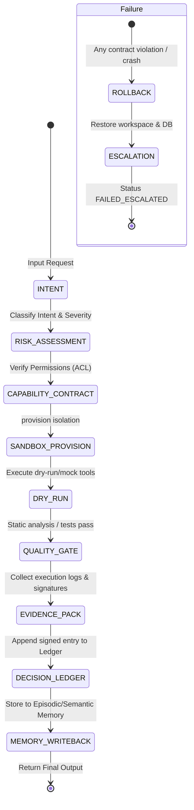

# 🛡️ Hard Frames: Architectural Analysis for Absolute Flow Enforcement

This analysis outlines the conceptual and operational differences between **Ordinary Mode** and **Hard Frames Mode** in the Reflective Agentic Engine (RAE). It describes how to translate soft guidelines (Markdown documents) into immutable, code-level execution contracts.

---

## ⚖️ Ordinary Mode vs. Hard Frames Mode

| Dimension | Ordinary Mode (Soft Constraints) | Hard Frames Mode (Hard Constraints) |
|---|---|---|
| **Mechanism** | Guided by prompt descriptions, markdown system instructions, and policy checklists. | Governed by an immutable Python state machine and strictly typed Pydantic models. |
| **Hallucination Prevention** | High risk of hallucination (e.g. LLM bypasses steps, fabricates tool names, invents output formats). | Zero risk of flow-level hallucination. State transitions are verified by compiled code before next-step execution. |
| **Control Authority** | LLM orchestrates the sequence of actions and calls tools freely. | `RAERuntime` controls the execution loop; LLM acts purely as a deterministic generator within a state. |
| **Failure Mode** | LLM tries to self-correct on error, potentially leading to cascading hallucinations or infinite loops. | Strict Fail-Closed policy: throws `ContractViolationError` and halts with `FAILED_ESCALATED` status. |
| **Audit Trace** | Soft logs capturing inputs, outputs, and intermediate thought text. | Cryptographically signed `Evidence Pack` and immutable state journal (`Decision Ledger`). |

---

## 🔄 The Autonomy State Machine Sequence

Under **Hard Frames Mode**, the agent must advance through an ordered sequence of states. Bypassing any state or executing actions out of order throws a runtime exception:

---

## 🛠️ Code-Level Hard Contracts

To achieve absolute enforceability, we implement:
1. **Explicit State Enums**: Defining all valid execution frames.
2. **State Transition Decorators**: `@enforce_frame(from_state, to_state)` on agent adapters.
3. **Step Validation Engine**: Validating input/output signatures at each step.

These constraints prevent any LLM generation from executing a tool out of sequence or bypassing validation gates.
