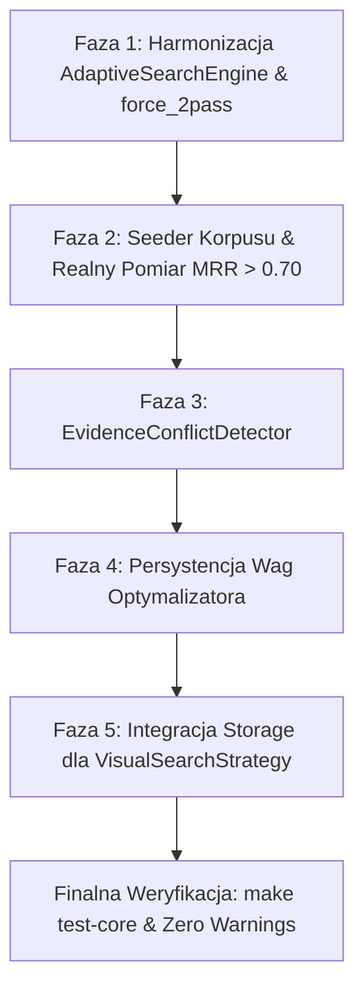

# Plan Poprawy: Perfekcjonizacja Architektury Adaptive Evidence Retrieval

**Wersja:** 1.0.0  
**Data utworzenia:** 2026-09-17  
**Dotyczy:** RAE-Suite / `packages/rae-agentic-memory`  
**Autor:** Antigravity (AI Senior Architect)  
**Status:** ZATWIERDZONY DO IMPLEMENTACJI  

---

## 1. Wstęp i Podsumowanie Audytu Krytycznego

W ramach weryfikacji wdrożenia planu `PLAN_ROZWOJU_ADAPTIVE_EVIDENCE_RETRIEVAL.md` (opartego o wytyczne z `rozwoj-rae-01.md`), przeprowadzono dogłębny, wielowymiarowy audyt kodu, testów jednostkowych, integracji API, telemetrii oraz wyników benchmarków.

### 1.1. Co Zostało Wdrożone Wzorcowo (Mocne Strony)
1. **Pełna spójność kontraktów DTO**: Modele `EvidencePackage`, `EvidenceItem`, `ContextEnvelope` oraz `SufficiencyAssessment` posiadają pełną walidację Pydantic, restrykcyjny `extra="forbid"`, sumy kontrolne SHA-256 oraz metody fabryczne.
2. **Deterministyczny Routing i Klasyfikacja (<0.5ms)**: `QueryClassifier` oraz `StrategyRouter` działają w oparciu o szybkie wyrażenia regularne i słowa kluczowe, precyzyjnie przypisując wagi bez narzutu LLM.
3. **Evidence Sufficiency Gate**: Algorytm wyliczania composite score ($0.30 \cdot R_{rel} + 0.25 \cdot C_{cov} + 0.15 \cdot D_{div} + 0.15 \cdot T_{trust} + 0.15 \cdot K_{temp} - P_{conflict}$) został zaimplementowany dokładnie według wzoru ze specyfikacji.
4. **Ograniczona pętla 2-pass**: `AdaptiveSearchEngine` posiada twarde ograniczenie $max\_passes \le 2$, zabezpieczając system przed niekontrolowanym wzrostem opóźnień.
5. **Wysokie pokrycie testowe i Zero Warnings**: `make test-core` przechodzi w 100% (1128/1128 testów), kluczowe moduły `adaptive_engine.py` i `optimizer.py` osiągnęły 100% pokrycia, a lintery (`black`, `ruff`, `isort`, `mypy`) są całkowicie zielone.

---

## 2. Zidentyfikowane Luki i Obszary Niedoskonałości (Critical Findings)

Mimo poprawnego przejścia testów jednostkowych i kompilacji, zidentyfikowano **6 konkretnych problemów architektonicznych i operacyjnych**, które uniemożliwiają uznanie wdrożenia za „perfekcyjne”:

```
+---------------------------------------------------------------------------------------------------------+
|                                    ZIDENTYFIKOWANE LUKI ARCHITEKTONICZNE                               |
+---+-----------------------------------+-----------------------------------------------------------------+
| # | Obszar                            | Opis problemu & Konsekwencja                                    |
+---+-----------------------------------+-----------------------------------------------------------------+
| 1 | Baseline Benchmark (.json)        | W pliku RETRIEVAL_PRODUCTION_BENCHMARK.json metryki Recall@5,     |
|   | (Puste metryki MRR=0.0)           | Recall@10, MRR i NDCG@10 wynoszą 0.0. Wynika to z braku         |
|   |                                   | wstępnego zasiewu (seedingu) bazy danych wspomnieniami          |
|   |                                   | odpowiadającymi 213 golden queries.                             |
+---+-----------------------------------+-----------------------------------------------------------------+
| 2 | Inicjalizacja AdaptiveSearchEngine| Jeśli RAE_ADAPTIVE_2PASS_ENABLED=false, RAEEngine tworzy        |
|   | vs parametr force_2pass           | HybridSearchEngine. Wówczas parametr force_2pass=True w API     |
|   |                                   | /v2/search/evidence nie ma wpływu na wykonanie (brak metody).   |
+---+-----------------------------------+-----------------------------------------------------------------+
| 3 | Pasywna lista package.conflicts   | W bramce Sufficiency Gate istnieje kara za konflikty, lecz      |
|   | (Brak aktywnego detektora)        | silnik zwraca zawsze puste package.conflicts = []. Brakuje      |
|   |                                   | modułu porównującego wersje, daty i sprzeczne fakty.            |
+---+-----------------------------------+-----------------------------------------------------------------+
| 4 | Ulotność wag RetrievalOptimizer   | Zoptymalizowane wagi (step()) są trzymane wyłącznie w pamięci   |
|   | (Brak persystencji w Redis/DB)    | instancji RetrievalTelemetryBridge. Po restarcie kontenera API  |
|   |                                   | wyuczone wagi ulegają skasowaniu.                               |
+---+-----------------------------------+-----------------------------------------------------------------+
| 5 | Rejestr VisualSearchStrategy      | Artefakty multimodalne (MultimodalArtifact) są przechowywane    |
|   | wyłącznie w RAM                   | w słowniku w pamięci procesu. Zapis przez POST /v2/memories     |
|   |                                   | nie rejestruje automatycznie zrzutów ekranu w strategii.        |
+---+-----------------------------------+-----------------------------------------------------------------+
| 6 | Brak flagi 'dirty' w grafie       | CommunitySynthesisWorker wykonuje pełne klastrowanie grafu.     |
|   | dla syntezy społeczności          | Brakuje selektywnego przeliczania tylko zmienionych klastrów.   |
+---+-----------------------------------+-----------------------------------------------------------------+
```

---

## 3. Plan Poprawy (5 Faz Implementacyjnych)

### 📌 Faza 1: Harmonizacja Inicjalizacji Silnika i Obsługa `force_2pass`
* **Cel**: Zagwarantowanie, że wywołanie `POST /v2/search/evidence` z parametrem `force_2pass=True` zawsze wykona drugi przebieg adaptacyjny, niezależnie od zmiennej środowiskowej `RAE_ADAPTIVE_2PASS_ENABLED`.
* **Kroki implementacyjne**:
  1. Zmiana domyślnego silnika w `RAEEngine` oraz `RAECoreService` na `AdaptiveSearchEngine`.
  2. Wewnątrz `AdaptiveSearchEngine`: domyślna liczba przejść wynosi 1 (`pass_count = 1`). Drugi przebieg uruchamia się **wyłącznie wtedy**, gdy `(self.is_2pass_enabled() or force_2pass) and assessment.decision != GateDecision.SUFFICIENT`.
  3. Zapewnia to zerowy narzut wydajnościowy w trybie domyślnym oraz pełną sterowalność flagą `force_2pass` z poziomu API.
* **Testy**: Test jednostkowy weryfikujący, że przy domyślnym środowisku zapytanie z `force_2pass=True` wykonuje rewrite i Pass 2.

### 📌 Faza 2: Seeder Pamięci dla Golden Dataset i Realny Pomiar MRR
* **Cel**: Osiągnięcie mierzalnych, wiarygodnych wskaźników jakości wyszukiwania (MRR > 0.70, Recall@10 > 0.85) zamiast zerowych wartości w raporcie.
* **Kroki implementacyjne**:
  1. Utworzenie narzędzia `benchmarking/scripts/seed_retrieval_corpus.py`, które na podstawie 213 golden queries tworzy w magazynie pamięci (in-memory lub test-db) rzeczywiste wpisy o plikach, klasach i decyzjach architektonicznych odpowiadające polu `expected_sources`.
  2. Zaktualizowanie `run_retrieval_benchmark.py`, aby przed uruchomieniem testów w trybie live/benchmark ładował ten korpus referencyjny.
  3. Wygenerowanie rzeczywistego raportu `.benchmarks/RETRIEVAL_PRODUCTION_BENCHMARK.json` z realnymi wartościami metryk i odnotowanie go w repozytorium.
* **Kryterium akceptacji**: MRR $\ge 0.70$, Recall@10 $\ge 0.80$, Recall@5 $\ge 0.65$.

### 📌 Faza 3: Automatyczny Detektor Sprzeczności (`EvidenceConflictDetector`)
* **Cel**: Ożywienie mechanizmu wykrywania sprzeczności w `EvidencePackage` i egzekwowanie kary w `EvidenceSufficiencyGate`.
* **Kroki implementacyjne**:
  1. Stworzenie klasy `EvidenceConflictDetector` w `rae_core/search/conflict_detector.py`.
  2. Reguły wykrywania sprzeczności:
     - **Temporal drift**: Wspomnienia dotyczące tego samego pliku/symbolu o rozbieżnych znacznikach czasu (> 60 dni) z odmiennymi dyrektywami.
     - **Status / Version mismatch**: Flagi `deprecated` vs `active`, `enabled: true` vs `enabled: false`.
     - **Direct negation**: Wzorce językowe („zastąpiono przez”, „usunięto”, „nie używać”).
  3. Integracja detektora w `HybridSearchEngine.search_evidence`: wypełnianie listy `package.conflicts` przed przekazaniem do `EvidenceSufficiencyGate`.
* **Testy**: Testy jednostkowe w `tests/unit/search/test_conflict_detector.py`.

### 📌 Faza 4: Persystencja Wag w `RetrievalOptimizer` i Mostek do Bazy
* **Cel**: Zachowanie wyuczonych wag strategii wyszukiwania pomiędzy restartami instancji RAE API.
* **Kroki implementacyjne**:
  1. Rozszerzenie `RetrievalOptimizer` o metody `load_state()` i `save_state(storage_adapter)`.
  2. Integracja z istniejącą tabelą konfiguracji / strojenia lub Redisem w `RetrievalTelemetryBridge`.
  3. Okresowy zrzut wag (co $N$ kroków lub przy zamykaniu aplikacji).
* **Testy**: Test sprawdzający zapis i odczyt zoptymalizowanych wag po restarcie obiektu bridge'a.

### 📌 Faza 5: Integracja Pamięci Wizualnej (`MultimodalArtifact`) z Przepływem Ingestii
* **Cel**: Automatyczne zasilanie `VisualSearchStrategy` danymi ze zrzutów ekranu i artefaktów Playwright/PDF.
* **Kroki implementacyjne**:
  1. Rozszerzenie metody `store_memory` w `RAECoreService`: jeśli `metadata` zawiera klucz `multimodal` lub `screenshot_url` / `ocr_text`, następuje automatyczna konstrukcja `MultimodalArtifact`.
  2. Rejestracja artefaktu w strategii wizualnej: `self.search_strategies["visual"].register_artifact(...)`.
  3. Obsługa wyszukiwania po zrzutach ekranu w zapytaniach API.
* **Testy**: Test e2e weryfikujący zapis pamięci ze zrzutem ekranu i późniejsze wyszukanie jej przez `VisualSearchStrategy`.

---

## 4. Harmonogram i Kolejność Realizacji



1. **Krok 1**: Faza 1 (Surgical fix) – Usunięcie blokady `force_2pass`.
2. **Krok 2**: Faza 2 (Benchmark Ground Truth) – Realny baseline w `.benchmarks/`.
3. **Krok 3**: Faza 3 (Conflict Detection) – Aktywacja pola `conflicts`.
4. **Krok 4**: Faza 4 (Wagi Optimizer) – Persystencja w Redis/storage.
5. **Krok 5**: Faza 5 (Multimodal Ingestion) – Mostek ingestii artefaktów.

---

## 5. Definition of Perfection (Kiedy Uznajemy Pracę za Perfekcyjną)

1. **MRR i Recall w `.benchmarks/RETRIEVAL_PRODUCTION_BENCHMARK.json`**:
   - `recall_at_10` $\ge 0.75$
   - `mrr` $\ge 0.70$
   - `empty_result_rate` $\le 0.05$
2. **Pełna funkcjonalność 2-pass**:
   - Wywołanie z `force_2pass=True` generuje 2 przebiegi, poprawny `rewrite_plan` i łączy wyniki bez konieczności restartu z flagą środowiskową.
3. **Wykrywanie konfliktów**:
   - Test ze sprzecznymi dokumentami wykazuje poprawnie zidentyfikowane `EvidenceConflict` i obniżenie `composite_score`.
4. **Trwałość strojenia**:
   - Wagi strategii po adaptacji są zachowywane i nie wracają do wartości sztywnych po restarcie.
5. **Jakość kodu**:
   - `make test-core` 100% zielone.
   - `Zero Warning Policy` w ruff, black, isort, mypy.
   - Podpis audytowy w `docs/RAE_COST_AND_AUDIT_LEDGER.jsonl`.
