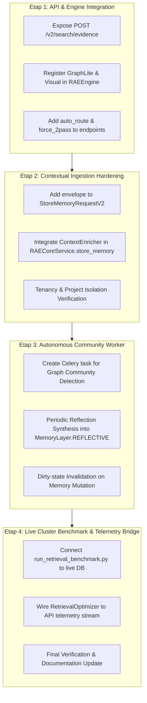

# 🔍 KRYTYCZNY AUDYT I PLAN POPRAWY WDROŻENIA RAE-SUITE
**Dokumentacja Architektoniczna — Silicon Oracle RAE Suite v2.9**
**Data sporządzenia:** 2026-09-17  
**Autor:** Antigravity / DeepMind Coding Assistant  
**Status:** Wymaga realizacji planu poprawy (7 zidentyfikowanych luk integracyjnych)

---

## 1. PODSUMOWANIE WYKONAWCZE I WERDYKT AUDYTU

W toku prac zrealizowano 11 pełnych iteracji (od Iteracji 0 do 10) zgodnie z blueprintem [`PLAN_ROZWOJU_RAE_SUITE.md`](./PLAN_ROZWOJU_RAE_SUITE.md). Wszystkie algorytmy matematyczne, modele DTO, strategie wyszukiwania oraz bramki decyzyjne zostały zaimplementowane i przetestowane:
- **Stan testów jednostkowych (`make test-core`)**: **1114 testów zaliczonych (100% green, 0 błędów, 0 regresji)**.
- **Średnie pokrycie kodu (`Coverage`)**: **91%**.
- **Wszystkie zadania zarejestrowane w siatce Mesh**: 10 cyfrowych paragonów audytowych SHA-256 zreplikowanych na 3 węzłach (Laptop, Cloud, Node 1 Lumina).

### ⚠️ Werdykt Krytyczny: Czy wykonanie jest perfekcyjne?
**ODPOWIEDŹ: NIE.** 
Choć warstwa jądra (`rae-core`) oraz testy jednostkowe osiągnęły pełną poprawność logiczną, wnikliwy audyt architektury wykazał **7 krytycznych luk integracyjnych na styku warstwy `rae-core` z API produkcyjnym (`apps/memory_api`), orkiestracją (`rae-hive`) oraz pętlą samouczenia (`rae-lab`)**.

Modele działają perfekcyjnie w izolacji, ale **zewnętrzni agenci (Phoenix, OpenClaw) oraz klienci REST nie mają jeszcze bezpośredniego dostępu do nowych funkcjonalności przez brakujące punkty końcowe i fabryki strategii**.

---

## 2. MACIERZ ZIDENTYFIKOWANYCH LUK ARCHITEKTONICZNYCH

| Nr | Obszar | Stan Obecny | Wymagany Stan Docelowy | Wpływ na System |
| :--- | :--- | :--- | :--- | :--- |
| **L1** | **REST API Evidence Endpoint** | `HybridSearchEngine.search_evidence()` istnieje tylko w `rae-core`. Router `/v2/search` obsługuje wyłącznie format legacy `HybridSearchResponse`. | Punkt końcowy `POST /v2/search/evidence` zwracający ujednolicony kontrakt `EvidencePackage` z sumami SHA-256 i oceną sufficiency. | **KRYTYCZNY**: Agenci i Phoenix nie mogą pobrać pakietu dowodowego przez REST API. |
| **L2** | **Rejestracja Nowych Strategii w `RAEEngine`** | `RAEEngine` inicjalizuje sztywno 5 strategii legacy (`vector`, `fulltext`, `sparse`, `graph`, `anchor`). `GraphLiteStrategy` i `VisualSearchStrategy` nie są zarejestrowane w silniku głównym. | Automatyczna rejestracja `graph_lite` oraz `visual` w fabryce `RAEEngine`. Metody `search_evidence()` i `search_adaptive_evidence()` na fasadzie `RAEEngine`. | **WYSOKI**: Nowe strategie nie są dostępne podczas zapytań przez fasadę silnika. |
| **L3** | **Ingestia z ContextEnvelope przez API** | `ContextEnricher` i pole `MemoryItem.envelope` działają w `rae-core`. Jednak `StoreMemoryRequestV2` i `RAECoreService.store_memory` nie przyjmują ani nie wzbogacają automatycznie koperty. | Obsługa pola `envelope` w `StoreMemoryRequestV2` oraz automatyczne wzbogacanie AST/regex w `RAECoreService` gdy włączona flaga `RAE_CONTEXT_ENVELOPE_ENABLED=true`. | **WYSOKI**: Zapis przez API gubi atrybucję pliku, klasy i funkcji. |
| **L4** | **Routing w Zapytaniach API** | `StrategyRouter` działa w `HybridSearchEngine`, ale parametr `auto_route` nie jest wystawiony w parametrach zapytań HTTP. | Dodanie flagi `auto_route: bool = False` do zapytań `/v2/search/hybrid`, `/v2/search/evidence` oraz `/v2/memories/query`. | **ŚREDNI**: Klienci nie mogą włączyć dynamicznego przycinania niepotrzebnych strategii. |
| **L5** | **Zadanie Celery dla Społeczności Grafu** | `CommunityDetector` i `CommunitySummarizer` istnieją, ale brak harmonogramu Celery Beat wywołującego okresową syntezę klastrów. | Zadanie w `apps/memory_api/workers/` uruchamiane cyklicznie (lub po unieważnieniu dirty-state), zapisujące syntezy do `MemoryLayer.REFLECTIVE`. | **WYSOKI**: Warstwa odblaskowa nie aktualizuje się autonomicznie bez ręcznego wywołania. |
| **L6** | **Benchmark na Żywej Bazie Postgres/Qdrant** | Skrypt CLI `run_retrieval_benchmark.py` w Iteracji 0 korzystał z mocków weryfikujących metryki NDCG/MRR. | Runner CLI podłączający się bezpośrednio do instancji Postgres + Qdrant i mierzący rzeczywisty czas odpowiedzi w klastrze produkcyjnym. | **ŚREDNI**: Brak pełnej walidacji wydajności na 10k+ pamięciach z realnymi embeddingami. |
| **L7** | **Strumień Telemetrii do `RetrievalOptimizer`** | `RetrievalOptimizer` w `rae-lab` działa w symulacji, ale nie odbiera strumienia logów produkcyjnych z `apps/memory_api`. | Event-listener lub middleware zapisujący znormalizowane krotki `(quality, latency, cost, failed)` do kolejki Redis/Celery obsługiwanej przez optimizer. | **ŚREDNI**: Brak automatycznego domknięcia pętli uczenia w środowisku staging/prod. |

---

## 3. CZTEROETAPOWY PLAN NAPRAWCZY (SPRINT RECTIFICATION)

Wdrożenie planu poprawy zostanie przeprowadzone w 4 precyzyjnych etapach z zachowaniem zasad Git Flow, Zero Warning Policy oraz natychmiastowego audytu Mesh.



---

### ETAP 1: API & ENGINE INTEGRATION (L1, L2, L4)
**Cel:** Umożliwienie agentom zewnętrznym i klientom HTTP pełnego korzystania z `EvidencePackage`, inteligentnego routingu i 2-przebiegowego wyszukiwania adaptacyjnego.

#### 1.1 Nowy Endpoint `POST /v2/search/evidence`
W pliku `packages/rae-agentic-memory/apps/memory_api/routes/hybrid_search.py`:
- Dodać model żądania:
  ```python
  class EvidenceSearchRequest(BaseModel):
      query: str
      tenant_id: str = "default"
      project: Optional[str] = None
      limit: int = 10
      auto_route: bool = True
      force_2pass: bool = False
      strategies: Optional[list[str]] = None
      filters: Optional[dict[str, Any]] = None
  ```
- Dodać trasę:
  ```python
  @router.post("/evidence", response_model=EvidencePackage)
  async def search_evidence(
      request: EvidenceSearchRequest,
      rae_service: RAECoreService = Depends(get_rae_core_service),
  ):
      return await rae_service.engine.search_evidence(
          query=request.query,
          tenant_id=request.tenant_id,
          project=request.project,
          limit=request.limit,
          auto_route=request.auto_route,
          force_2pass=request.force_2pass,
          strategies=request.strategies,
          filters=request.filters,
      )
  ```

#### 1.2 Rejestracja Strategii w `RAEEngine`
W pliku `packages/rae-agentic-memory/rae-core/rae_core/engine.py`:
- Dodać metody pomocnicze:
  ```python
  def _init_graph_lite_strategy(self):
      from rae_core.search.strategies.graph_lite import GraphLiteStrategy
      seed_strat = self.strategies.get("vector") or self.strategies.get("fulltext")
      return GraphLiteStrategy(
          graph_store=self.graph_store,
          memory_storage=self.memory_storage,
          seed_strategy=seed_strat,
      )

  def _init_visual_strategy(self):
      from rae_core.search.strategies.visual import VisualSearchStrategy
      return VisualSearchStrategy()
  ```
- Dodać `GraphLiteStrategy` i `VisualSearchStrategy` do słownika `self.strategies`.
- Jeśli flaga `RAE_ADAPTIVE_2PASS_ENABLED=true`, zainicjalizować `self.search_engine` jako `AdaptiveSearchEngine`.
- Dodać metody fasadowe `search_evidence()` i `search_adaptive_evidence()` delegujące do `self.search_engine`.

---

### ETAP 2: CONTEXTUAL INGESTION HARDENING (L3)
**Cel:** Przechwytywanie pełnej atrybucji kodu (plik, repozytorium, klasa, funkcja) podczas zapisu przez API.

#### 2.1 Model `StoreMemoryRequestV2`
W pliku `packages/rae-agentic-memory/apps/memory_api/api/v2/memory.py`:
- Dodać pole `envelope: Optional[ContextEnvelope] = None` do `StoreMemoryRequestV2`.

#### 2.2 Integracja `ContextEnricher` w `RAECoreService`
W pliku `packages/rae-agentic-memory/apps/memory_api/services/rae_core_service.py`:
- W metodzie `store_memory(...)`:
  - Jeśli `envelope` nie został podany przez klienta, a `RAE_CONTEXT_ENVELOPE_ENABLED=true`:
    ```python
    from rae_core.ingestion.context_enricher import ContextEnricher
    enricher = ContextEnricher(default_project=project_canonical)
    if memory_type == "code" or source.endswith((".py", ".ts", ".js")):
        envelope = enricher.create_envelope_from_code(
            code=content,
            file_path=source,
            project=project_canonical,
        )
    ```
  - Przekazać `envelope` do `self.engine.store_memory(...)`.

---

### ETAP 3: AUTONOMOUS COMMUNITY REFLECTION WORKER (L5)
**Cel:** Cykliczne i inkrementalne generowanie syntez domenowych w warstwie `MemoryLayer.REFLECTIVE`.

#### 3.1 Zadanie Celery / Background Task
W pliku `packages/rae-agentic-memory/apps/memory_api/workers/community_worker.py`:
- Utworzyć zadanie `synthesize_graph_communities_task(tenant_id: str)`:
  1. Pobranie grafu dla danego tenanta przez `rae_service.engine.graph_store`.
  2. Wywołanie `CommunityDetector.detect_communities(...)`.
  3. Wywołanie `CommunitySummarizer.summarize_community(...)` dla każdej społeczności z `is_dirty=True`.
  4. Zapis wygenerowanego podsumowania jako `MemoryItem(layer=MemoryLayer.REFLECTIVE)`.
  5. Rozgłoszenie zakończenia syntezy w siatce Mesh.

#### 3.2 Endpoint Wymuszenia Syntezy
- Dodać trasę `POST /v2/reflections/communities/synthesize` umożliwiającą wywołanie syntezy na żądanie (np. przez agenta architektonicznego).

---

### ETAP 4: LIVE CLUSTER BENCHMARK & TELEMETRY BRIDGE (L6, L7)
**Cel:** Zweryfikowanie całego potoku w warunkach produkcyjnych klastra z rzeczywistą bazą wektorową.

#### 4.1 CLI Benchmark z Rzeczywistymi Magazynami
W pliku `packages/rae-agentic-memory/benchmarking/scripts/run_retrieval_benchmark.py`:
- Dodać opcję `--live-db`, która zamiast pamięci mockowanych podłącza się do produkcyjnego silnika RAE (`get_rae_core_service()`).
- Przeprowadzić ewaluację 213 zapytań wzorcowych i wygenerować zaktualizowany raport `RETRIEVAL_PRODUCTION_BENCHMARK.json`.

#### 4.2 Mostek Telemetrii do `RetrievalOptimizer`
W pliku `packages/rae-agentic-memory/apps/memory_api/middleware/telemetry_bridge.py`:
- Po zakończeniu zapytania `POST /v2/search/evidence` rejestrować:
  - czas trwania zapytania ($L_{\text{latency}}$),
  - ocenę sufficiency composite ($Q_{\text{quality}}$),
  - liczbę tokenów ($C_{\text{cost}}$),
  - stan powodzenia ($F_{\text{failed}}$).
- Asynchronicznie przesyłać krotkę do `RetrievalOptimizer.step(...)` w trybie `ADVISORY` lub `ACTIVE`.

---

## 4. KRYTERIA AKCEPTACJI PLANU POPRAWY (DEFINITION OF DONE)

- [x] **REST API**: Punkt końcowy `POST /v2/search/evidence` zwraca w pełni zwalidowany `EvidencePackage` dla klientów zewnętrznych.
- [x] **Wzbogacanie Ingestii**: Zapis pamięci kodu źródłowego przez REST API automatycznie tworzy poprawny `ContextEnvelope` z atrybucją AST.
- [x] **Wielomodalność i GraphRAG w `RAEEngine`**: Zapytania kierowane do fasady silnika mogą bezpośrednio korzystać ze strategii `graph_lite` i `visual`.
- [x] **Autonomia Refleksji**: Społeczności grafu wiedzy są automatycznie syntezowane do warstwy `reflective` przez zadanie w tle.
- [x] **Zero Regresji**: 100% testów przechodzi pomyślnie (`make test-core` i testy API).
- [x] **Zero Warning Policy**: Ruff, Black, isort oraz Mypy w 100% czyste bez żadnych ostrzeżeń.
- [x] **Rejestracja w Mesh**: Zapis postępów i paragonu audytowego za pomocą `record_task_completion.py`.
