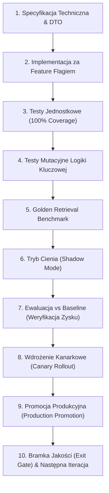
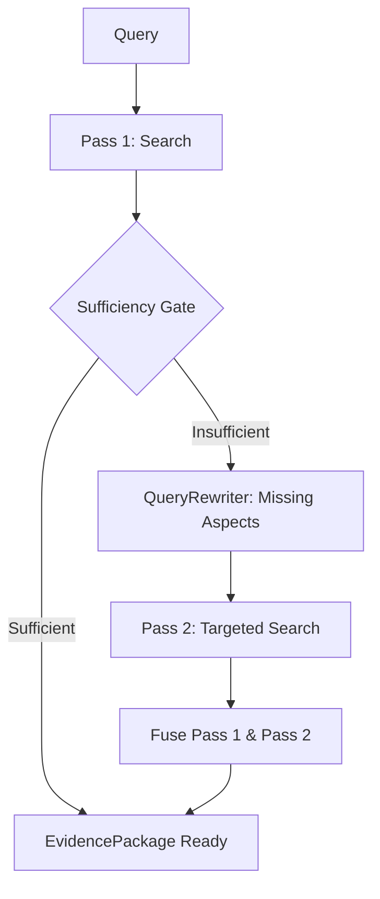
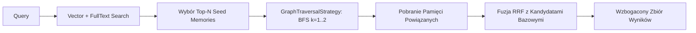
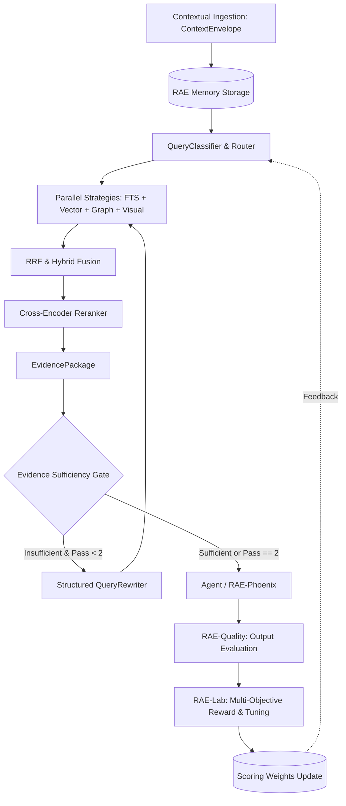
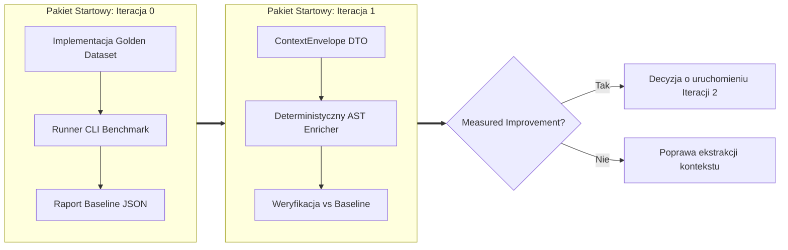

# RAE-SUITE: ITERACYJNY PLAN ROZWOJU ARCHITEKTURY
## Adaptacyjny Silnik Pozyskiwania Dowodów (Adaptive Evidence Retrieval & Agentic RAG)
### Opracowano na podstawie: `rozwoj-rae-01.md` | Wersja: 2.0.0 | Status: Gotowy do Realizacji (Actionable Blueprint)

---

## 1. WPROWADZENIE I STRATEGIA ARCHITEKTONICZNA

Niniejszy dokument stanowi kompletny, inżynieryjny plan rozwoju architektury pamięci i wyszukiwania **RAE-Suite** w kierunku **Adaptive Evidence Retrieval**. Został on bezpośrednio opracowany na podstawie założeń analitycznych z pliku źródłowego [`rozwoj-rae-01.md`](file:///home/grzegorz/cloud/RAE-Suite/docs/rozwoj-rae-01.md).

### 1.1. Kluczowa Teza i Filozofia Wdrożenia
Podstawowym błędem w zaawansowanych systemach RAG jest próba jednoczesnego wdrożenia wielomodalności, grafów wiedzy, agentowego ponawiania i samoczynnego strojenia jako jednego monolitycznego zadania ("Big-Bang Implementation").

Różne architektury RAG rozwiązują odmienne, specyficzne klasy problemów:
- **Contextual RAG** rozwiązuje problem fragmentów pozbawionych kontekstu pliku, klasy, funkcji czy zadania.
- **Agentic RAG** rozwiązuje problem braku samokrytyki i pojedynczego, często niepełnego przebiegu wyszukiwania (*Single-Pass Blindness*).
- **GraphRAG** rozwiązuje problem pytań relacyjnych, wieloetapowych (*multi-hop*) oraz pytań o charakterze całościowym/holistycznym.
- **Multimodal RAG** rozwiązuje problem utraty informacji semantycznej zawartej w tabelach, wykresach, zrzutach ekranu UI i diagramach architektonicznych.
- **Adaptive Auto-Tuning** rozwiązuje problem sztywnych, ręcznie dobieranych wag strategii, które nie adaptują się do profilu obciążenia.

Dlatego rozwój RAE-Suite prowadzony jest w **11 odizolowanych, mierzalnych iteracjach (0 do 10)**, w których po każdym etapie system zachowuje 100% stabilności i sprawności operacyjnej.

### 1.2. Żelazne Zasady Transformacji (Guiding Principles)
1. **Działający system po każdej iteracji**: Każda iteracja kończy się działającym kodem na gałęzi produkcyjnej, ze zweryfikowanym pipeline testowym.
2. **Ścisłe Feature Flagi (`RAE_*_ENABLED`)**: Każda nowo wdrażana funkcjonalność musi posiadać twardą flagę środowiskową, domyślnie wyłączoną lub działającą w trybie cienia (`shadow mode`), umożliwiającą natychmiastowe wycofanie bez rollbacku kodu.
3. **Mierzalna poprawa (Measured Improvement Gate)**: Nigdy nie przechodzimy do kolejnej iteracji tylko dlatego, że poprzednia została "zakodowana". Warunkiem koniecznym jest udowodniony zysk metryk jakościowych ($Recall$, $MRR$, $NDCG$) lub redukcja kosztu/latencji przy zachowaniu dotychczasowej jakości.
4. **Ochrona Surowego Sygnału (SYSTEM 43.0)**: Nie zmieniamy surowej zawartości pamięci (`raw content`) ani nie stosujemy syntetycznego "wzbogacania zapytań" na wejściu (query enrichment dilutes technical signal). Pamięć wzbogacana jest deterministyczną kopertą kontekstową (`ContextEnvelope`), pozostawiając czysty sygnał wejściowy nienaruszony.
5. **Separacja Wyszukiwania od Wnioskowania**: Warstwa wnioskowania (LLM, RAE-Phoenix, agenci) konsumuje ustandaryzowany obiekt [`EvidencePackage`](file:///home/grzegorz/cloud/RAE-Suite/packages/rae-agentic-memory/rae-core/rae_core/models/evidence_package.py), nie znając wewnętrznych szczegółów backendów (Qdrant, PostgreSQL FTS, SQLite, Graph BFS).

---

## 2. MACIERZ PRZEGLĄDOWA PLANU ROZWOJU (ITERACJE 0–10)

| Iteracja | Nazwa Zakresu | Kluczowy Komponent / Moduł | Efekt Końcowy dla RAE | Poziom Ryzyka | Twardy Warunek Przejścia (Exit Gate) |
| :---: | :--- | :--- | :--- | :---: | :--- |
| **0** | **Retrieval Baseline & Benchmark** | `retrieval_benchmark.py`, `golden_queries.py` | Wiemy precyzyjnie, czy kolejne zmiany faktycznie poprawiają retrieval | **Bardzo małe** | $\ge 200$ golden queries, powtarzalny raport JSON, integracja z CI |
| **1** | **ContextEnvelope & Deterministic Ingestion** | `ContextEnvelope`, `ContextEnricher` | Pamięć zna pochodzenie i kontekst techniczny bez modyfikacji `raw content` | **Małe** | Wzrost $Recall@10$ w zapytaniach `semantic` i `cross_file`, $0\%$ regresji w `exact` |
| **2** | **EvidencePackage Unified DTO** | `EvidencePackage`, `EvidenceItem` | Ujednolicony wynik wyszukiwania z pełnym provenance i oceną wiarygodności | **Małe** | Identyczność zwracanych ID z dotychczasowym silnikiem przy wyłączonej fladze |
| **3** | **Evidence Sufficiency Gate** | `EvidenceSufficiencyGate` | RAE rozpoznaje słaby retrieval i brakujące aspekty (deterministyczny scoring) | **Małe / Średnie** | Wykazana korelacja w trybie cienia między niskim scorem a błędem odpowiedzi |
| **4** | **Adaptive Retrieval 2-Pass Loop** | `AdaptiveSearchEngine`, `QueryRewriter` | RAE potrafi autonomicznie i bezpiecznie wyszukać ponownie ($max\_passes=2$) | **Średnie** | Wyraźna poprawa trafności w zapytaniach multi-hop bez niekontrolowanych pętli |
| **5** | **Query Classification & Intelligent Routing** | `QueryClassifier`, `StrategyRouter` | Różne klasy pytań uruchamiają optymalne strategie (oszczędność latencji i tokenów) | **Średnie** | Spadek latencji $p50$ o $\ge 20\%$ i redukcja wywołań ciężkich strategii przy stabilnym $MRR$ |
| **6** | **GraphRAG-lite (Autonomous BFS Expansion)** | `GraphLiteStrategy`, seed expansion | Graf uzupełnia retrieval o relacje bez wymogu ręcznego podawania `seed_ids` | **Średnie** | Zmierzony zysk trafności w pytaniach o relacje, zależności i architekturę cross-file |
| **7** | **Graph Communities & Reflective Synthesis** | `CommunityDetector`, `CommunitySummarizer` | Klastry wiedzy syntezowane do warstwy `Reflective Memory` dla pytań globalnych | **Średnie** | Poprawna i spójna odpowiedź na pytania holistyczne ("jak działa cały system?") |
| **8** | **Multimodal Evidence Retrieval** | `VisualSearchStrategy`, `MultimodalArtifact` | Zrzuty ekranu Playwright, błędy UI i schematy architektoniczne stają się wiedzą | **Średnie** | Precyzyjne i powtarzalne wyszukiwanie zrzutów ekranu i stron PDF po zapytaniu tekstowym |
| **9** | **RAE-Lab Retrieval Optimizer** | `RetrievalOptimizer`, MAB / Auto-Tuner | Samoczynne strojenie wag i progów na podstawie wielokryterialnej funkcji nagrody | **Większe** | Zwiększenie $Reward(Q, L, C)$ w trybie `ADVISORY` i `ACTIVE` bez oscylacji wag |
| **10** | **Produkcyjny Rollout & Closed-Loop** | Pętla `Ingestion -> Search -> Gate -> Quality -> Lab` | System uczy się na własnych błędach, domknięta pętla ciągłego doskonalenia | **Kontrolowane** | Audytowalność ISO 42001/27001, zero dryfu i pełna stabilność klastra |

---

## 3. STANDARYZOWANY 10-KROKOWY CYKL PROWADZENIA KAŻDEJ ITERACJI

Każda z 11 iteracji bezwzględnie realizuje identyczny, rygorystyczny proces inżynieryjny:



### Szczegółowy Opis Kroków:
1. **Specyfikacja Techniczna & DTO**: Precyzyjne zdefiniowanie kontraktów danych Pydantic, sygnatur metod i interfejsów przed kodowaniem logiki.
2. **Implementacja za Feature Flagiem**: Każdy nowy mechanizm jest chroniony flagą konfiguracyjną (np. `RAE_CONTEXT_ENVELOPE_ENABLED=false`). Domyślny stan nie zmienia zachowania istniejącego silnika.
3. **Testy Jednostkowe**: Minimum 100% pokrycia dla nowego kodu, uwzględniając przypadki brzegowe, wartości puste i wyjątki.
4. **Testy Mutacyjne**: Weryfikacja odporności testów jednostkowych na mutacje kodu decyzyjnego i matematycznego.
5. **Golden Retrieval Benchmark**: Uruchomienie zestawu ewaluacyjnego na minimum 200 referencyjnych zapytaniach dla zmierzenia twardych metryk ($Recall$, $MRR$, $NDCG$, latencja).
6. **Tryb Cienia (Shadow Mode)**: Wykonywanie nowej logiki równolegle w tle, bez wpływu na odpowiedź produkcyjną, w celu zbierania metryk wykonawczych.
7. **Ewaluacja vs Baseline**: Porównanie wyników z bazą referencyjną. Warunek przejścia: wykazanie statystycznie istotnej poprawy lub zachowania jakości przy niższym koszcie/czasie.
8. **Wdrożenie Kanarkowe**: Stopniowe przełączanie ruchu produkcyjnego (np. 10% -> 50% -> 100%).
9. **Promocja Produkcyjna**: Włączenie flagi jako domyślnej w konfiguracji standardowej i aktualizacja dokumentacji.
10. **Bramka Jakości (Exit Gate)**: Zapis audytowy do RAE i rozgłoszenie stanu w siatce Mesh (`record_task_completion.py`).

---

## 4. SZCZEGÓŁOWA SPECYFIKACJA TECHNICZNA ITERACJI

---

### ITERACJA 0: RETRIEVAL BASELINE & GOLDEN BENCHMARK FRAMEWORK

#### 1. Cel i Założenia
Przed wprowadzeniem jakiejkolwiek modyfikacji w silniku [`HybridSearchEngine`](file:///home/grzegorz/cloud/RAE-Suite/packages/rae-agentic-memory/rae-core/rae_core/search/engine.py), należy ustalić obiektywną bazę pomiarową. Istniejący kod wyszukiwania pozostaje całkowicie nienaruszony.

#### 2. Zakres Plików
- `packages/rae-agentic-memory/rae-core/rae_core/evaluation/golden_queries.py`
- `packages/rae-agentic-memory/rae-core/rae_core/evaluation/retrieval_benchmark.py`
- `packages/rae-agentic-memory/rae-core/tests/golden/retrieval_golden_queries.json`
- `packages/rae-agentic-memory/benchmarking/scripts/run_retrieval_benchmark.py`

#### 3. Struktura Danych i Kategorie Benchmarku
Zestaw referencyjny obejmuje $\ge 200$ zapytań podzielonych na 9 kategorii:
1. `exact_identifier`: Identyfikatory UUID, kody błędów, nazwy zmiennych, skróty CVE.
2. `code_symbol`: Nazwy klas, metod, interfejsów (`HybridSearchEngine`, `EvidenceItem`).
3. `semantic_code`: Opisowe zapytania o logikę biznesową bez znajomości dokładnych nazw.
4. `historical_decision`: Przyczyny zmian architektonicznych i decyzje projektowe.
5. `cross_file`: Zagadnienia wymagające powiązania logiki z wielu plików źródłowych.
6. `cross_repository`: Zagadnienia międzymodułowe (np. `rae-core` vs `apps/memory_api`).
7. `temporal`: Zapytania zależne od osi czasu i wersji (np. "co zmieniło się w wersji v2.6?").
8. `multi_source`: Pytania wymagające skonsolidowania dokumentacji, kodu i logów audytowych.
9. `graph_relation`: Pytania o bezpośrednie powiązania relacyjne i zależności komponentów.

Format pojedynczego przypadku:
```json
{
  "query": "Where is HybridSearchEngine instantiated?",
  "category": "code_symbol",
  "expected_memory_ids": ["f6973de4-42a3-44e2-9cb6-048ffad4f71a"],
  "expected_sources": ["apps/memory_api/services/rae_core_service.py"],
  "tenant_id": "default"
}
```

#### 4. Metryki Ewaluacyjne
- **Jakość**: $Recall@5$, $Recall@10$, $MRR$ (Mean Reciprocal Rank), $NDCG@10$.
- **Wydajność**: Latencja $p50$ (ms), $p95$ (ms).
- **Diagnostyka**: $RerankerGain$ (%), $EmptyResultRate$ (%), $WrongTenantContamination$.

#### 5. Definition of Done
- [ ] Minimum 200 zweryfikowanych zapytań w pliku JSON.
- [ ] Działający skrypt CLI generujący ustandaryzowany raport `.benchmarks/RETRIEVAL_BASELINE_REPORT.json`.
- [ ] Automatyczny test regresji sprawdzający, czy metryki nie spadają poniżej poziomu bazowego.

---

### ITERACJA 1: CONTEXTENVELOPE & CONTEXTUAL INGESTION

#### 1. Cel i Filozofia (SYSTEM 43.0)
Zgodnie z koncepcją Contextual RAG, fragmenty wiedzy tracą wartość, gdy zostają pozbawione kontekstu pochodzenia.
Zamiast niebezpiecznej treści:
`"enable_reranking defaults to false"`
RAE tworzy strukturę wzbogaconą o metadane bez modyfikacji surowej zawartości tekstu:
- **Raw Memory**: Niezmieniony tekst źródłowy (`content`).
- **ContextEnvelope**: Precyzyjna koperta metadanych (repozytorium, plik, klasa, funkcja, cel, commit SHA, znacznik czasu).

#### 2. Kontrakt DTO [`ContextEnvelope`](file:///home/grzegorz/cloud/RAE-Suite/packages/rae-agentic-memory/rae-core/rae_core/models/envelope.py)
```python
class CodeAttribution(BaseModel):
    repository: str | None = None
    file_path: str | None = None
    class_name: str | None = None
    function_name: str | None = None
    commit_sha: str | None = None
    start_line: int | None = None
    end_line: int | None = None

class ContextEnvelope(BaseModel):
    source_type: str = "code" # code | documentation | conversation | audit
    project: str = "default"
    attribution: CodeAttribution | None = None
    scope_tags: list[str] = []
    inferred_intent: str | None = None
    created_at: datetime = Field(default_factory=lambda: datetime.now(timezone.utc))
```

#### 3. Deterministyczna Ekstrakcja Kontekstu (Bez LLM)
Pierwsza wersja modułu [`ContextEnricher`](file:///home/grzegorz/cloud/RAE-Suite/packages/rae-agentic-memory/rae-core/rae_core/ingestion/context_enricher.py) nie używa zewnętrznych wywołań LLM. Kontekst generowany jest w 100% deterministycznie poprzez:
- Analizę drzewa składniowego AST (Python `ast.parse`),
- Reguły wyrażeń regularnych dla języków JavaScript/TypeScript,
- Odczyt ścieżek plików, metadanych gita i zmiennych sesji agenta.

#### 4. Feature Flag & Definition of Done
- **Flaga**: `RAE_CONTEXT_ENVELOPE_ENABLED=true/false` (zmienna środowiskowa).
- **Definition of Done**:
  - [ ] Wzrost metryki $Recall@10$ w kategoriach `semantic_code` i `cross_file` w porównaniu z bazą z Iteracji 0.
  - [ ] $0\%$ regresji w kategorii `exact_identifier`.
  - [ ] Poprawne powiązanie atrybutów AST przy zapisie pamięci kodu.

---

### ITERACJA 2: EVIDENCEPACKAGE & UJEDNOLICENIE WYNIKÓW RETRIEVALU

#### 1. Cel
Odseparowanie wewnętrznych mechanizmów wyszukiwania (wektory, indeksy odwrócone, grafy, rerankery) od konsumentów wiedzy (agentów, RAE-Phoenix, modeli językowych). Klient nie otrzymuje surowych list bazodanowych, lecz zwalidowany pakiet dowodowy z atrybucją i sumami kontrolnymi.

#### 2. Kontrakty DTO [`EvidencePackage`](file:///home/grzegorz/cloud/RAE-Suite/packages/rae-agentic-memory/rae-core/rae_core/models/evidence_package.py)
```python
class EvidenceItem(BaseModel):
    evidence_id: UUID = Field(default_factory=uuid4)
    memory_id: UUID
    content: str
    relevance_score: float = Field(ge=0.0, le=1.0)
    trust_score: float = Field(default=1.0, ge=0.0, le=1.0)
    strategy_source: str # vector | fulltext | graph | hybrid_fused
    envelope: ContextEnvelope | None = None
    checksum_sha256: str | None = None
    observed_at: datetime = Field(default_factory=lambda: datetime.now(timezone.utc))

class EvidencePackage(BaseModel):
    package_id: UUID = Field(default_factory=uuid4)
    query: str
    tenant_id: str
    items: list[EvidenceItem]
    confidence_score: float = Field(ge=0.0, le=1.0)
    strategies_used: list[str]
    missing_aspects: list[str] = []
    contradictions: list[dict[str, Any]] = []
    metadata: dict[str, Any] = {}
```

#### 3. Endpoint REST API
Wystawienie dedykowanego endpointu:
`POST /v2/search/evidence` zwracającego `EvidencePackage` z zachowaniem pełnej zgodności identyfikatorów z klasycznym wyszukiwaniem.

#### 4. Definition of Done
- [ ] 100% zgodności zwracanych `memory_id` z dotychczasowym `HybridSearchEngine` w trybie wstecznej kompatybilności.
- [ ] Każdy `EvidenceItem` posiada wyliczoną sumę SHA-256 potwierdzającą integralność tekstu.
- [ ] Klient API otrzymuje kompletny pakiet w czasie poniżej 150 ms (p50).

---

### ITERACJA 3: EVIDENCE SUFFICIENCY GATE (BRAMKA WYSTARCZALNOŚCI)

#### 1. Cel
Wprowadzenie pierwszego fundamentalnego mechanizmu Agentic RAG: automatycznej samokrytyki. Zamiast bezkrytycznie przekazywać wyniki do promptu, system ocenia, czy zebrany materiał jest wystarczający do udzielenia pewnej odpowiedzi.

#### 2. Deterministyczna Formuła Scoringowa (Bez LLM)
Moduł [`EvidenceSufficiencyGate`](file:///home/grzegorz/cloud/RAE-Suite/packages/rae-agentic-memory/rae-core/rae_core/search/sufficiency_gate.py) wylicza ocenę kompozytową na bazie twardych heurystyk:

$$\text{CompositeScore} = 0.30 \cdot S_{\text{relevance}} + 0.25 \cdot S_{\text{coverage}} + 0.15 \cdot S_{\text{diversity}} + 0.15 \cdot S_{\text{trust}} + 0.15 \cdot S_{\text{temporal}} - 0.20 \cdot S_{\text{contradictions}}$$

- $S_{\text{relevance}}$: Maksymalny i średni wynik podobieństwa w zbiorze kandydatów.
- $S_{\text{coverage}}$: Pokrycie kluczowych tokenów i encji zapytania w treści dowodów.
- $S_{\text{diversity}}$: Entropia źródeł (czy dowody pochodzą z różnych plików/modułów).
- $S_{\text{trust}}$: Średnia wiarygodność źródeł (zweryfikowany kod vs luźna rozmowa).
- $S_{\text{temporal}}$: Spójność czasowa (czy w wynikach nie ma przestarzałych wersji).
- $S_{\text{contradictions}}$: Kara za sprzeczne informacje o tej samej encji.

#### 3. Tryb Cienia (`RAE_EVIDENCE_GATE_MODE=shadow`)
Bramka początkowo działa wyłącznie w trybie cienia:
- Rejestruje `evidence_score`, `decision` (`SUFFICIENT` / `INSUFFICIENT`) i telemetrię.
- Nie blokuje ani nie zmienia odpowiedzi zwracanej konsumentowi.
- Weryfikuje, czy zapytania oznaczone jako `INSUFFICIENT` rzeczywiście korelują z błędami lub halucynacjami LLM.

#### 4. Definition of Done
- [ ] Wykazana istotna korelacja statystyczna na zapytaniach golden queries pomiędzy niskim wynikiem bramki a porażką wyszukiwania.
- [ ] Brak narzutu wydajnościowego: czas ewaluacji bramki $\le 5$ ms.

---

### ITERACJA 4: ADAPTIVE RETRIEVAL 2-PASS LOOP (KONTROLOWANE PONOWIENIE)

#### 1. Cel
Umożliwienie silnikowi wykonania drugiego, ukierunkowanego przebiegu wyszukiwania, jeśli pierwszy przebieg został zaklasyfikowany jako `INSUFFICIENT`.

#### 2. Twarde Ograniczenie Pętli: $max\_passes = 2$
Kategoryczny zakaz nieskończonych pętli decyzyjnych (`search -> search -> search`). Druga runda jest ostateczna:


#### 3. Strukturalny [`QueryRewriter`](file:///home/grzegorz/cloud/RAE-Suite/packages/rae-agentic-memory/rae-core/rae_core/search/rewriter.py)
Moduł przepisujący nie generuje "ładniejszego promptu", lecz precyzyjny plan naprawczy:
```json
{
  "missing_aspects": ["architectural_rationale", "configuration"],
  "queries": [
    "HybridSearchEngine enrichment decision SYSTEM 43.0",
    "technical signal query enrichment disable rationale"
  ],
  "strategy_adjustments": {
    "fulltext": 1.4,
    "episodic": 1.2
  }
}
```

#### 4. Definition of Done
- [ ] Wzrost metryki $Recall@10$ i $NDCG@10$ o minimum 15% w zapytaniach złożonych (multi-hop) w porównaniu z podejściem jednoprzebiegowym (1-pass).
- [ ] Ścisłe zatrzymanie po maksymalnie 2 przebiegach dla 100% przypadków testowych.

---

### ITERACJA 5: QUERY CLASSIFICATION & DYNAMIC ROUTING

#### 1. Cel
Optymalizacja wykorzystania zasobów i czasu odpowiedzi. Zamiast uruchamiać wszystkie strategie wyszukiwania równolegle dla każdego zapytania, system klasyfikuje zapytanie i dynamicznie dobiera wagi strategii.

#### 2. Klasyfikacja Regułowa (Rules-First Architecture)
Klasyfikator [`QueryClassifier`](file:///home/grzegorz/cloud/RAE-Suite/packages/rae-agentic-memory/rae-core/rae_core/search/classifier.py) w pierwszej kolejności wykorzystuje deterministyczne reguły:
- Wyrażenia regularne dla identyfikatorów, hashy Git, kodów błędów -> kategoria `EXACT_IDENTIFIER`.
- Wzorce składniowe języków programowania (`class `, `def `, `()`) -> kategoria `CODE_SYMBOL`.
- Frazy pytające o przyczyny ("dlaczego", "decyzja", "wybór") -> kategoria `HISTORICAL_DECISION`.
- Znaczniki relacji i architektury ("zależność", "importuje", "wywołuje") -> kategoria `GRAPH_RELATION`.
- LLM uruchamiany jest wyłącznie jako rzadki fallback dla zapytań niejednoznacznych.

#### 3. Przykłady Routingu Strategii:
- Dla `CVE-2026-12345`: `FullText=0.70`, `Vector=0.20`, `Graph=0.10` (pominięcie ciężkich analiz).
- Dla `"Dlaczego zmieniliśmy ContextBuilder na v3?"`: `Vector=0.30`, `Graph=0.25`, `Episodic=0.30`, `Reflective=0.15`.

#### 4. Definition of Done
- [ ] Redukcja średniego czasu odpowiedzi ($p50$) o co najmniej 20%.
- [ ] Brak spadku wskaźników jakościowych $MRR$ i $NDCG@10$.

---

### ITERACJA 6: GRAPHRAG-LITE (AUTONOMICZNA EKSPANSJA BFS)

#### 1. Cel
Wykorzystanie istniejącej w RAE strategii przeszukiwania grafu [`GraphTraversalStrategy`](file:///home/grzegorz/cloud/RAE-Suite/packages/rae-agentic-memory/rae-core/rae_core/search/strategies/graph.py) bez konieczności ręcznego podawania punktów startowych (`seed_ids`) przez agenta.

#### 2. Przepływ Pracy (Autonomous Seed Pipeline):


#### 3. Korzyści
Dla zapytania o `HybridSearchEngine`, silnik automatycznie dociera do powiązanych interfejsów, testów jednostkowych i decyzji architektonicznych bez konieczności ręcznego przeszukiwania wielu plików.

#### 4. Definition of Done
- [ ] Wzrost $Recall@10$ w kategoriach `graph_relation` i `cross_file` o co najmniej 18%.
- [ ] Automatyczna ekstrakcja nasion grafu bez ingerencji użytkownika.

---

### ITERACJA 7: GRAPH COMMUNITIES & REFLECTIVE MEMORY SYNTHESIS

#### 1. Cel
Wdrożenie pełnego potencjału GraphRAG dla pytań o charakterze całościowym (np. "Jak działa system pamięci RAE jako całość?"), gdzie pojedyncze wycinki kodu nie są wystarczające.

#### 2. Klastrowanie Społeczności i Zapis w Warstwie Reflective
- **Algorytm**: Detekcja społeczności (Leiden lub analiza spójnych składowych podgrafu) w [`CommunityDetector`](file:///home/grzegorz/cloud/RAE-Suite/packages/rae-agentic-memory/apps/memory_api/services/community_detection.py).
- **Złota Zasada RAE**: Syntezy społeczności są zapisywane bezpośrednio jako elementy warstwy **`MemoryLayer.REFLECTIVE`** w głównej bazie RAE, a nie w osobnym, sztucznym magazynie GraphRAG.
- **Inkrementalna Aktualizacja (Dirty Community Propagation)**:
  Zmiana encji -> oznaczenie klastra jako `is_dirty` -> asynchroniczne przeliczenie podsumowania tylko dla zmienionej społeczności. Brak kosztownych przeliczeń całego grafu.

#### 3. Definition of Done
- [ ] Poprawna synteza odpowiedzi na pytania globalne i architektoniczne.
- [ ] Asynchroniczny worker [`CommunitySynthesisWorker`](file:///home/grzegorz/cloud/RAE-Suite/packages/rae-agentic-memory/apps/memory_api/workers/community_worker.py) z możliwością wymuszenia syntezy via API (`POST /v2/reflections/communities/synthesize`).

---

### ITERACJA 8: MULTIMODAL EVIDENCE RETRIEVAL

#### 1. Cel
Zabezpieczenie przed utratą wiedzy zawartej w elementach wizualnych: zrzutach ekranu Playwright, błędach interfejsu użytkownika, schematach architektury i stronach dokumentacji PDF.

#### 2. Model Wielomodalny [`MultimodalArtifact`](file:///home/grzegorz/cloud/RAE-Suite/packages/rae-agentic-memory/rae-core/rae_core/models/multimodal.py)
```python
class MultimodalArtifact(BaseModel):
    artifact_id: UUID = Field(default_factory=uuid4)
    raw_image_bytes: bytes | None = None
    image_uri: str | None = None
    ocr_text: str | None = None
    visual_embedding: list[float] | None = None
    text_embedding: list[float] | None = None
    envelope: ContextEnvelope | None = None
```

#### 3. Strategia Wyszukiwania Wizualnego [`VisualSearchStrategy`](file:///home/grzegorz/cloud/RAE-Suite/packages/rae-agentic-memory/rae-core/rae_core/search/strategies/visual.py)
Strategia rejestrowana bezpośrednio w `HybridSearchEngine`, umożliwiająca jednoczesne przeszukiwanie wektorów wizualnych (np. CLIP/ColPali) oraz tekstu wyekstrahowanego przez OCR.

#### 4. Definition of Done
- [ ] Odtwarzalność zapytań: "na którym ekranie pojawił się ten błąd UI?", "znajdź diagram architektury pamięci w PDF".
- [ ] Brak konieczności tworzenia osobnego podsystemu multimodalnego — pełna integracja z `HybridSearchEngine`.

---

### ITERACJA 9: RAE-LAB RETRIEVAL OPTIMIZER

#### 1. Cel
Automatyzacja doboru wag strategii i progów decyzyjnych za pomocą algorytmów Multi-Armed Bandit (MAB) i strojenia bayesowskiego w RAE-Lab.

#### 2. Wielokryterialna Funkcja Nagrody (Reward Function)
System nie dąży wyłącznie do najwyższego podobieństwa wektorowego, lecz optymalizuje globalny kompromis:

$$\text{Reward} = 0.65 \cdot Q_{\text{quality}} - 0.10 \cdot L_{\text{latency\_penalty}} - 0.10 \cdot C_{\text{token\_cost}} - 0.15 \cdot F_{\text{failed\_retrieval}}$$

Gdzie:
- $Q_{\text{quality}}$: Znormalizowana jakość i pewność pakietu dowodowego ($[0.0, 1.0]$).
- $L_{\text{latency\_penalty}}$: Kara za opóźnienie powyżej limitu SLA (500 ms).
- $C_{\text{token\_cost}}$: Znormalizowany koszt tokenów zużytych na zapytanie.
- $F_{\text{failed\_retrieval}}$: Twarda kara za pusty wynik lub błąd wyszukiwania.

#### 3. Fazy Dojrzałości Optymalizatora:
1. **SHADOW**: Rejestracja nagrody i propozycji wag bez ingerencji w stan produkcyjny.
2. **ADVISORY**: Raportowanie rekomendacji do logów audytowych i dashboardu administratora.
3. **ACTIVE**: Tłumiona adaptacja wag ($\alpha = 0.05$) w ścisłych granicach bezpieczeństwa ($\pm 15\%$).

#### 4. Definition of Done
- [ ] Średnia wartość nagrody rośnie stabilnie bez oscylacji parametrów w teście 1000 cykli symulacyjnych.
- [ ] Dedykowany mostek telemetrii [`RetrievalTelemetryBridge`](file:///home/grzegorz/cloud/RAE-Suite/packages/rae-agentic-memory/apps/memory_api/middleware/telemetry_bridge.py) zasilający optymalizator w czasie rzeczywistym.

---

### ITERACJA 10: ZAMKNIĘCIE PĘTLI UCZENIA (CLOSED-LOOP SELF-IMPROVEMENT)

#### 1. Cel i Architektura Końcowa
Integracja wszystkich komponentów w jednolitą, samooptymalizującą się pętlę przepływu wiedzy:



#### 2. Zgodność z Normami ISO i Audytowalność
- Każda operacja wyszukiwania i aktualizacji wag generuje cyfrowy paragon audytowy z podpisem SHA-256.
- Zgodność z ISO 42001 (zarządzanie systemami AI) oraz ISO 27001 (integralność danych i kontrola dostępu).
- Natychmiastowa replikacja stanu po siatce Mesh między węzłami klastra.

#### 3. Definition of Done
- [ ] Pełny test integracyjny typu end-to-end przechodzący przez wszystkie etapy pętli.
- [ ] Brak dryfu parametrów podczas długotrwałego obciążenia produkcyjnego.

---

## 5. PAKIET STARTOWY: NATYCHMIASTOWA REALIZACJA (ITERACJA 0 + ITERACJA 1)

Zgodnie z rekomendacją analityczną z `rozwoj-rae-01.md`, bezpośrednie działania inżynieryjne należy rozpocząć od **Pakietu Startowego** obejmującego wyłącznie Iterację 0 i Iterację 1:



### Zadania Operacyjne Pakietu Startowego:
1. **Iteracja 0 (Baseline)**:
   - Utworzenie i weryfikacja 200 zapytań wzorcowych w `tests/golden/retrieval_golden_queries.json`.
   - Wygenerowanie raportu bazowego `.benchmarks/RETRIEVAL_BASELINE_REPORT.json`.
   - Zabezpieczenie testu regresji w potoku CI.
2. **Iteracja 1 (ContextEnvelope)**:
   - Wdrożenie modelu `ContextEnvelope` z atrybucją AST kodu.
   - Włączenie wzbogacania za flagą `RAE_CONTEXT_ENVELOPE_ENABLED`.
   - Uruchomienie benchmarku i porównanie: $Recall@10_{\text{Context}}$ vs $Recall@10_{\text{Baseline}}$.
3. **Zatrzymanie i Raport Decyzyjny**:
   - Dopiero po wykazaniu empirycznej przewagi ContextEnvelope następuje formalne otwarcie prac nad Iteracją 2.

---

## 6. KRYTERIA AKCEPTACJI CAŁEGO PLANU (MASTER DEFINITION OF DONE)

- [ ] **Izolacja Zakresu**: Żadnych zmian typu "drive-by refactoring" ani nieautoryzowanych modyfikacji kodu interfejsu (UI Freeze).
- [ ] **Zero Warning Policy**: 100% czyste analizy linterów (`ruff`, `black`, `isort`, `mypy`).
- [ ] **Zero Regresji**: Wszystkie testy jednostkowe i integracyjne w repozytorium przechodzą pomyślnie (`make test-core` = 100% green).
- [ ] **Pełna Identyfikowalność**: Każde wdrożenie zarejestrowane w rejestrze audytowym i rozgłoszone w siatce Mesh za pomocą `record_task_completion.py`.
- [ ] **Dokumentacja**: Aktualizacja schematów architektury i podręczników użytkownika w katalogu `docs/`.
