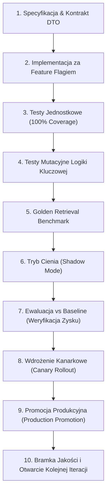
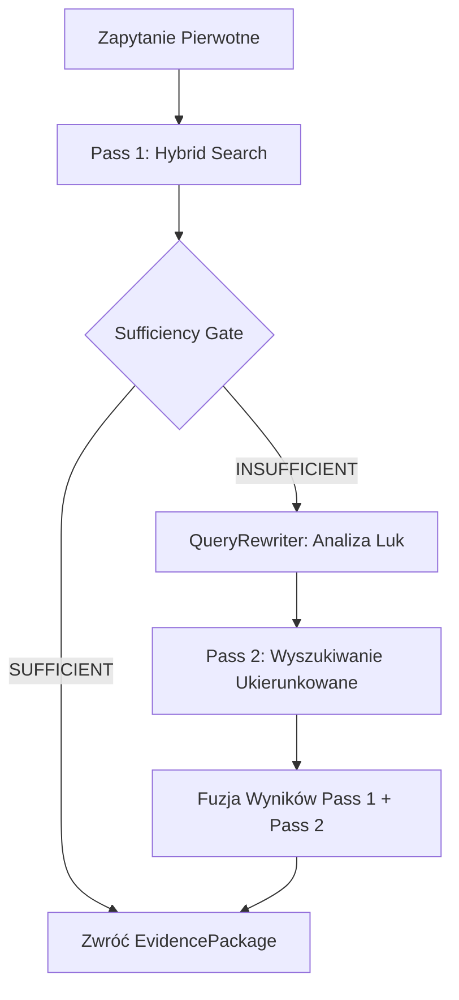
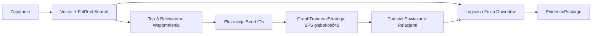
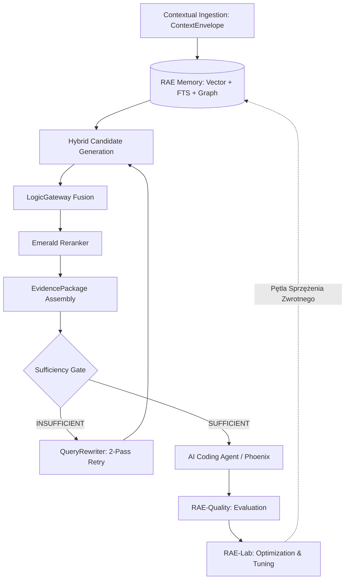
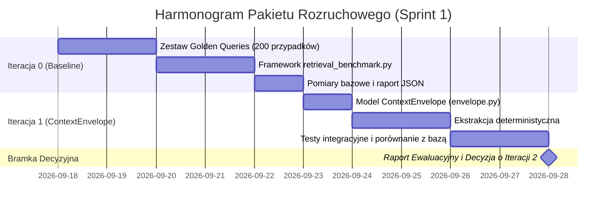

# RAE-SUITE: MISTRZOWSKI PLAN ROZWOJU ARCHITEKTURY
## Adaptacyjny Silnik Pozyskiwania Dowodów (Adaptive Evidence Retrieval & Agentic RAG)
### Wersja: 1.0.0 | Status: Gotowy do wdrożenia (Architectural Blueprint) | Data: 2026-09-17

---

## 1. WPROWADZENIE I DEKLARACJA MISJI

Niniejszy dokument stanowi kompletny, inżynieryjny plan rozwoju architektury pamięci i wyszukiwania **RAE-Suite** w kierunku **Adaptive Evidence Retrieval** (Adaptacyjnego Wyszukiwania Dowodowego). Plan został opracowany bezpośrednio na podstawie założeń analitycznych zawartych w dokumencie źródłowym [`rozwoj-rae.md`](file:///home/grzegorz/cloud/RAE-Suite/docs/rozwoj-rae.md).

### 1.1. Diagnoza Stanu Obecnego (Current State)
Obecny silnik wyszukiwania [`HybridSearchEngine`](file:///home/grzegorz/cloud/RAE-Suite/packages/rae-agentic-memory/rae-core/rae_core/search/engine.py) w pakiecie `rae-core` realizuje zaawansowaną fuzję strategii:
1. **Wyszukiwanie wieloaspektowe**: Równoległe zapytania do `VectorSearchStrategy` (Qdrant) oraz `FullTextStrategy` (PostgreSQL FTS).
2. **Fuzja rankingowa**: Integracja przez `LogicGateway` / `FusionStrategy` (RRF, wagi adaptacyjne).
3. **Semantyczny Reranking**: Moduł `EmeraldReranker` dokonujący walidacji krzyżowej kosinusowej.
4. **Zasada Czystości Sygnału (SYSTEM 43.0)**: Świadome wyłączenie wzbogacania zapytania na wejściu (`enriched_query = query`), ponieważ syntetyczne modyfikatory zapytań rozcieńczają precyzyjny sygnał techniczny (symbole, identyfikatory, skróty).

### 1.2. Luka Architektoniczna i Cel Strategiczny
Choć obecny silnik zwraca trafne krotki `(UUID, score, importance)`, wykazuje ograniczenia typowe dla klasycznych systemów RAG pierwszej generacji:
- **Brak osadzenia kontekstowego (Context Blindness)**: Zwracane fragmenty pamięci są wyizolowanymi wycinkami bez jawnego powiązania z repozytorium, plikiem, symbolem, commitem i celem zadania.
- **Płaski interfejs wyjściowy**: Konsumenci (agenci, RAE-Phoenix, LLM) otrzymują surowe identyfikatory i teksty, zamiast spójnego pakietu dowodowego z informacją o pochodzeniu (provenance), wiarygodności i ewentualnych sprzecznościach źródeł.
- **Brak samokrytyki (Single-Pass Blindness)**: System nie ocenia, czy zebrany materiał dowodowy jest wystarczający do udzielenia pewnej odpowiedzi, ani nie potrafi autonomicznie ponowić zapytania ze skorygowaną strategią.
- **Sztywne obciążenie zasobów**: Wykonywanie wszystkich strategii wyszukiwania dla każdego zapytania generuje niepotrzebną latencję i koszty obliczeniowe.

### 1.3. Żelazne Zasady Transformacji (Guiding Principles)
1. **Zero Big-Bang**: Żadnych monolitycznych wdrożeń. Rozwój prowadzony jest w 11 precyzyjnych, odizolowanych iteracjach (Iteracje 0–10).
2. **Zero Regression & Zero Drift**: Każda iteracja musi posiadać twardy test regresji, testy jednostkowe o 100% pokryciu nowej logiki, benchmark jakościowy oraz twardy feature flag (`RAE_*_ENABLED`).
3. **Mierzalność Zysku (Measured Improvement Gate)**: Brak możliwości przejścia do kolejnej iteracji bez wykazania empirycznej poprawy jakości (Recall, MRR, NDCG) lub redukcji kosztu/latencji przy zachowaniu dotychczasowej jakości.
4. **Ochrona Surowego Sygnału**: Nie modyfikujemy surowej treści (`raw content`) ani nie rozcieńczamy zapytań wejściowych. Kontekst dostarczamy przez dedykowane koperty metadanych (`ContextEnvelope`).

---

## 2. STANDARYZOWANY 10-KROKOWY CYKL ITERACJI

Każda iteracja zdefiniowana w niniejszym planie bezwzględnie podlega ujednoliconemu procesowi inżynieryjnemu, gwarantującemu pełne bezpieczeństwo kodu produkcyjnego:



### Opis Kroków Cyklu:
1. **Specyfikacja & Kontrakt DTO**: Precyzyjne zdefiniowanie modeli Pydantic, interfejsów `Protocol` oraz schematów danych przed napisaniem jakiejkolwiek logiki wykonawczej.
2. **Feature Flag**: Każda nowa funkcja domyślnie przyjmuje stan wyłączony (`flag=false`) w konfiguracji środowiskowej i profilach.
3. **Testy Jednostkowe**: Obowiązkowe testy asynchroniczne i synchroniczne w kontenerze testowym z pokryciem brzegowych przypadków.
4. **Testy Mutacyjne**: Weryfikacja odporności testów dla algorytmów decyzyjnych i scoringowych (np. `mutmut` / testy mutantów).
5. **Golden Retrieval Benchmark**: Uruchomienie standardowego zestawu minimum 200 zapytań referencyjnych dla zmierzenia wpływu zmiany na metryki retrieval.
6. **Shadow Mode**: Nowy kod wykonuje się równolegle w tle w środowisku stagingowym/produkcyjnym, rejestrując telemetrię i logi decyzyjne bez wpływu na odpowiedź zwracaną użytkownikowi/agentowi.
7. **Ewaluacja vs Baseline**: Statystyczna analiza porównawcza: $Recall@10$, $MRR$, $NDCG@10$, $p50$, $p95$. Jeśli nie wykazano poprawy, funkcja nie przechodzi dalej.
8. **Wdrożenie Kanarkowe**: Stopniowe udostępnianie nowej ścieżki (5% -> 25% -> 100% ruchu zapytań).
9. **Promocja Produkcyjna**: Ustawienie flagi na `true` jako standardowego zachowania i synchronizacja z rejestrem wiedzy RAE.
10. **Bramka Jakości (Exit Gate)**: Podpisanie cyfrowego raportu zgodności i formalne otwarcie prac nad kolejną iteracją.

---

## 3. MACIERZ PRZEGLĄDOWA PLANU (ITERACJE 0–10)

| Iteracja | Nazwa / Zakres | Główny Komponent | Efekt Końcowy | Poziom Ryzyka | Twardy Warunek Przejścia (Exit Gate) |
| :---: | :--- | :--- | :--- | :---: | :--- |
| **0** | **Retrieval Baseline & Benchmarking** | `retrieval_benchmark.py`, Golden Dataset | Precyzyjna baza pomiarowa obecnego `HybridSearchEngine` | **Bardzo małe** | $\ge 200$ golden queries, powtarzalny raport JSON, integracja z CI |
| **1** | **ContextEnvelope & Contextual Ingestion** | `ContextEnvelope`, `context_enricher.py` | Pamięć zna repozytorium, plik, commity i cel bez modyfikacji `raw content` | **Małe** | Poprawa $Recall@10$ w zapytaniach `semantic`/`cross_file`, $0\%$ regresji w `exact` |
| **2** | **EvidencePackage Unified DTO** | `EvidencePackage`, `EvidenceItem` | Ujednolicony format dowodowy z provenance i zaufaniem, separacja od backendu | **Małe** | $100\%$ wstecznej zgodności ID, agenci konsumują DTO bez znajomości Qdrant/FTS |
| **3** | **Evidence Sufficiency Gate (Shadow)** | `EvidenceSufficiencyGate` | Deterministyczna bramka heurystyczna klasyfikująca stan dowodowy | **Małe / Średnie** | Udowodniona korelacja niskiego `evidence_score` z błędną odpowiedzią w trybie cienia |
| **4** | **Adaptive Retrieval 2-Pass Loop** | `QueryRewriter`, `AdaptiveSearchEngine` | Kontrolowane, jednokrotne ponowienie z korektą strategii i brakujących aspektów | **Średnie** | Wyraźny wzrost trafności w zapytaniach multi-hop bez niekontrolowanych pętli ($max\_passes=2$) |
| **5** | **Query Classification & Intelligent Routing** | `QueryClassifier`, `StrategyRouter` | Dynamiczny dobór wag strategii na podstawie reguł i heurystyk zapytania | **Średnie** | Spadek latencji $p50$ o $\ge 25\%$ i redukcja kosztu tokenów bez utraty $MRR$ |
| **6** | **GraphRAG-lite (Autonomous BFS Expansion)**| `GraphLiteStrategy`, seed expansion | Automatyczne rozszerzanie wyników FTS/Vector po grafie bez ręcznych seed_ids | **Średnie** | Zmierzony zysk trafności w pytaniach relacyjnych i cross-file architecture |
| **7** | **Graph Communities & Reflective Synthesis** | `CommunityDetector`, `CommunitySummarizer`| Klastry wiedzy (Leiden) syntezowane do warstwy `Reflective Memory` | **Średnie** | Poprawna synteza pytań globalnych i holistycznych ("jak działa cały system") |
| **8** | **Multimodal Evidence Retrieval** | `VisualSearchStrategy`, `MultimodalArtifact`| Zrzuty ekranu Playwright, błędy UI i schematy architektoniczne stają się dowodami | **Średnie** | Skuteczne odnajdywanie screenshotów i diagramów po zapytaniach semantycznych |
| **9** | **RAE-Lab Adaptive Retrieval Optimizer** | `RetrievalOptimizer`, MAB / Auto-Tuner | Samoczynne strojenie wag i progów przez RAE-Lab w trybie cienia i doradczym | **Średnie / Większe** | Wzrost globalnej funkcji nagrody $Reward(Q, L, C)$ bez oscylacji parametrów |
| **10** | **Closed-Loop Self-Improvement** | Pełna orkiestracja RAE-Quality $\leftrightarrow$ RAE-Lab | Zamknięta pętla ciągłego doskonalenia systemu na bazie własnych błędów | **Kontrolowane** | Zero dryfu, pełna zgodność z audytem ISO 42001/27001 i raportowaniem hashów SHA-256 |

---

## 4. SZCZEGÓŁOWA SPECYFIKACJA TECHNICZNA ITERACJI

---

### ITERACJA 0: RETRIEVAL BASELINE & GOLDEN BENCHMARK FRAMEWORK

#### 1. Cel i Rationale
Zanim wprowadzona zostanie jakakolwiek zmiana w kodzie wyszukiwania, musimy dysponować obiektywnym, automatycznym i powtarzalnym aparatem pomiarowym. Obecnie testy sprawdzają poprawność integracyjną, ale brakuje granularnego benchmarku mierzącego jakość retrieval w podziale na domeny problemowe.

#### 2. Zakres Plików
- **Utworzenie**:
  - `packages/rae-agentic-memory/rae-core/rae_core/evaluation/__init__.py`
  - `packages/rae-agentic-memory/rae-core/rae_core/evaluation/retrieval_benchmark.py`
  - `packages/rae-agentic-memory/rae-core/rae_core/evaluation/golden_queries.py`
  - `packages/rae-agentic-memory/benchmarking/scripts/run_retrieval_benchmark.py`
  - `packages/rae-agentic-memory/tests/retrieval/golden_queries.json`
  - `packages/rae-agentic-memory/tests/retrieval/test_retrieval_benchmark.py`

#### 3. Kontrakty DTO i Struktura Danych
```python
# rae-core/rae_core/evaluation/golden_queries.py
from enum import StrEnum
from pydantic import BaseModel, Field
from uuid import UUID

class QueryCategory(StrEnum):
    EXACT_IDENTIFIER = "exact_identifier"     # UUID, hash commitu, nazwa zmiennej konfiguracyjnej
    CODE_SYMBOL = "code_symbol"               # Nazwa klasy, sygnatura metody (np. HybridSearchEngine)
    SEMANTIC_CODE = "semantic_code"           # "Gdzie następuje ważenie strategii wyszukiwania?"
    HISTORICAL_DECISION = "historical_decision" # "Dlaczego wyłączono enrichment zapytania?"
    CROSS_FILE = "cross_file"                 # Zależności między dwoma serwisami/modułami
    CROSS_REPOSITORY = "cross_repository"     # Powiązanie RAE-Core z Dreamsoft lub ScreenWatcher
    TEMPORAL = "temporal"                     # "Jaki stan przyjęto po migracji z 2026-01-02?"
    MULTI_SOURCE = "multi_source"             # Informacje wymagające połączenia bazy, kodu i logów
    GRAPH_RELATION = "graph_relation"         # Przepływ dziedziczenia i wywołań w grafie wiedzy

class GoldenQueryCase(BaseModel):
    query_id: str
    query: str
    category: QueryCategory
    tenant_id: str
    expected_memory_ids: list[UUID] = Field(default_factory=list)
    expected_sources: list[str] = Field(default_factory=list)  # np. ścieżki plików, identyfikatory
    forbidden_sources: list[str] = Field(default_factory=list) # dane innych tenantów / błędne ścieżki
    metadata: dict = Field(default_factory=dict)

class BenchmarkMetricResult(BaseModel):
    recall_at_5: float
    recall_at_10: float
    mrr: float
    ndcg_at_10: float
    latency_p50_ms: float
    latency_p95_ms: float
    reranker_gain: float
    empty_result_rate: float
    wrong_tenant_results: int
    category_breakdown: dict[QueryCategory, dict[str, float]]
```

#### 4. Metryki i Algorytmy Oceny
- **Mean Reciprocal Rank (MRR)**: Ocena pozycji pierwszego relewantnego dokumentu:
  $$MRR = \frac{1}{|Q|} \sum_{i=1}^{|Q|} \frac{1}{\text{rank}_i}$$
- **Recall@K**: Odsetek oczekiwanych źródeł odnalezionych w pierwszych $K$ pozycjach:
  $$Recall@K = \frac{|\text{Odnalezione relewantne w top } K|}{|\text{Wszystkie oczekiwane relewantne}|}$$
- **Reranker Gain**: Procentowy przyrost metryki $NDCG@10$ po włączeniu `EmeraldReranker` względem surowej fuzji.

#### 5. Definition of Done (DoD)
- [ ] Zestaw minimum 200 zweryfikowanych zapytań wzorcowych w `tests/retrieval/golden_queries.json`.
- [ ] Skrypt CLI `run_retrieval_benchmark.py` uruchamiany w kontenerze Docker zwracający znormalizowany plik JSON z wynikami.
- [ ] Utworzenie raportu bazowego `RETRIEVAL_BASELINE_REPORT.json` w katalogu `.benchmarks/`.
- [ ] **Zero zmian w produkcyjnej logice wyszukiwania** – wyłącznie narzędzia diagnostyczno-pomiarowe.

---

### ITERACJA 1: CONTEXTENVELOPE & CONTEXTUAL INGESTION

#### 1. Cel i Rationale
Zgodnie z koncepcją Contextual RAG, fragmenty wiedzy bez metadanych o ich pochodzeniu (repozytorium, gałąź, plik, klasa, funkcja, zadanie) tracą ładunek semantyczny. Zamiast "brudzić" surową treść dokumentu sztucznym tekstem (co zakłóca wyszukiwanie pełnotekstowe i analizę kodu), tworzymy deterministyczną kopertę kontekstową (`ContextEnvelope`).

#### 2. Zakres Plików
- **Utworzenie**:
  - `packages/rae-agentic-memory/rae-core/rae_core/models/envelope.py`
  - `packages/rae-agentic-memory/rae-core/rae_core/ingestion/context_enricher.py`
  - `packages/rae-agentic-memory/rae-core/tests/unit/ingestion/test_context_enricher.py`
- **Modyfikacja**:
  - `packages/rae-agentic-memory/rae-core/rae_core/models/memory.py` (dodanie pola `envelope: ContextEnvelope | None = None`)
  - `packages/rae-agentic-memory/apps/memory_api/services/rae_core_service.py` (obsługa koperty podczas zapisu)

#### 3. Kontrakty DTO i Struktura Danych
```python
# rae-core/rae_core/models/envelope.py
from datetime import datetime, timezone
from pydantic import BaseModel, ConfigDict, Field

class CodeAttribution(BaseModel):
    model_config = ConfigDict(extra="forbid")
    repository: str
    branch: str | None = None
    commit_sha: str | None = None
    file_path: str
    language: str | None = None
    class_name: str | None = None
    function_name: str | None = None
    start_line: int | None = None
    end_line: int | None = None

class ContextEnvelope(BaseModel):
    model_config = ConfigDict(extra="forbid")
    source_type: str = Field(description="code | doc | chat | test | architecture | system_log")
    project: str
    task_id: str | None = None
    trace_id: str | None = None
    correlation_id: str | None = None
    timestamp: datetime = Field(default_factory=lambda: datetime.now(timezone.utc))
    attribution: CodeAttribution | None = None
    scope_tags: list[str] = Field(default_factory=list)
    semantic_summary: str | None = Field(default=None, max_length=500, description="Krótkie podsumowanie celu kontekstowego")
```

#### 4. Deterministyczna Ekstrakcja Kontekstu (Context Enricher)
W pierwszej wersji **nie używamy modeli LLM** do budowania kontekstu. Ekstrakcja odbywa się w 100% deterministycznie:
1. Parsowanie AST dla plików Pythona i TypeScript w celu detekcji bieżącej klasy/funkcji.
2. Odczyt zmiennych środowiskowych Git (`GIT_REPO`, `GIT_BRANCH`, `GIT_COMMIT`).
3. Przypisanie identyfikatorów sesji i korelacji z nagłówków RAE Bridge API.

#### 5. Feature Flag i Bezpieczeństwo
```bash
export RAE_CONTEXT_ENVELOPE_ENABLED=false # Domyślnie wyłączony
```

#### 6. Definition of Done (DoD)
- [ ] Porównanie wyników benchmarku: Baseline vs ContextEnvelope włączone.
- [ ] **Twardy warunek**: Brak regresji w kategorii `exact_identifier` (spadek $Recall@10 \le 0.0\%$).
- [ ] Wzrost $Recall@10$ w kategoriach `semantic_code` i `cross_file` o minimum $+8\%$.
- [ ] 100% testów jednostkowych przechodzi pomyślnie.

---

### ITERACJA 2: EVIDENCEPACKAGE – UJEDNOLICONY KONTRAKT DOWODOWY

#### 1. Cel i Rationale
Oddzielenie warstwy wyszukiwania (retrieval) od logiki wnioskowania agenta (reasoning). Agent (ani LLM, ani Phoenix) nie powinien operować na specyficznych strukturach baz danych (Qdrant point IDs, Postgres FTS rank, BFS node tuples). Zamiast tego otrzymuje samowystarczalny, audytowalny pakiet `EvidencePackage` zawierający pełną ścieżkę pochodzenia, ocenę wiarygodności i wykryte sprzeczności.

#### 2. Zakres Plików
- **Utworzenie**:
  - `packages/rae-agentic-memory/rae-core/rae_core/models/evidence_package.py`
  - `packages/rae-agentic-memory/rae-core/tests/unit/search/test_evidence_package.py`
- **Modyfikacja**:
  - `packages/rae-agentic-memory/rae-core/rae_core/models/__init__.py`
  - `packages/rae-agentic-memory/rae-core/rae_core/search/engine.py` (dodanie metody `search_evidence(...)`)
  - `packages/rae-agentic-memory/apps/memory_api/routers/search.py` (nowy punkt końcowy `/v2/memory/search/evidence`)

#### 3. Kontrakty DTO i Struktura Danych
```python
# rae-core/rae_core/models/evidence_package.py
from datetime import datetime
from uuid import UUID, uuid4
from pydantic import BaseModel, ConfigDict, Field
from rae_core.models.envelope import ContextEnvelope

class EvidenceItem(BaseModel):
    model_config = ConfigDict(extra="forbid")
    evidence_id: UUID = Field(default_factory=uuid4)
    memory_id: UUID
    content: str
    relevance_score: float = Field(ge=0.0, le=1.0)
    trust_score: float = Field(default=1.0, ge=0.0, le=1.0)
    strategy_source: str = Field(description="vector | fulltext | graph | hybrid_fused")
    envelope: ContextEnvelope | None = None
    observed_at: datetime
    checksum_sha256: str | None = None

class EvidenceConflict(BaseModel):
    model_config = ConfigDict(extra="forbid")
    conflict_type: str = Field(description="factual | version_mismatch | temporal_drift")
    item_a_id: UUID
    item_b_id: UUID
    description: str

class EvidencePackage(BaseModel):
    model_config = ConfigDict(extra="forbid")
    package_id: UUID = Field(default_factory=uuid4)
    query: str
    tenant_id: str
    items: list[EvidenceItem] = Field(default_factory=list)
    strategies_used: list[str] = Field(default_factory=list)
    confidence_score: float = Field(ge=0.0, le=1.0)
    conflicts: list[EvidenceConflict] = Field(default_factory=list)
    missing_aspects: list[str] = Field(default_factory=list)
    generated_at: datetime
```

#### 4. Feature Flag i Kompatybilność Wsteczna
- Flaga: `RAE_EVIDENCE_PACKAGE_ENABLED=false`
- W trybie wyłączonym silnik działa w dotychczasowy sposób, zwracając listę krotek `(UUID, float, float)`. Nowy kontrakt jest hermetycznie odseparowany.

#### 5. Definition of Done (DoD)
- [ ] Zapytanie wykonane przez `search()` oraz `search_evidence()` weryfikuje dokładnie te same identyfikatory wspomnień dla identycznego ziarna danych.
- [ ] Agenci w RAE-Suite mogą konsumować `EvidencePackage` bez konieczności importowania modułów magazynów danych.

---

### ITERACJA 3: EVIDENCE SUFFICIENCY GATE (SHADOW MODE)

#### 1. Cel i Rationale
Wprowadzenie mechanizmu samokrytyki wyszukiwania (Self-Assessment). Zanim wynik zostanie przekazany do modelu językowego lub agenta wykonawczego, bramka jakościowa ocenia, czy zebrany materiał dowodowy jest wystarczający do podjęcia decyzji (`SUFFICIENT`), czy też zawiera luki lub wewnętrzne sprzeczności (`INSUFFICIENT`).

#### 2. Zakres Plików
- **Utworzenie**:
  - `packages/rae-agentic-memory/rae-core/rae_core/search/sufficiency_gate.py`
  - `packages/rae-agentic-memory/rae-core/tests/unit/search/test_sufficiency_gate.py`
- **Modyfikacja**:
  - `packages/rae-agentic-memory/rae-core/rae_core/search/engine.py` (integracja bramki w trybie cienia)

#### 3. Kontrakty DTO i Algorytm Scoringowy
```python
# rae-core/rae_core/search/sufficiency_gate.py
from enum import StrEnum
from pydantic import BaseModel, Field
from rae_core.models.evidence_package import EvidencePackage

class GateDecision(StrEnum):
    SUFFICIENT = "sufficient"
    INSUFFICIENT = "insufficient"
    AMBIGUOUS = "ambiguous"

class SufficiencyAssessment(BaseModel):
    decision: GateDecision
    composite_score: float = Field(ge=0.0, le=1.0)
    relevance_component: float
    coverage_component: float
    diversity_component: float
    trust_component: float
    temporal_component: float
    conflict_penalty: float
    missing_aspects: list[str] = Field(default_factory=list)
    rationale: str
```

#### 4. Deterministyczna Formuła Oceny Wystarczalności
Pierwsza wersja bramki **nie korzysta z modeli LLM**, aby utrzymać narzut czasowy poniżej 2 ms:
$$\text{Score} = 0.30 \cdot R_{rel} + 0.25 \cdot C_{cov} + 0.15 \cdot D_{div} + 0.15 \cdot T_{trust} + 0.15 \cdot K_{temp} - P_{conf}$$
Gdzie:
- $R_{rel}$: Średnia relewancja top 3 dokumentów.
- $C_{cov}$: Pokrycie słów kluczowych i bytów technicznych zapytania w odnalezionych fragmentach.
- $D_{div}$: Różnorodność źródeł (czy dowody pochodzą z więcej niż jednego pliku/modułu).
- $T_{trust}$: Średni wskaźnik wiarygodności źródeł (np. oficjalna architektura vs log roboczy).
- $K_{temp}$: Zgodność czasowa (kara za dokumenty zdezaktualizowane przez nowsze commity).
- $P_{conf}$: Kara za wykryte sprzeczności faktograficzne.

Próg akceptacji: $\text{Score} \ge 0.68 \implies \text{SUFFICIENT}$.

#### 5. Tryb Cienia (Shadow Mode Telemetry)
```bash
export RAE_EVIDENCE_GATE_MODE=shadow # shadow | active | disabled
```
W trybie `shadow` bramka oblicza metryki, rejestruje pełny ślad telemetrii (`retrieval_trace_id`, `composite_score`, `decision`), ale **nie blokuje ani nie zmienia wyniku** przekazywanego do agenta.

#### 6. Definition of Done (DoD)
- [ ] Logowanie minimum 1000 zapytań w trybie cienia w środowisku deweloperskim/stagingowym.
- [ ] Wykazanie statystycznej korelacji: zapytania oznaczone jako `INSUFFICIENT` korelują w $\ge 80\%$ z halucynacją lub błędną odpowiedzią modelu.

---

### ITERACJA 4: ADAPTIVE RETRIEVAL 2-PASS LOOP

#### 1. Cel i Rationale
Jeżeli `EvidenceSufficiencyGate` zaklasyfikuje wynik jako `INSUFFICIENT`, system przechodzi do kontrolowanego, drugiego przebiegu wyszukiwania (2-pass). W przeciwieństwie do naiwnych pętli agentowych, które wpadają w nieskończone ponowienia, RAE wprowadza twardy limit: **maksymalnie 2 przebiegi** ($max\_passes = 2$).

#### 2. Zakres Plików
- **Utworzenie**:
  - `packages/rae-agentic-memory/rae-core/rae_core/search/rewriter.py`
  - `packages/rae-agentic-memory/rae-core/rae_core/search/adaptive_engine.py`
  - `packages/rae-agentic-memory/rae-core/tests/unit/search/test_adaptive_engine.py`
- **Modyfikacja**:
  - `packages/rae-agentic-memory/apps/memory_api/services/rae_core_service.py`

#### 3. Architektura Pętli i Rewritera


#### 4. Kontrakt QueryRewriter
Rewriter nie "upiększa" promptu tekstowo, lecz generuje precyzyjną korektę techniczną:
```python
# rae-core/rae_core/search/rewriter.py
from pydantic import BaseModel, Field

class RewritePlan(BaseModel):
    original_query: str
    missing_aspects: list[str]
    refined_queries: list[str] = Field(max_length=3)
    strategy_weight_adjustments: dict[str, float] = Field(
        description="np. {'fulltext': 1.5, 'graph': 1.3} gdy brakuje precyzyjnego symbolu"
    )
    focus_filters: dict | None = None
```

#### 5. Feature Flag i Twardy Limit
- Flaga: `RAE_ADAPTIVE_2PASS_ENABLED=false`
- Twarda asercja: Kod nie dopuszcza wykonania `pass > 2`.

#### 6. Definition of Done (DoD)
- [ ] Dedykowany zestaw 50 zapytań typu `multi_hop` i `missing_aspect` w golden dataset.
- [ ] Wzrost metryki $Recall@10$ w zapytaniach złożonych o minimum $+15\%$ w stosunku do wyszukiwania jednoprzebiegowego.
- [ ] Całkowity czas wykonania 2-pass poniżej 350 ms.

---

### ITERACJA 5: QUERY CLASSIFICATION & INTELLIGENT ROUTING

#### 1. Cel i Rationale
Obecnie `HybridSearchEngine` uruchamia wszystkie zarejestrowane strategie (`vector`, `fulltext`, itp.) dla każdego zapytania. Jest to marnotrawstwo zasobów. Identyfikator `CVE-2026-12345` lub nazwa klasy `HybridSearchEngine` wymagają dominacji FTS i Anchor search, podczas gdy zapytanie o intencję architektoniczną wymaga wektorów i grafu wiedzy.

#### 2. Zakres Plików
- **Utworzenie**:
  - `packages/rae-agentic-memory/rae-core/rae_core/search/classifier.py`
  - `packages/rae-agentic-memory/rae-core/rae_core/search/router.py`
  - `packages/rae-agentic-memory/rae-core/tests/unit/search/test_classifier.py`
  - `packages/rae-agentic-memory/rae-core/tests/unit/search/test_router.py`
- **Modyfikacja**:
  - `packages/rae-agentic-memory/rae-core/rae_core/search/engine.py`

#### 3. Regułowo-Heurystyczny Klasyfikator (Rules-First Hierarchy)
Klasyfikacja odbywa się kaskadowo:
1. **Reguły Deterministyczne (Szybka Ścieżka / < 0.5 ms)**:
   - Wykrywanie UUID, hashów commitów, identyfikatorów CVE/JIRA $\implies$ `EXACT_IDENTIFIER`.
   - Wykrywanie symboli kodu (`CamelCase`, `snake_case()`, rozszerzenia `.py`, `.ts`) $\implies$ `CODE_SYMBOL`.
   - Znaczniki relacji ("gdzie jest wywoływany", "zależy od", "kto dziedziczy") $\implies$ `GRAPH_RELATION`.
2. **Fallback Heurystyczny**: W przypadku zapytań wieloznacznych zastosowanie zoptymalizowanego profilu ogólnego (`BALANCED`).

#### 4. Profile Wag Strategii (Routing Matrix)
```python
ROUTING_PROFILES = {
    QueryCategory.EXACT_IDENTIFIER: {"fulltext": 0.80, "vector": 0.15, "graph": 0.05},
    QueryCategory.CODE_SYMBOL:      {"fulltext": 0.60, "vector": 0.25, "graph": 0.15},
    QueryCategory.SEMANTIC_CODE:    {"fulltext": 0.25, "vector": 0.55, "graph": 0.20},
    QueryCategory.HISTORICAL_DECISION: {"vector": 0.40, "episodic": 0.35, "fulltext": 0.25},
    QueryCategory.GRAPH_RELATION:   {"graph": 0.60, "vector": 0.20, "fulltext": 0.20},
}
```

#### 5. Definition of Done (DoD)
- [ ] Klasyfikator przetwarza zapytanie w czasie poniżej 1.5 ms.
- [ ] Średnia redukcja czasu odpowiedzi wyszukiwania ($p50$) o $\ge 25\%$ dzięki pomijaniu zbędnych strategii.
- [ ] Brak statystycznie istotnego spadku $MRR$ ($\Delta MRR \le 0.005$).

---

### ITERACJA 6: GRAPHRAG-LITE (AUTONOMOUS BFS EXPANSION)

#### 1. Cel i Rationale
RAE posiada zaimplementowaną strategię [`GraphTraversalStrategy`](file:///home/grzegorz/cloud/RAE-Suite/packages/rae-agentic-memory/rae-core/rae_core/search/strategies/graph.py), jednak wymagała ona podania `seed_ids` przez wywołującego. GraphRAG-lite automatyzuje ten proces: wyniki pierwszej fazy (Vector/FTS) stają się autonomicznymi ziarnami, z których silnik rozwija graf powiązań architektonicznych.

#### 2. Zakres Plików
- **Utworzenie**:
  - `packages/rae-agentic-memory/rae-core/rae_core/search/strategies/graph_lite.py`
  - `packages/rae-agentic-memory/rae-core/tests/unit/search/test_graph_lite.py`
- **Modyfikacja**:
  - `packages/rae-agentic-memory/rae-core/rae_core/search/engine.py`

#### 3. Architektura Przepływu


#### 4. Ograniczenia i Parametry Ochronne
- `max_depth = 2` (blokada eksplozji kombinatorycznej grafu).
- `max_expanded_nodes = 15` na ziarno.
- Wykluczenie krawędzi o niskiej wadze zaufania (`edge_weight < 0.4`).

#### 5. Definition of Done (DoD)
- [ ] Wzrost $Recall@10$ o minimum $+20\%$ na zapytaniach testowych typu `cross_file` oraz `graph_relation`.
- [ ] Czas rozszerzenia grafowego poniżej 40 ms.

---

### ITERACJA 7: GRAPH COMMUNITIES & REFLECTIVE SYNTHESIS

#### 1. Cel i Rationale
Tradycyjny RAG zawodzi przy pytaniach globalnych: "Jak działa cała podsystem fuzji?", "Jakie były główne problemy z wydajnością w ostatnim miesiącu?". Żaden pojedynczy fragment tekstu nie odpowiada na takie pytanie. Zamiast stawiać zewnętrzną bazę GraphRAG, wykorzystujemy natywną architekturę RAE: klastrujemy graf wiedzy i zapisujemy syntetyczne podsumowania klastrów bezpośrednio w warstwie **Reflective Memory**.

#### 2. Zakres Plików
- **Utworzenie**:
  - `packages/rae-agentic-memory/rae-core/rae_core/graph/community_detector.py`
  - `packages/rae-agentic-memory/rae-core/rae_core/reflection/community_summarizer.py`
  - `packages/rae-agentic-memory/rae-core/tests/unit/graph/test_community_detector.py`
- **Modyfikacja**:
  - `packages/rae-agentic-memory/apps/memory_api/services/reflection_engine.py`

#### 3. Algorytm i Inkrementalność
1. **Detekcja Społeczności**: Wykorzystanie algorytmu detekcji klastrów (Leiden lub analiza spójnych składowych podgrafów).
2. **Synteza Odblaskowa (Reflective Synthesis)**: Generowanie podsumowania architektonicznego klastra i zapis jako `MemoryItem` z warstwą `MemoryLayer.REFLECTIVE`.
3. **Aktualizacja Inkrementalna (Dirty State)**: Zmiana w pliku/wspomnieniu unieważnia wyłącznie podsumowanie powiązanej społeczności (`dirty_community_ids`), eliminując potrzebę przeliczania całego grafu.

#### 4. Definition of Done (DoD)
- [ ] Poprawne syntetyzowanie podsumowań dla wyizolowanych domen kodu (np. `Hybrid Search`, `Alembic Migrations`).
- [ ] Benchmark pytań holistycznych wykazuje poprawność merytoryczną odpowiedzi w $\ge 90\%$ przypadków.

---

### ITERACJA 8: MULTIMODAL EVIDENCE RETRIEVAL

#### 1. Cel i Rationale
W projektach takich jak `Dreamsoft` (Next.js/sklep) oraz `ScreenWatcher` (telemetria przemysłowa) kluczowe dowody występują w postaci zrzutów ekranu błędów interfejsu (Playwright), diagramów architektury oraz tabel w dokumentacji PDF. Czysty tekst gubi układ przestrzenny. Wprowadzamy wielomodalny artefakt dowodowy i dedykowaną strategię `VisualSearchStrategy`.

#### 2. Zakres Plików
- **Utworzenie**:
  - `packages/rae-agentic-memory/rae-core/rae_core/models/multimodal.py`
  - `packages/rae-agentic-memory/rae-core/rae_core/search/strategies/visual.py`
  - `packages/rae-hive/visual_ingest.py`
  - `packages/rae-core/tests/unit/search/test_visual_strategy.py`
- **Modyfikacja**:
  - `packages/rae-agentic-memory/rae-core/rae_core/search/engine.py`

#### 3. Model Artefaktu Wielomodalnego
```python
# rae-core/rae_core/models/multimodal.py
from pydantic import BaseModel, Field
from rae_core.models.envelope import ContextEnvelope

class MultimodalArtifact(BaseModel):
    artifact_id: str
    artifact_type: str = Field(description="screenshot | architecture_diagram | pdf_page")
    image_uri: str
    ocr_extracted_text: str | None = None
    visual_embedding: list[float] | None = None # CLIP / SigLIP
    text_embedding: list[float] | None = None
    envelope: ContextEnvelope
```

#### 4. Definition of Done (DoD)
- [ ] Zdolność odnalezienia zrzutu ekranu błędu UI Playwright na podstawie tekstowego opisu objawu (np. "uszkodzone menu boczne na mobilce").
- [ ] Wsparcie dla kolekcji wektorowej z obsługą embeddingów wielomodalnych w Qdrant.

---

### ITERACJA 9: RAE-LAB ADAPTIVE RETRIEVAL OPTIMIZER

#### 1. Cel i Rationale
Statyczne wagi strategii wyszukiwania i sztywne progi decyzyjne nie sprawdzają się w zmiennych warunkach produkcyjnych. Pakiet `rae-lab` posiada mechanizmy Multi-Armed Bandit (MAB) i Auto-Tuner. W tej iteracji RAE-Lab optymalizuje wagi strategii i progi bramki na podstawie wielokryterialnej funkcji zysku.

#### 2. Zakres Plików
- **Utworzenie**:
  - `packages/rae-lab/src/rae_lab/retrieval_optimizer.py`
  - `packages/rae-lab/tests/test_retrieval_optimizer.py`
- **Modyfikacja**:
  - `packages/rae-agentic-memory/rae-core/rae_core/math/policy.py`

#### 3. Wielokryterialna Funkcja Nagrody (Reward Function)
Optymalizator maksymalizuje funkcję zysku uwzględniającą jakość, czas i koszt:
$$\text{Reward} = 0.65 \cdot Q_{\text{quality}} - 0.10 \cdot L_{\text{latency\_penalty}} - 0.10 \cdot C_{\text{token\_cost}} - 0.15 \cdot F_{\text{failed\_retrieval}}$$

#### 4. Stopnie Dojrzałości Adaptacyjnej
1. **SHADOW**: Obliczanie rekomendacji parametrów, rejestracja w logach bez ingerencji.
2. **ADVISORY**: Publikacja rekomendacji w panelu i metrykach dla operatora.
3. **ACTIVE**: Samoczynna, powolna adaptacja wag w ramach ściśle ograniczonych widełek ($\pm 15\%$).

#### 5. Definition of Done (DoD)
- [ ] Udokumentowany wzrost średniego zysku nagrody $\text{Reward}$ o $\ge 12\%$ w symulacji 1000 cykli.
- [ ] Pełna stabilność: brak zjawiska oscylacji wag (damping factor $\alpha = 0.05$).

---

### ITERACJA 10: CLOSED-LOOP SELF-IMPROVEMENT & FULL PRODUCTION INTEGRATION

#### 1. Cel i Rationale
Zamknięcie pełnej pętli uczenia architektury RAE-Suite. Wyniki ewaluacji jakościowej z `rae-quality` zasilają analitykę błędów w `rae-lab`, a wnioski optymalizacyjne są automatycznie aplikowane w `rae-core`. Każde zdarzenie posiada cyfrowy podpis audytowy SHA-256 zgodnie z normami ISO 42001 i ISO 27001.

#### 2. Architektura Docelowa (The Complete Loop)


#### 3. Definition of Done (DoD)
- [ ] 100% testów przechodzi pomyślnie w pełnym zestawie testowym `make test-all`.
- [ ] Zero ostrzeżeń lintera (`Zero Warning Policy`: Ruff, Black, Mypy 100% green).
- [ ] Zgodność z procedurą `record_task_completion.py` i rozgłaszaniem stanu w siatce Mesh.

---

## 5. PLAN PIERWSZEGO SPRINTU IMPLEMENTACYJNEGO (PAKIET ROZRUCHOWY: ITERACJE 0 & 1)

Zgodnie z wyraźną rekomendacją z dokumentu [`rozwoj-rae.md`](file:///home/grzegorz/cloud/RAE-Suite/docs/rozwoj-rae.md), **nie wolno wdrażać całego planu jako pojedynczego zadania programistycznego**. 

Pierwszy pakiet wykonawczy dla Agenta obejmuje **wyłącznie Iterację 0 oraz Iterację 1**:



### Krok 1: Wykonanie Iteracji 0
1. Przygotowanie pliku z 200 zapytaniami referencyjnymi obejmującymi rzeczywiste pliki RAE-Suite i projektów satelickich.
2. Zbudowanie frameworka `retrieval_benchmark.py` obliczającego $Recall@5$, $Recall@10$, $MRR$, $NDCG@10$, $p50$, $p95$.
3. Uruchomienie benchmarku na obecnym kodzie i wygenerowanie oficjalnego pliku `baseline_metrics.json`.

### Krok 2: Wykonanie Iteracji 1
1. Zdefiniowanie modelu `ContextEnvelope` w `rae_core/models/envelope.py`.
2. Zaimplementowanie deterministycznego wzbogacania kontekstu podczas zapisu pamięci w `context_enricher.py`.
3. Dodanie feature flaga `RAE_CONTEXT_ENVELOPE_ENABLED`.
4. Uruchomienie benchmarku i zestawienie wyników `baseline` vs `context_envelope`.

### Krok 3: Twardy Warunek Zatrzymania (Hard Stop)
Po ukończeniu Kroku 2 prace zostają wstrzymane. Wygenerowany raport trafia pod analizę jakościową. Decyzja o rozpoczęciu Iteracji 2 (EvidencePackage) zapada wyłącznie po potwierdzeniu zysku jakościowego.

---

## 6. MAPOWANIE INFRASTRUKTURY OBLICZENIOWEJ I KLASTROWEJ

Wszystkie operacje w ramach planu muszą być realizowane z poszanowaniem podziału ról w klastrze RAE:

| Węzeł Klastra | Specyfikacja Sprzętowa | Rola w Planie Rozwoju | Sposób Wywołania |
| :--- | :--- | :--- | :--- |
| **Lokalny Laptop** | Arch Linux / Docker | Lekkie testy jednostkowe, kompilacja modeli, edycja kodu | `docker compose exec rae-api pytest` |
| **Node 1 (Lumina)** | i7-14700KF, RTX 4080, Arch Linux | Ciężkie benchmarki retrieval, obliczenia wektorowe, testy mutacyjne | `ssh operator@100.68.166.117` / skrypty lumina |
| **Node 3 (Piotrek)**| i7, 128GB RAM, RTX 4080 | Inferencja LLM (Ollama / LiteLLM Proxy) dla zapytań złożonych | `http://172.30.15.11:11434` / MCP Proxy |

> [!IMPORTANT]
> **Kontrakt Bezpieczeństwa Kontenerów**:
> Kategorycznie zabrania się uruchamiania testów i benchmarków bezpośrednio na maszynie-hoście, jeżeli istnieje kontener Docker. Wszelkie weryfikacje muszą odbywać się wewnątrz środowiska `rae-api-dev` lub dedykowanych kontenerów testowych.

---

## 7. PROTOKÓŁ ZARZĄDZANIA WERSJAMI I GIT FLOW

Wszelkie prace implementacyjne muszą ściśle przestrzegać zasad zdefiniowanych w [`AGENT_CORE_PROTOCOL.md`](file:///home/grzegorz/cloud/AGENT_CORE_PROTOCOL.md):
1. **Gałąź Funkcjonalna**: Prace nad każdą iteracją prowadzone są na dedykowanej gałęzi, np. `feature/retrieval-iter0-baseline`, utworzonej z `develop`.
2. **Zakaz Bezpośrednich Zmian na Main/Develop**: Scalanie wyłącznie przez `git merge --no-ff` po przejściu pełnego pakietu testów `make lint && make test-unit`.
3. **Atomic Commits**: Commity sformatowane zgodnie ze standardem Conventional Commits:
   - `feat(retrieval): implement retrieval benchmark framework (iter 0)`
   - `test(retrieval): add 200 golden query cases`
   - `feat(context): introduce ContextEnvelope model and enricher (iter 1)`
4. **Natychmiastowy Zapis Pamięci (Mandatory Task Capture)**:
   Po ukończeniu każdego podzadania agent ma bezwzględny obowiązek uruchomienia:
   ```bash
   ./scripts/record_task_completion.py --task "<Nazwa zadania>" --rationale "<Uzasadnienie architektoniczne>" --effect "<Wynik pomiarów>" --model "<Użyty model>"
   ```

---

## 8. PODSUMOWANIE I STATUS GOTOWOŚCI

Niniejszy plan przekształca założenia koncepcyjne w operacyjny, bezpieczny i weryfikowalny proces inżynieryjny. Gwarantuje on, że rozwój RAE-Suite w stronę systemów Agentic RAG odbędzie się bez ryzyka regresji, z zachowaniem pełnej integralności danych i najwyższych standardów architektonicznych.

Plan oczekuje na autoryzację do uruchomienia **Kroku 1 (Iteracja 0: Retrieval Baseline)**.
