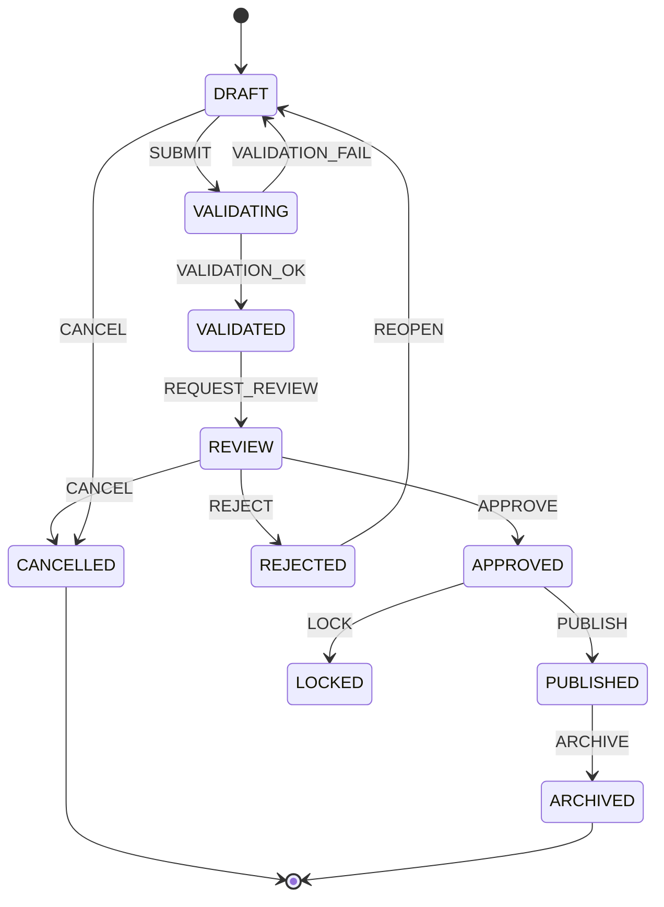

````markdown
# ADR-001: Kontrakty przejść FSM, bezpieczeństwo typów, katalog zagrożeń (V-01–V-09) oraz poziomy izolacji transakcji w RAE-Suite

| Pole | Wartość |
|---|---|
| **Numer** | ADR-001 |
| **Tytuł** | Kontrakty przejść maszyny stanów (FSM), reguły bezpieczeństwa typów, katalog zagrożeń V-01–V-09, poziomy izolacji bazy danych |
| **Status** | Zaakceptowana (Accepted) |
| **Wersja** | 1.1 (po przeglądzie architektonicznym — zob. §6) |
| **Data** | 2025-01-15 |
| **Autorzy** | Zespół Architektury RAE-Suite |
| **Zatwierdzający** | Rada Architektury (RAE-Suite Architecture Board) |
| **Tagi** | fsm, type-safety, security, database, isolation-levels, workflow |

---

## 1. Kontekst

RAE-Suite implementuje procesy biznesowe (rekordy ryzyka, zdarzenia audytowe, wnioski o akceptację) jako obiekty przechodzące przez ściśle zdefiniowany cykl życia. Dotychczasowe podejście — mutowalne pole `status: string` aktualizowane ad-hoc w warstwie serwisowej — doprowadziło do:

- niekontrolowanych przejść stanu (np. `PUBLISHED → DRAFT` bez ścieżki audytu),
- rozjazdu typów między API, domeną i bazą danych,
- wyścigów (race conditions) przy równoległych aktualizacjach tego samego rekordu,
- braku jednoznacznej definicji, kto może wywołać dane przejście i pod jakimi warunkami,
- braku śladu audytowego dla **nieudanych** prób przejść (martwe pole forenzyczne),
- braku ochrony przed powtórzeniem żądania dla przejść nieoznaczonych jako idempotentne.

Niniejszy ADR ustanawia **wiążący kontrakt** dla: (1) definicji i wykonywania przejść FSM, (2) reguł bezpieczeństwa typów obowiązujących w całym stosie, (3) katalogu nazwanych zagrożeń V-01–V-09 wraz z kontrolami mitygującymi, (4) poziomów izolacji transakcji bazodanowych powiązanych z operacjami na FSM.

## 2. Decyzja

### 2.1 Kontrakty przejść FSM

#### 2.1.1 Model stanów

Każdy obiekt domenowy podlegający cyklowi życia (`Entity`) posiada pole `state` typu **zamkniętego wyliczenia** (closed enum), nigdy `string`.



#### 2.1.2 Kontrakt przejścia

Błędy przejść tworzą **zamkniętą, strukturalną hierarchię** — każdy wariant niesie dane diagnostyczne wystarczające do obsługi i audytu bez parsowania komunikatów:

```typescript
// --- Zamknięta hierarchia błędów (T-4, obsługa wyczerpująca wg T-5) ---
type TransitionError =
  | { code: "GUARD_FAILED"; reason: string }
  | { code: "AUTHORIZATION_FAILED"; actorId: ActorId; event: string }
  | { code: "VERSION_CONFLICT"; expected: number; actual: number }
  | { code: "TERMINAL_STATE"; state: TerminalState }
  | { code: "CYCLE_LIMIT_EXCEEDED"; cycleCount: number; limit: number }
  | { code: "PERSISTENCE_ERROR"; dbCode: "40001" | "40P01" | string };

type TransitionResult<S> =
  | { ok: true; nextState: S; effects: DomainEvent[] }
  | { ok: false; error: TransitionError };

// --- Kontekst przejścia: jedyne źródło prawdy dla authorize/guard ---
// Zbudowany wyłącznie przez silnik FSM z danych zaufanych (sesja, DB, zegar systemowy).
interface TransitionContext {
  entityId: EntityId;              // branded type (T-2)
  entityVersion: number;           // wersja odczytana pod blokadą wiersza
  actor: Actor;                    // WYŁĄCZNIE z sesji/tokena — nigdy z payloadu (V-04)
  resource: EntitySnapshot;        // migawka zasobu dla ABAC (ownerId, tenantId, ...)
  timestamp: Instant;              // zegar systemowy wstrzykiwany przez silnik
  idempotencyKey: IdempotencyKey;  // wymagany dla KAŻDEGO przejścia (V-03, zob. p. 8)
  cycleCount: number;              // licznik iteracji cyklu, persistowany w encji (V-09)
}

// --- Kontrakt ---
interface TransitionContract<S extends string, E> {
  from: S | S[];
  to: S;
  event: E;
  authorize(actor: Actor, ctx: TransitionContext): boolean;   // krok 1: RBAC + ABAC na zasobie
  guard(ctx: TransitionContext): boolean;                     // krok 2: warunek domenowy
  apply(entity: Entity<S>, payload: unknown): TransitionResult<S>; // krok 3: czysta funkcja
  cycleLimit?: number;   // OBOWIĄZKOWE, gdy przejście zamyka cykl w grafie (zob. p. 6)
}
```

Przykład autoryzacji opartej na atrybutach zasobu (ABAC):

```typescript
const rejectContract: TransitionContract<"REVIEW", "REJECT"> = {
  from: "REVIEW",
  to: "REJECTED",
  event: "REJECT",
  // recenzent może odrzucić wyłącznie wniosek przypisany do niego
  authorize: (actor, ctx) =>
    actor.hasRole("REVIEWER") && ctx.resource.assigneeId === actor.id,
  guard: (ctx) => ctx.resource.reviewItemsCompleted,
  apply: (entity, payload) => /* ... czysta transformacja ... */,
};
```

**Reguły obligatoryjne dla każdego kontraktu:**

1. **Jawność grafu** — dozwolone przejścia definiowane są w jednej, centralnej tablicy (`TRANSITION_TABLE`); wszelkie przejścia poza tabelą są odrzucane na poziomie silnika FSM (deny-by-default), niezależnie od logiki wywołującej. Tabela `TRANSITION_TABLE` jest jedynym źródłem prawdy, z którego **generowana** jest bazodanowa tabela `fsm_allowed_transitions` (zob. §2.4.6) — eliminuje to rozjazd między aplikacją a DB.
2. **Determinizm** — `apply()` nie wykonuje operacji I/O (baza, HTTP); efekty (zdarzenia domenowe) są zwracane, a nie wykonywane w miejscu — publikacja odbywa się poza transakcją FSM (wzorzec Transactional Outbox, zob. §2.4.4).
3. **Authorize → Guard → Apply** — kolejność weryfikacji jest ustalona i niezmienna. Autoryzacja poprzedza ewaluację guardu, dzięki czemu podmiot bez uprawnień nie może sonduować stanu wewnętrznego encji poprzez różnicowanie odpowiedzi (na poziomie API `AUTHORIZATION_FAILED` dla nieuprawnionego podmiotu jest nierozróżnialny od `NOT_FOUND`).
4. **Wersjonowanie optymistyczne** — każde przejście wymaga podania `expectedVersion`; niezgodność wersji → `TransitionError.VERSION_CONFLICT` z polami `expected`/`actual`, nigdy nie jest cichym no-op.
5. **Ślad audytowy — sukcesy i porażki** — każde skuteczne przejście generuje niemutowalny wpis `transition_log` (append-only): `entity_id`, `from`, `to`, `event`, `actor_id`, `timestamp`, `expected_version`, `resulting_version`, `payload_hash`. Każda **nieudana** próba (guard, autoryzacja, konflikt wersji) generuje wpis `transition_attempts` (append-only): `entity_id`, `from`, `attempted_event`, `error_code`, `actor_id`, `timestamp`, `payload_hash`. Ponieważ transakcja przejścia podlega rollback, wpis do `transition_attempts` wykonywany jest w **osobnej, krótkiej transakcji** po niepowodzeniu; przechowuje wyłącznie hash payloadu (bez danych wrażliwych).
6. **Kontrola cykli** — cykle w grafie (np. `REVIEW → REJECTED → DRAFT → …`) podlegają limitom: licznik `cycleCount` jest **persistowany w stanie encji** i inkrementowany przez każde przejście zamykające cykl; kontrakt takiego przejścia musi definiować `cycleLimit`; przekroczenie → `TransitionError.CYCLE_LIMIT_EXCEEDED`. Dodatkowo obowiązują limity kosztowe i przepustowości (zob. V-09).
7. **Zamknięty zbiór stanów końcowych — obrona w głębi** — `ARCHIVED`, `CANCELLED` są terminalne i wykluczane na trzech niezależnych warstwach: (a) poziom typów — kontraktów wychodzących ze stanów terminalnych nie da się skonstruować (T-8); (b) runtime silnika FSM — `isTerminal(state)` sprawdzane przed dyspozycją zdarzenia; (c) baza danych — trigger `block_terminal_update()` (§2.4.6) jako ostatnia linia obrony przed ad-hoc SQL, migracjami i dostępem z konsoli.
8. **Uniwersalna idempotencja** — **każde** przejście stanu (nie tylko wybrane) wymaga nagłówka `Idempotency-Key`; middleware API odrzuca żądanie bez klucza (`400`). Klucz jest zapisywany w tej samej transakcji co przejście z unikalnym indeksem `(entity_id, idempotency_key)`; konflikt powoduje zwrot **zapamiętanego rezultatu** bez ponownego wykonania efektów (zob. §2.4, wiersz „Idempotency-Key insert").

### 2.2 Reguły bezpieczeństwa typów

| # | Reguła | Uzasadnienie |
|---|---|---|
| T-1 | Stan (`state`) modelowany jako **discriminated union**, nie `string`/`enum` liczbowy. | Wyklucza nielegalne wartości na etapie kompilacji. |
| T-2 | Identyfikatory domenowe używają **branded/opaque types** (`EntityId`, `ActorId`), nie `string` bezpośrednio. | Zapobiega przypadkowej podmianie ID między typami encji (type confusion, V-07). |
| T-3 | Wejście z granic systemu (API, kolejka, DB) walidowane schematem (np. Zod/io-ts) **przed** rzutowaniem na typ domenowy. Brak `as`/`unsafe cast`. Schematy w trybie `strict()` odrzucają nieznane pola. | Typ statyczny ≠ gwarancja poprawności danych w runtime na granicy procesu; strict mode mityguje V-04. |
| T-4 | Funkcje przejść zwracają `Result<T, E>` / dyskryminowany union błędów — **zakaz** rzucania wyjątków dla błędów przewidywalnych. Union błędów (`TransitionError`) musi być obsłużony **wyczerpująco** w punkcie wywołania. | Wymusza świadomą obsługę każdego wariantu błędu; nowy wariant błędu = błąd kompilacji w miejscach obsługi. |
| T-5 | Każdy `switch`/`match` po polu `state`, `event` lub `error.code` musi być **exhaustive** — kompilator wymusza obsługę wszystkich wariantów (asercja `never` w gałęzi `default`). | Dodanie nowego stanu/błędu bez aktualizacji logiki powoduje błąd kompilacji, nie błąd produkcyjny. |
| T-6 | Obiekty encji są **niemutowalne** (`readonly`, `Object.freeze` w runtime dla payloadów krytycznych); przejście tworzy nową instancję. | Eliminuje mutacje częściowe i niekonsystentne stany pośrednie (V-05). |
| T-7 | Typy DTO API i typy domenowe są **rozłączne** i mapowane explicite (anti-corruption layer) — zakaz reużycia typu domenowego jako typu odpowiedzi HTTP. **Wymuszenie:** reguła lint/architecture-test blokująca import typów domenowych w warstwie API; DTO definiowane schematami Zod z `.strict()` i `.brand<...>()`. | Zmiana modelu domenowego nie łamie kontraktu API w sposób niewidoczny; reguła jest egzekwowana automatycznie, nie konwencją. |
| T-8 | Stany terminalne modelowane tak, by kontrakty przejść wychodzących z nich **nie mogły zostać skonstruowane** w systemie typów (np. `TransitionContract<never, TerminalEvent>`), **oraz** egzekwowane w runtime: check `isTerminal()` w silniku FSM i trigger DB (§2.4.6). | Typy same nie chronią przed ad-hoc SQL, migracjami ani dostępem serwisowym — wymagana obrona w głębi. |
| T-9 | `unknown` dozwolony wyłącznie na granicy deserializacji; propagacja `any` w kodzie domenowym jest zabroniona i wymuszana przez lint (`noImplicitAny`, `no-explicit-any`). | Zapobiega utracie gwarancji typowych w głębi wywołań. |

Przykład wymuszenia T-3/T-7 na granicy API:

```typescript
const TransitionRequestDTO = z.object({
  entityId: z.string().uuid().brand<"EntityId">(),
  event: z.enum(FSMEvents),
  expectedVersion: z.number().int().nonnegative(),
  payload: z.unknown(),          // walidowany dalej per-kontrakt
}).strict();                     // odrzuca nieznane pola (V-04)
```

### 2.3 Katalog nazwanych zagrożeń (V-01–V-09)

Zagrożenia odnoszą się do warstwy FSM/workflow i są śledzone w rejestrze ryzyka RAE-Suite. Format oceny: **Wpływ / Prawdopodobieństwo** (Niski/Średni/Wysoki).

| ID | Nazwa | Opis | Wektor | Wpływ/Prawdop. | Kontrola mitygująca |
|---|---|---|---|---|---|
| **V-01** | Nielegalne przejście stanu (State Bypass) | Wywołanie przejścia niewystępującego w `TRANSITION_TABLE` poprzez bezpośrednią manipulację warstwą persystencji lub pominięcie silnika FSM. | Bezpośredni zapis do DB, wywołanie prywatnego API. | Wysoki/Średni | §2.1.2 p.1 (deny-by-default); brak grantów `UPDATE` na `state` poza rolą serwisową FSM (§2.4.5); trigger `enforce_transition_table()` walidujący parę `(OLD.state, NEW.state)` względem `fsm_allowed_transitions` (§2.4.6). |
| **V-02** | Wyścig przy współbieżnych przejściach (TOCTOU) | Dwa równoczesne żądania odczytują ten sam stan i wykonują sprzeczne przejścia, z których jedno "wygrywa" bez wykrycia konfliktu. | Równoczesne żądania API na tym samym `entity_id`. | Wysoki/Wysoki | Optymistyczna kontrola wersji (§2.1.2 p.4) + `SELECT ... FOR UPDATE` (§2.4.2); `SERIALIZABLE` dla operacji wieloencyjnych. |
| **V-03** | Powtórzenie zdarzenia (Replay / Double Submission) | Ponowne wysłanie tego samego żądania przejścia (np. retry sieciowy) powoduje podwójne wykonanie efektu (np. dwukrotna publikacja). | Retry klienta, duplikacja w kolejce komunikatów. | Średni/Wysoki | **Uniwersalny** `Idempotency-Key` dla każdego przejścia (§2.1.2 p.8); unikalny indeks `(entity_id, idempotency_key)`; konflikt → zwrot zapamiętanego rezultatu; konsumenci outbox idempotentni wg `event_id` (§2.4.4). |
| **V-04** | Eskalacja uprawnień przez manipulację payloadem przejścia | Payload przejścia zawiera pola nadpisujące kontekst autoryzacji (np. `actorRole` w body żądania). | Manipulacja JSON w żądaniu HTTP. | Wysoki/Niski | `authorize()` korzysta wyłącznie z `TransitionContext` zbudowanego z sesji/tokena, nigdy z payloadu; walidacja schematu odrzuca nieznane pola (T-3, strict mode). |
| **V-05** | Wyciek/uszkodzenie danych przez niekonsystentny stan pośredni | Częściowa mutacja encji w trakcie wykonywania przejścia (np. awaria po zapisie części pól) prowadzi do nieautoryzowanego stanu widocznego dla innych transakcji. | Awaria procesu, brak atomowości. | Wysoki/Niski | Niemutowalność (T-6); pojedyncza transakcja atomowa na przejście (§2.4.1); brak odczytów `READ UNCOMMITTED`. |
| **V-06** | Zakleszczenie / zagłodzenie przy blokadach (Deadlock/Starvation) | Wielokrotne blokady `FOR UPDATE` na powiązanych encjach w różnej kolejności powodują deadlock lub długie kolejkowanie. | Wysoka współbieżność na tych samych rekordach. | Średni/Średni | Ustalony globalny porządek pozyskiwania blokad (sortowanie po `entity_id`); `lock_timeout`; retry z backoff wyłącznie dla `40P01`/`40001` (§2.4.3). |
| **V-07** | Pomylenie typów (Type Confusion) między API a domeną | ID lub payload jednego typu encji zaakceptowany jako inny typ z powodu strukturalnej zgodności typów. | Błędna integracja, refaktoryzacja bez branded types. | Wysoki/Niski | Branded types (T-2); rozłączne DTO/domena z automatycznym wymuszeniem (T-7). |
| **V-08** | Utrata integralności audytu | Modyfikacja lub usunięcie wpisu audytowego albo brak zapisu nieudanej próby, uniemożliwiający rekonstrukcję historii decyzji i wykrycie sonowania. | Nadużycie uprawnień administracyjnych, błąd operacyjny, atakujący zacierający ślady. | Wysoki/Niski | Tabele `transition_log` i `transition_attempts` append-only (brak grantów `UPDATE`/`DELETE` dla wszystkich ról aplikacyjnych, §2.4.5); logowanie **nieudanych** prób (§2.1.2 p.5); opcjonalny hash-chaining wpisów. |
| **V-09** | Odmowa usługi przez cykle przejść (Transition Loop DoS) | Automatyzacja (bot, błędna integracja) wykonuje cykliczne przejścia generując nadmierne obciążenie i szum audytowy. | Zautomatyzowany klient API. | Średni/Średni | Persistowany `cycleCount` + obowiązkowy `cycleLimit` w kontrakcie (§2.1.2 p.6); **ważony koszt przejść** (np. `REOPEN` = 5 jednostek) z budżetem per encja; rate-limiting per `(actor_id, entity_type)`; **circuit breaker** po N cyklach/minutę; alarmowanie przy przekroczeniu progu w `transition_log`. |

**Zasada śledzenia:** każda nowa funkcjonalność dotykająca FSM musi w opisie PR wskazać, które z V-01–V-09 dotyczy i jaką kontrolę zastosowano lub odziedziczono.

### 2.4 Poziomy izolacji transakcji bazodanowych

Silnik bazy danych: **PostgreSQL ≥ 14**. Poziomy izolacji przypisane per typ operacji:

| Operacja | Poziom izolacji | Mechanizm blokowania | Uzasadnienie |
|---|---|---|---|
| **Wykonanie przejścia FSM** (`apply` + zapis stanu + `transition_log`) | `REPEATABLE READ` + jawny `SELECT ... FOR UPDATE` na wierszu encji | Blokada wierszowa + kontrola `expected_version` (CAS) | Gwarantuje, że odczyt stanu i zapis nowego stanu widzą ten sam snapshot; eliminuje V-02. `SERIALIZABLE` używane wyłącznie dla przejść dotykających ≥2 encji (transfer/relacje). |
| **Operacje wieloencyjne** (np. przejście kaskadowe rodzic-dziecko) | `SERIALIZABLE` | Predykatowe blokady silnika (SSI) | Zapobiega anomaliom write-skew między powiązanymi encjami; wymaga obsługi `40001 serialization_failure` z retry (§2.4.3). |
| **Odczyty w API (GET, listing)** | `READ COMMITTED` (domyślny) | Brak blokad | Wystarczające dla odczytów niekrytycznych; brak ryzyka spójności decyzyjnej. |
| **Raportowanie / analityka** | `REPEATABLE READ` na dedykowanej replice (read-only) | Snapshot | Izolacja od ruchu transakcyjnego OLTP; brak wpływu na blokady produkcyjne. |
| **Zapis `transition_log`** | Ta sama transakcja co przejście (atomowość) | — | Log i stan muszą być commitowane razem (all-or-nothing) — brak logu bez zmiany stanu i odwrotnie. |
| **Zapis `transition_attempts`** | Osobna krótka transakcja po niepowodzeniu | — | Główna transakcja podlega rollback; nieudana próba musi pozostawić ślad (V-08). |
| **Idempotency-Key insert** (V-03) | W tej samej transakcji co przejście, unikalny indeks | `ON CONFLICT DO NOTHING` + odczyt istniejącego rezultatu | Zapewnia atomowe „check-then-act" bez okna na duplikat; replay zwraca zapamiętany rezultat. |

#### 2.4.1 Zasada „jedna transakcja na przejście"

Wykonanie przejścia FSM jest zawsze pojedynczą transakcją bazodanową obejmującą: odczyt z blokadą → walidację wersji → zapis nowego stanu → zapis `transition_log` → zapis klucza idempotencji z rezultatem → zapis rekordu do tabeli outbox. Commit wszystkiego albo rollback wszystkiego.

#### 2.4.2 Wzorzec blokady

```sql
BEGIN;
SELECT id, state, version
  FROM entities
 WHERE id = $1
   FOR UPDATE;

-- autoryzacja i guard w aplikacji, na świeżym kontekście --

UPDATE entities
   SET state = $2, version = version + 1, updated_at = now()
 WHERE id = $1 AND version = $3;   -- optimistic check jako podwójna gwarancja

-- 0 wierszy zmienionych => VERSION_CONFLICT --

INSERT INTO transition_log (...) VALUES (...);
INSERT INTO idempotency_keys (entity_id, idempotency_key, result) VALUES (...)
  ON CONFLICT (entity_id, idempotency_key) DO NOTHING;
INSERT INTO outbox (...) VALUES (...);
COMMIT;
```

#### 2.4.3 Retry przy `serialization_failure` / `deadlock_detected`

Warstwa dostępu do danych implementuje automatyczny retry (max 3 próby, backoff wykładniczy) wyłącznie dla kodów `40001` i `40P01`; inne błędy propagowane są jako `TransitionError.PERSISTENCE_ERROR`. **Krytyczne:** każda próba retry odbudowuje `TransitionContext` i **ponownie waliduje autoryzację, guard i inwarianty biznesowe** — snapshot z poprzedniej próby mógł zostać unieważniony przez współbieżną transakcję. Błędy domenowe (`GUARD_FAILED`, `VERSION_CONFLICT`, …) nigdy nie są retry-owane.

```typescript
async function executeTransition(cmd: TransitionCommand): Promise<TransitionResult<State>> {
  return withRetry(
    { maxAttempts: 3, backoff: "exponential", retryOn: ["40001", "40P01"] },
    () =>
      db.transaction(isolationFor(cmd), async (tx) => {
        const entity = await lockAndLoad(tx, cmd.entityId);   // SELECT ... FOR UPDATE
        const ctx = buildContext(entity, cmd);                // świeży kontekst przy KAŻDEJ próbie
        const result = fsmEngine.dispatch(entity, cmd.event, ctx); // authorize → guard → apply
        if (!result.ok) return result;                        // błąd domenowy: bez retry
        await persistAll(tx, entity, result, ctx);            // stan + log + idempotency + outbox
        return result;
      }),
  );
}
```

#### 2.4.4 Wzorzec Transactional Outbox

Zdarzenia domenowe (efekty przejścia) nie są publikowane bezpośrednio do brokera w trakcie transakcji FSM — zapisywane są do tabeli `outbox` w tej samej transakcji, a osobny proces (relay) publikuje je asynchronicznie z gwarancją *at-least-once*. Eliminuje to niekonsystencję między stanem bazy a systemami zewnętrznymi (dual-write problem).

**Wymagania niezawodnościowe:**

- każde zdarzenie posiada unikalny `event_id` (UUID) generowany w momencie zapisu do outbox;
- **konsumenci muszą być idempotentni** — deduplikacja po `event_id` (at-least-once oznacza, że duplikaty *wystąpią*);
- tabela `outbox` zawiera kolumny `delivery_attempts` i `last_error` dla obserwowalności relayu; po przekroczeniu progu prób rekord trafia do kolejki martwej (DLQ) z alarmem.

#### 2.4.5 Uprawnienia bazodanowe

- Rola aplikacyjna `rae_fsm_service` — jedyna z prawem `UPDATE` na kolumnie `state`/`version` w `entities`.
- Rola `rae_readonly` — wyłącznie `SELECT`, używana przez usługi raportujące.
- Tabele `transition_log` i `transition_attempts` — brak grantów `UPDATE`/`DELETE` dla wszystkich ról aplikacyjnych; wyłącznie `INSERT` i `SELECT` (mitygacja V-08).
- Tabela `fsm_allowed_transitions` — `SELECT` dla ról aplikacyjnych; zapis wyłącznie przez migracje (generowana z `TRANSITION_TABLE`, §2.1.2 p.1).

#### 2.4.6 Obrona w głębi na poziomie bazy danych

Triggery stanowią ostatnią linię obrony (ad-hoc SQL, migracje, dostęp serwisowy) — nie zastępują silnika FSM, lecz czynią ominięcie go niemożliwym bez błędu:

```sql
-- Blokada przejść wychodzących ze stanów terminalnych (T-8, V-01)
CREATE FUNCTION block_terminal_update() RETURNS trigger AS $$
BEGIN
  IF OLD.state IN ('ARCHIVED', 'CANCELLED') THEN
    RAISE EXCEPTION 'ILLEGAL_TRANSITION_FROM_TERMINAL_STATE';
  END IF;
  RETURN NEW;
END;
$$ LANGUAGE plpgsql;

CREATE TRIGGER trg_block_terminal
  BEFORE UPDATE OF state ON entities
  FOR EACH ROW EXECUTE FUNCTION block_terminal_update();

-- Walidacja pary (from, to) względem tabeli dozwolonych przejść (V-01)
CREATE FUNCTION enforce_transition_table() RETURNS trigger AS $$
BEGIN
  IF NEW.state IS DISTINCT FROM OLD.state AND NOT EXISTS (
    SELECT 1 FROM fsm_allowed_transitions t
     WHERE t.entity_type = TG_ARGV[0]
       AND t.from_state  = OLD.state
       AND t.to_state    = NEW.state
  ) THEN
    RAISE EXCEPTION 'ILLEGAL_STATE_TRANSITION: % -> %', OLD.state, NEW.state;
  END IF;
  RETURN NEW;
END;
$$ LANGUAGE plpgsql;

CREATE TRIGGER trg_enforce_transitions
  BEFORE UPDATE OF state ON entities
  FOR EACH ROW EXECUTE FUNCTION enforce_transition_table('risk_record');
```

## 3. Konsekwencje

**Pozytywne:**
- Statyczna eliminacja klasy błędów związanych z nielegalnymi przejściami i pomyleniem typów (V-01, V-07), wsparta obroną w głębi na poziomie DB.
- Jednoznaczny, testowalny kontrakt przejść ze strukturalnymi błędami — ułatwia code review, obsługę błędów i audyt zgodności.
- Odtwarzalna, niemutowalna historia decyzji biznesowych **wraz z nieudanymi próbami** — pełne pokrycie forenzyczne (V-08).
- Przewidywalne zachowanie pod współbieżnością dzięki jednoznacznym poziomom izolacji i bezpiecznemu retry z rewalidacją inwariantów.
- Odporność na replay i DoS: uniwersalna idempotencja (V-03), limity cykli z kosztami i circuit breakerem (V-09).

**Negatywne / koszty:**
- Wyższy koszt wstępny implementacji (silnik FSM, generowanie typów, testy exhaustive, triggery DB).
- Retry na `SERIALIZABLE` wymaga dodatkowej logiki i dyscypliny rewalidacji inwariantów przy każdej próbie.
- Odczyt raportowy z repliki wprowadza opóźnienie (eventual consistency) dla widoków analitycznych.
- Uniwersalne klucze idempotencji, `transition_attempts` i outbox zwiększają zużycie pamięci trwałej i wymagają polityk retencji/archiwizacji.
- Triggery DB i tabela `fsm_allowed_transitions` muszą być utrzymywane w synchronizacji z `TRANSITION_TABLE` — ryzyko mitygowane generowaniem z jednego źródła prawdy w migracjach.
- Wymaganie `Idempotency-Key` obciąża klientów API koniecznością generowania i przechowywania kluczy przy retry.

## 4. Rozważane alternatywy

| Alternatywa | Powód odrzucenia |
|---|---|
| Zewnętrzny silnik workflow (np. Camunda/Temporal) | Nadmiarowa złożoność operacyjna dla obecnej skali; zależność od dodatkowej infrastruktury; utrata pełnej kontroli nad kontraktami typów. |
| Wymuszanie przejść wyłącznie triggerami DB (bez silnika w aplikacji) | Logika biznesowa (authorize/guard) trudna do testowania i wersjonowania w SQL; brak spójności z systemem typów. Triggery przyjęte wyłącznie jako **obrona w głębi** (§2.4.6), nie jako nosiciel logiki. |
| `READ COMMITTED` dla wszystkich operacji FSM | Niewystarczające dla eliminacji V-02 (write skew) bez dodatkowych blokad jawnych — odrzucone jako niewystarczające samodzielnie. |
| Idempotency-key tylko dla przejść oznaczonych flagą | Pozostawia lukę replay dla przejść „nieidempotentnych" (V-03); przyjęto model uniwersalny (§2.1.2 p.8). |
| Logowanie wyłącznie skutecznych przejść | Brak śladu nieudanych prób uniemożliwia wykrycie sondowania i ataków (V-08) — przyjęto dwie tabele append-only. |

## 5. Odniesienia

- Rejestr ryzyka RAE-Suite — sekcja V-01–V-09 (dokument wewnętrzny SEC-REG-014).
- Styleguide TypeScript RAE-Suite — reguły T-1–T-9 (DEV-STD-007).
- PostgreSQL Documentation: *Transaction Isolation* (rozdz. 13.2).
- Wzorzec Transactional Outbox — wewnętrzny wzorzec integracyjny INT-PAT-003.
- Protokół z przeglądu architektonicznego ADR-001 (uwagi włączone w wersji 1.1) — ARCH-REV-2025-003.

## 6. Historia zmian

| Wersja | Data | Zakres |
|---|---|---|
| 1.0 | 2025-01-15 | Wersja początkowa. |
| 1.1 | 2025-01-22 | Po przeglądzie Rady Architektury: (1) strukturalna hierarchia `TransitionError` i jawny `TransitionContext` z zasobem dla ABAC; (2) zmiana kolejności weryfikacji na **Authorize → Guard → Apply** (eliminacja wycieku stanu przez różnicowanie błędów); (3) uniwersalne klucze idempotencji dla wszystkich przejść; (4) logowanie nieudanych prób (`transition_attempts`); (5) obrona w głębi stanów terminalnych i tabeli przejść na poziomie DB (triggery §2.4.6); (6) rewalidacja inwariantów przy retry `SERIALIZABLE`; (7) wymagania idempotentnych konsumentów i obserwowalności outbox; (8) rozszerzone kontrole V-09 (koszty przejść, rate-limiting, circuit breaker); (9) automatyczne wymuszenie T-7 (lint/arch-test, Zod strict+brand); (10) persistowany licznik cykli z obowiązkowym `cycleLimit`. |
````