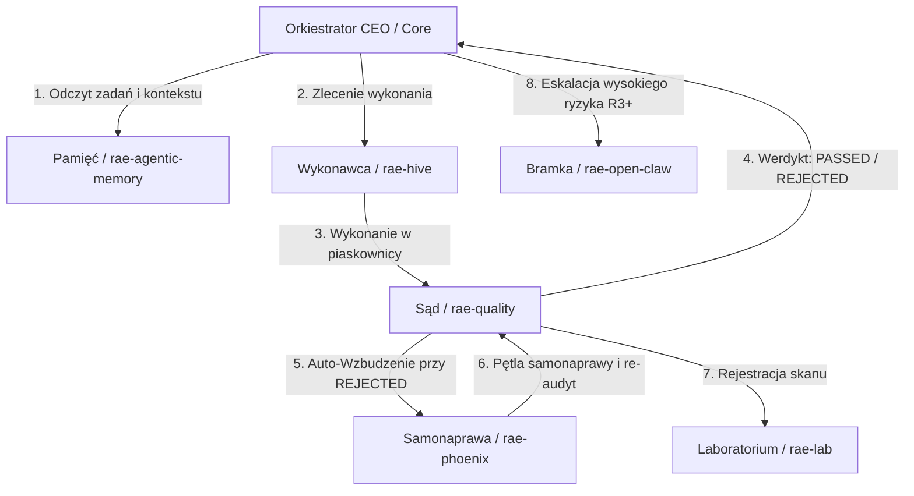

# Audyt Techniczny i Funkcjonalny RAE-Suite (Silicon Oracle v5.0)
## Część 9: Interakcje między Modułami (Agent-to-Agent Interactions)

---

## 1. Architektura Komunikacji w RAE-Suite

Komunikacja między modułami w suicie RAE jest w pełni zdecentralizowana i opiera się na dwóch głównych protokołach:
1.  **FastAPI HTTP Bridge (REST):** Używany do synchronicznej komunikacji wewnętrznej w sieci Docker (`rae-internal`) na dedykowanych portach kontenerów.
2.  **MCP (Model Context Protocol):** Używany do dynamicznej wymiany narzędzi i kontekstu pomiędzy jądrem systemu a modelami językowymi.

Poniższy diagram Mermaid przedstawia mapę przepływu danych i pętle sterowania w suicie RAE:

---

## 2. Kluczowe Przepływy i Wyzwalacze (Triggers)

### A. Pętla Jakości i Samonaprawy (Quality $\rightarrow$ Phoenix $\rightarrow$ Quality)
Jest to najbardziej krytyczna i dynamiczna pętla w całym systemie:
*   **Wyzwalacz (Trigger):** Zapisanie przez dewelopera lub agenta kodu, który nie spełnia norm bezpieczeństwa, asercji testowych lub poziomu seniority w `rae-quality`.
*   **Przepływ:**
    1.  `QualitySentinel` odrzuca kod i wylicza uzasadnienie (np. "Brak typowania parametrów w linii 12").
    2.  Quality Sentinel wysyła zapytanie POST do `rae-phoenix` na endpoint `/v2/phoenix/repair` wraz z kodem źródłowym i raportem błędów.
    3.  `PhoenixRefactorer` analizuje AST, wybiera wtyczkę refaktoryzacyjną, generuje poprawkę (patch) i wysyła zmieniony kod z powrotem do `rae-quality` na endpoint `/v2/quality/audit`.
    4.  Pętla ta wykonuje się maksymalnie do `5` prób, dopóki kod nie otrzyma statusu `PASSED` i oceny seniority $\ge 0.90$. W przeciwnym razie następuje rollback.

### B. Cykl Orkiestracji CEO (CEO $\rightarrow$ Memory $\rightarrow$ Hive)
*   **Wyzwalacz (Trigger):** Cykliczny tick demona orkiestracji (co 60 sekund).
*   **Przepływ:**
    1.  Orkiestrator pyta bazę PostgreSQL (`rae-agentic-memory`) o najnowsze zadania z backlogu.
    2.  Przekazuje zadanie do `AutonomyKernel`, który klasyfikuje poziom ryzyka (`RiskClass`).
    3.  Jeśli ryzyko wynosi `R0`-`R2`, zadanie jest delegowane do `rae-hive` w celu wykonania w piaskownicy Docker bez dostępu do sieci.
    4.  Jeśli ryzyko wynosi `R3` lub więcej, jądro wymusza utworzenie gałęzi Git przez `GitOpsDaemon` i kieruje zadanie do dwuetapowej akceptacji użytkownika.

### C. Eskalacja do OpenClaw (Core $\rightarrow$ OpenClaw $\rightarrow$ Operator)
*   **Wyzwalacz (Trigger):** Wykrycie w jądrze operacji o klasyfikacji ryzyka `RiskClass.R3` lub wyższej (np. próba modyfikacji konfiguracji systemowej lub użycie niedozwolonych narzędzi w kontrakcie).
*   **Przepływ:**
    1.  `AutonomyKernel` wstrzymuje wykonanie zadania (stan `NEEDS_APPROVAL`).
    2.  Wywołuje CLI OpenClaw (`node dist/index.js agent`), przekazując intencję operacji.
    3.  OpenClaw wysyła wiadomość interaktywną na WhatsApp/Slack do operatora.
    4.  Oczekiwanie na odpowiedź operatora (`yes` / `no`). Jeśli operator zatwierdzi, jądro wznawia proces.

---

## 3. Szczegóły Techniczne Endpointów i Portów

Wewnętrzne API Docker komunikuje się za pośrednictwem sieci `rae-internal` na poniższych adresach:

*   **Pamięć poznawcza (`rae-memory`):** `http://rae-memory:8000`
    *   `/v2/memories` (Zapis/odczyt wspomnień wektorowych i relacyjnych).
    *   `/v2/bridge/interact` (Punkt routowania zdarzeń A2A i logowania epizodycznego).
    *   `/v2/mesh/sync` (Synchronizacja P2P między węzłami).
*   **Strażnik Jakości (`rae-quality`):** `http://rae-quality:8010`
    *   `/v2/quality/audit` (Ewaluacja poprawności kodu i ocena seniority).
*   **Planista Phoenix (`rae-phoenix`):** `http://rae-phoenix:8012`
    *   `/v2/phoenix/repair` (Uruchomienie pętli samonaprawy kodu).
*   **Laboratorium (`rae-lab`):** `http://rae-lab:8011`
    *   `/api/scan` (Rejestracja wyników audytów i gromadzenie telemetrii).
*   **Wykonawca Hive (`rae-hive`):** `http://rae-hive:8013`
    *   Udostępnia połączenie MCP SSE `/mcp/sse` oraz `/mcp/messages`.
