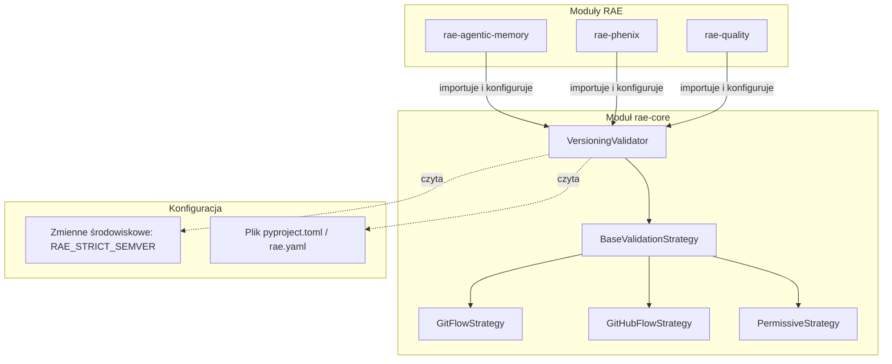

# Strategia Wersjonowania i Model Branchowania (Git Flow & SemVer 2.0.0)
## Rozszerzenie Architektury dla RAE Suite (Open-Source & Modułowość)

Dokument opisuje zunifikowany standard numerowania wersji i zarządzania gałęziami (branchami) we wszystkich projektach ekosystemu **Silicon Oracle / Dreamsoft Factory**, w szczególności w otwartym systemie **RAE Suite**. 

---

## 1. Czy to nadmiarowa inżynieria? (Ocena Architektoniczna)
**Nie, to nie jest nadmiarowa inżynieria.** W kontekście projektu o charakterze open-source, modularnego i dystrybuowanego niezależnie:
* **Monolityczne, sztywne wdrożenie** walidacji Git Flow byłoby błędem projektowym (zablokowałoby zewnętrznych kontrybutorów używających np. *GitHub Flow* lub *Trunk-Based Development*).
* **Elastyczna, konfigurowalna walidacja** (oparta o wzorzec strategii oraz poziomy rygorystyczności) jest **niezbędną inżynierią systemową**, która gwarantuje wysoką jakość kodu w naszym zespole, jednocześnie zachowując pełną kompatybilność i otwartość dla społeczności open-source.

---

## 2. Aktualizacja Planu: Architektura Walidacji w RAE Suite

Wdrażamy architekturę opartą na trzech filarach: **Wzorzec Strategii (Strategy Pattern)**, **Decentralizacja (Modułowość)** oraz **Poziomy Rygoru (Enforcement Levels)**.



### Filar I: Wzorzec Strategii (Pluggable Strategies)
Walidator gałęzi w RAE Core nie jest zakodowany na sztywno pod jeden przepływ. Obsługuje on różne strategie weryfikacji:
1. **`GitFlowStrategy`** (Domyślna dla zespołu Dreamsoft):
   - Wymaga gałęzi: `develop`, `master`/`main`, `feature/*`, `bugfix/*`, `release/X.Y.Z`, `hotfix/X.Y.Z`.
   - Wymusza SemVer dla wersji wydań na `release/` i `hotfix/`.
2. **`GitHubFlowStrategy`**:
   - Wymaga gałęzi: `master`/`main` oraz gałęzi deweloperskich o dowolnych nazwach (lub z prostym prefiksem).
   - Wersjonowanie opiera się głównie o tagi wydań na głównej gałęzi.
3. **`PermissiveStrategy`** (Domyślna dla środowisk zewnętrznych):
   - Nie blokuje żadnych nazw gałęzi. Skanuje kod wyłącznie diagnostycznie, zgłaszając sugestie w logach.

### Filar II: Poziomy Rygoru (Enforcement Levels)
Walidacja może działać w dwóch trybach kontrolowanych zmienną środowiskową `RAE_STRICT_SEMVER` (lub konfiguracją projektu):
* **Tryb `WARN` (Permissive - Domyślny dla Open-Source)**:
  - Niezgodności z zadeklarowaną strategią są wypisywane w logach jako ostrzeżenia (`WARNING`).
  - Uruchomienie aplikacji oraz testy przechodzą pomyślnie (nie blokuje pracy zewnętrznym programistom).
* **Tryb `STRICT` (Strict - Włączony dla naszego zespołu i CI/CD)**:
  - Każde wykrycie nieprawidłowej struktury wersji lub niezgodności z Git Flow przerywa uruchomienie modułu (`sys.exit(1)` lub rzuca `ValidationError`).
  - Aktywowany w środowiskach wewnętrznych przez ustawienie:
    ```bash
    export RAE_STRICT_SEMVER=true
    ```

### Filar III: Decentralizacja (Module-level contracts)
Każdy moduł (np. `rae-agentic-memory`, `rae-quality`) jest niezależny i może wywołać walidację autonomicznie podczas swojej inicjalizacji (`__init__.py`) lub w testach integracyjnych.

Każdy moduł odczytuje plik konfiguracyjny (np. sekcja `[tool.rae.versioning]` w `pyproject.toml` danego modułu):
```toml
[tool.rae.versioning]
strategy = "git-flow"          # Wartości: git-flow, github-flow, permissive
strict_mode = false            # Lokalne nadpisanie poziomu rygoru
exclude_branches = ["legacy-*"] # Wykluczenia ze sprawdzania
```

---

## 3. Implementacja w Kodzie

### 3.1. Klasa Walidatora w `rae-core` (`rae_core/governance/versioning.py`)
`rae-core` udostępnia klasę `VersioningValidator`, która wczytuje konfigurację modułu i wykonuje walidację:

```python
import os
import re
import sys
import logging
from typing import Tuple, List

class VersioningValidator:
    def __init__(self, project_path: str, module_name: str):
        self.project_path = project_path
        self.module_name = module_name
        self.logger = logging.getLogger(f"rae.validator.{module_name}")
        self.config = self._load_config()

    def _load_config(self) -> dict:
        # Wczytanie konfiguracji z pyproject.toml lub słownik domyślny
        # Domyślnie dla open-source: permissive, chyba że ustawiono RAE_STRICT_SEMVER
        is_strict = os.getenv("RAE_STRICT_SEMVER", "false").lower() == "true"
        default_strategy = "git-flow" if is_strict else "permissive"
        return {
            "strategy": default_strategy,
            "strict": is_strict
        }

    def validate(self) -> bool:
        strategy_name = self.config.get("strategy", "permissive")
        is_strict = self.config.get("strict", False)
        
        # Pobranie bieżącej gałęzi gita w module
        branch = self._get_current_branch()
        if not branch:
            return True # Brak gita (np. dystrybucja pypi/docker) -> walidacja pomijana

        # Wykonanie sprawdzenia według wybranej strategii
        is_valid, msg = self._check_rules(branch, strategy_name)
        if not is_valid:
            if is_strict:
                self.logger.critical(f"❌ RAE CONTRACT VIOLATION [{self.module_name}]: {msg}")
                sys.exit(1)
            else:
                self.logger.warning(f"⚠️ RAE Contract Suggestion [{self.module_name}]: {msg}")
                
        return is_valid
```

### 3.2. Wywołanie w Modułach
Każdy niezależny moduł (np. `rae-agentic-memory`) importuje walidator i uruchamia go w punkcie wejścia aplikacji lub w bazie testowej, aby upewnić się, że praca deweloperska przebiega prawidłowo:

```python
# rae_agentic_memory/__init__.py lub testy zdrowotne (conftest.py)
import os
try:
    from rae_core.governance.versioning import VersioningValidator
    validator = VersioningValidator(
        project_path=os.path.dirname(os.path.abspath(__file__)),
        module_name="rae-agentic-memory"
    )
    validator.validate()
except ImportError:
    # Umożliwia działanie modułu nawet bez zainstalowanego rae-core (jeśli mockowany)
    pass
```
