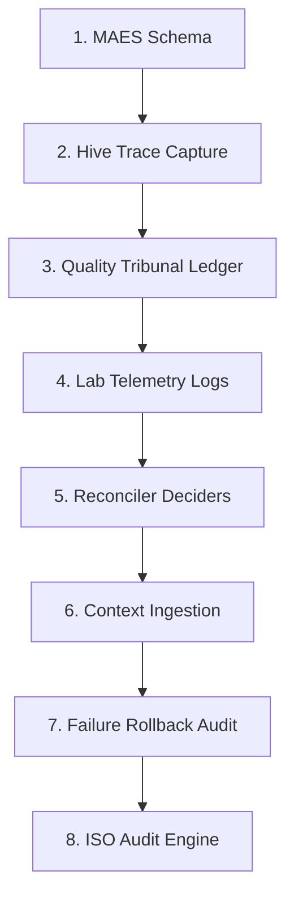

# Strategic Plan: RAE-Suite Autonomy & Absolute Auditability Upgrade (v1.0)
## Target Standard: ISO 27001 & ISO 42001 Auditable Autonomy
**Codename: Oracle Sentinel**

This strategic plan outlines the **8-stage upgrade** to maximize the autonomy of all RAE-Suite modules (`rae-core`, `rae-hive`, `rae-quality`, `rae-lab`, `rae-phoenix`, and `rae-suite`'s orchestrator) while enforcing **absolute auditability**. Under this plan, every module is legally bound to ingest and reflect a standardized *Minimum Auditable Event Schema (MAES)* to the `RAE-agentic-memory` cognitive layers before and after any autonomous action.

> [!IMPORTANT]
> **Cardinal RAE-First Rule (No Evidence, No Autonomy):**
> Any action taken by an agent without a corresponding cryptographic trace in `RAE-agentic-memory` is a compliance violation. Autonomy is gated by auditability.

---

## 📊 The 8-Stage Upgrade Path



### Stage 1: Enforce the Minimum Auditable Event Schema (MAES)
*   **Objective:** Define and enforce a rigid contract for cognitive logging across all RAE-Suite modules.
*   **Technical Specification:** Every module must utilize a common validator in `rae-contracts` requiring the following metadata payload when calling `RAEMemoryBridge`:
    ```python
    class MinimumAuditableEvent(BaseModel):
        schema_version: str = "1.0"
        trace_id: str = Field(..., description="UUID or deterministic SHA-256 bound to transaction")
        module_id: str = Field(..., description="E.g., 'rae-hive', 'rae-quality'")
        risk_class: RiskClass = Field(..., description="Class R0 to R6")
        action: str = Field(..., description="The exact operation name")
        payload: Dict[str, Any] = Field(..., description="Full contextual JSON payload")
        signature: str = Field(..., description="Cryptographic SHA-256 of payload + trace_id")
        timestamp: datetime = Field(default_factory=lambda: datetime.now(timezone.utc))
        human_label: str = Field(..., description="Auditable, human-scannable label describing the action")
    ```
*   **Verification:** Add strict schema validation directly into the `RAEMemoryBridge.log_decision` interface.

---

### Stage 2: RAE-Hive Sandbox & Build Auditing (Sterile Trace Capture)
*   **Objective:** Prevent "blind execution" in sandboxes. Ensure every build, file write, or test run is recorded.
*   **Implementation Steps:**
    *   Update [hive_engine.py](file:///home/grzegorz-lesniowski/cloud/RAE-Suite/packages/rae-hive/hive_engine.py) to capture standard outputs (`stdout`, `stderr`) of every Docker container or Git worktree execution.
    *   Package execution outputs as an `EvidencePack`.
    *   Calculate the SHA-256 hash of the evidence pack and write it to RAE's **episodic memory layer** with a high-impact audit classification (`R2` or `R3`).
    *   *Audit Requirement:* Every sandbox execution must link to its parent `trace_id`.

---

### Stage 3: RAE-Quality Tribunal & AST Governance Auditing
*   **Objective:** Log all quality score recalculations, McCabe complexity scans, static analysis metrics, and `TestIntegrityGuard` actions.
*   **Implementation Steps:**
    *   Modify RAE-Quality Sentinel [main.py](file:///home/grzegorz-lesniowski/cloud/RAE-Suite/packages/rae-quality/main.py) to write every `QualityGateResult` object to RAE's **episodic memory layer**.
    *   If `TestIntegrityGuard` flags an assertion weakening attempt, register a `Quarantine Event` (R6 risk class) in the reflective layer.
    *   Record baseline code metrics (coverage ratios, security logs) directly in RAE's **semantic memory layer** to ensure other agents can consult these standards (Zero Regression Policy).

---

### Stage 4: RAE-Lab Shadow Mode Rollout Telemetry
*   **Objective:** Ensure candidate rules and Multi-Armed Bandit (MAB) optimizer weight calculations are transparently audited.
*   **Implementation Steps:**
    *   Integrate [shadow_guardrail_manager.py](file:///home/grzegorz-lesniowski/cloud/RAE-Suite/packages/rae-lab/core/shadow_guardrail_manager.py) with `RAEMemoryBridge`.
    *   Whenever a candidate rule is evaluated or promoted, write the false positive rate, total logs replayed, and policy checks to RAE's **reflective memory layer**.
    *   Log cost-benefit router adjustments (model latencies, accuracy deltas, token usage) to ensure the adaptive routing decisions are 100% auditable over time.

---

### Stage 5: RAE-Suite CEO Declarative Reconciler Ledger
*   **Objective:** Keep a precise, chronological ledger of infrastructure drifts, micro-restarts, and auto-tuning decisions.
*   **Implementation Steps:**
    *   Update [rae_suite_orchestrator.py](file:///home/grzegorz-lesniowski/cloud/RAE-Suite/rae_suite_orchestrator.py) to record all drift detections (e.g., missing containers, configuration drifts).
    *   Every micro-restart attempt or DB schema upgrade must log a `DecisionLedgerEntry` linked to a compliant `ExecutionReceipt` in RAE's **episodic memory layer**.
    *   Sign all strategic orchestrator plans with a SHA-256 orchestrator signature.

---

### Stage 6: Mandated Contextual Ingestion (A2A Bridge Ingestion)
*   **Objective:** Enforce double-loop learning by requiring all decider modules to query memory prior to action.
*   **Implementation Steps:**
    *   Before any tool invocation (R1+ risk level), RAE modules must dynamically fetch the last 5 relevant execution receipts, error logs, and kaizen suggestings via `RAEContextLocator`.
    *   Enforce a cognitive logging check: Every decision logged to RAE must include a `context_retrieved_hash` payload, proving that the agent planned on top of historical memories.

---

### Stage 7: Rollback SLA & Failure Escalation Audit
*   **Objective:** Audit rollback sequences and make Human-in-the-Loop (HITL) escalations extremely transparent.
*   **Implementation Steps:**
    *   When a Stop Condition is met (e.g., Phoenix failing after 5 attempts or cost overrun), write a complete `ApprovalPack` to the episodic layer.
    *   Include the simulated `RollbackPlan` execution logs, measured SLA restore time (guaranteed < 15s), and developer feedback.
    *   Block all subsequent autonomous actions for the affected context until a HITL resolution is written back to RAE.

---

### Stage 8: Centralized ISO 27001 / 42001 Auditing Dashboard Engine
*   **Objective:** Build a security compiler that aggregates reflective logs and validates signatures to compile an immutable compliance ledger.
*   **Implementation Steps:**
    *   Create a core auditing tool `core/compliance_auditor.py` in `RAE-Suite`.
    *   The auditor periodically crawls RAE reflective/episodic layers, verifies all cryptographic signatures (`signature` matching `payload` + `trace_id`), checks for gap anomalies, and outputs a formatted compliance report.
    *   *Result:* Immediate, push-button evidence generation for external ISO 27001 / ISO 42001 certification audits.

---

## 🔒 Module Capability Matrix (Minimum Audit Targets)

| Module RAE | Risk Boundary | Minimum Auditable Memory Target | Required Evidentiary Artifacts |
| :--- | :--- | :--- | :--- |
| **`rae-core`** | R0 / R4-R5 | Semantic & Reflective Layer | `EmbeddingProfile`, `CapabilityContract` |
| **`rae-hive`** | R1-R2 | Episodic Layer | `EvidencePack` (Sandbox Outputs, playwight diffs) |
| **`rae-quality`**| R3 | Episodic & Reflective Layer | `QualityGateResult`, `TestIntegrityGuard` logs |
| **`rae-lab`** | R1 / R6 | Reflective Layer | MAB Tuner weights, Candidate FP rates |
| **`rae-phoenix`**| R2 | Episodic Layer | `process_repair_request` loop iterations, logs |
| **`rae-suite`** | R3-R5 | Permanent Decision Ledger | `DecisionLedgerEntry`, `ExecutionReceipt`, `RollbackPlan` |

---

## 🎯 Verification and DoD for Auditability Upgrades
1.  **Zero Unsigned Actions:** 100% of database, file-writing, and network activities must have a matching validated signed entry in `RAE-agentic-memory`.
2.  **No Data Leakage:** Log files, error dumps, and evidence packages must pass automatic regex masking to clean `.env` variables and SSH keys.
3.  **Strict Typing:** All MAES events must be mapped to system Enums (e.g., `RiskClass`, `ExecutionStatus`, `TaskState`).

Moje uwagi:
To jest dobry, logiczny dokument, ale traktowałbym go jako plan rozszerzenia audytowalności RAE-Suite, a nie zamiennik wcześniejszego blueprintu v6.8. Największa wartość tego planu: dobrze wymusza zasadę No Evidence, No Autonomy i próbuje spiąć wszystkie moduły przez wspólny schemat MAES oraz zapis do warstw pamięci RAE.

Moja ocena całości:

Strategia audytu: 8.5/10
Spójność z RAE v6.8: 8/10
Gotowość wykonawcza: 7.5/10
ISO-readiness: 8/10
Bezpieczeństwo: 7.5/10

Największa luka: plan bardzo mocno mówi co logować, ale za słabo mówi kiedy wolno działać, kto zatwierdza, jak odróżniać symulację od produkcji, jak unikać wycieku danych i jak powiązać MAES z ExecutionReceipt / EvidencePack / DecisionLedgerEntry z v6.8.

Ocena etapów
Etap	Ocena	Komentarz
Stage 1: MAES Schema	8/10	Dobry fundament, ale MAES powinien być kompatybilny z ExecutionReceipt, RiskAssessment, EvidencePack, DecisionLedgerEntry i PolicyBundle z v6.8. Sam payload: Dict[str, Any] jest zbyt luźny.
Stage 2: Hive Trace Capture	8/10	Dobre logowanie sandboxów, stdout/stderr i worktree. Brakuje redakcji sekretów przed zapisem, limitów rozmiaru logów i jasnego powiązania z ExecutionMode.
Stage 3: Quality Tribunal Ledger	8.5/10	Bardzo mocny etap. Dobrze, że TestIntegrityGuard generuje R6 quarantine. Brakuje progów Quality Baseline i formalnego QualityGateResult.
Stage 4: Lab Shadow Mode Telemetry	8/10	Dobry kierunek, ale trzeba dopisać kryteria promocji guardraila: FP threshold, shadow duration, policy conflict check, rollback plan.
Stage 5: CEO Reconciler Ledger	7.5/10	Ważny etap, ale zbyt ryzykowny bez ApprovalPack, RollbackPlan, dry-run i limitów autonomii R4/R5.
Stage 6: Contextual Ingestion	8/10	Bardzo zgodne z RAE: decyzja przed akcją ma korzystać z pamięci. Brakuje mechanizmu ochrony przed zatruciem pamięci i zasad selekcji kontekstu.
Stage 7: Rollback SLA & Failure Escalation	7.5/10	Dobry zamysł, ale „rollback <15s” nie może być globalną gwarancją dla każdego typu awarii. Potrzeba SLA per risk/type.
Stage 8: ISO Audit Engine	8.5/10	Bardzo potrzebne. Brakuje mapowania raportów na konkretne kontrolki ISO 27001/42001 i testów wykrywających luki w ledgerze.
Najważniejsza poprawka: scalić MAES z v6.8

Obecny MAES jest dobrym „minimalnym eventem”, ale nie powinien żyć obok kontraktów v6.8. Powinien być warstwą zdarzeniową nad ExecutionReceipt/EvidencePack, a nie osobnym konkurencyjnym formatem.

Proponuję taką zasadę:

MAES = minimalny event audytowy
ExecutionReceipt = paragon zakończonej akcji
EvidencePack = pełny pakiet dowodowy
DecisionLedgerEntry = lekki, podpisany wpis decyzyjny
RAE Memory = poznawcza warstwa refleksji i uczenia się z tych zdarzeń

Dopisałbym do Stage 1:

MAES nie zastępuje ExecutionReceipt, EvidencePack ani DecisionLedgerEntry.
MAES jest minimalnym zdarzeniem emitowanym przez każdy moduł na początku, w trakcie i po zakończeniu akcji.
Każdy MAES musi wskazywać powiązane obiekty:
- trace_id
- task_id
- risk_assessment_id
- execution_receipt_id, jeśli istnieje
- evidence_pack_hash, jeśli istnieje
- policy_bundle_hash
- execution_mode
Stage 1 — jak podnieść do 10/10

Obecnie: 8/10.

Problem: payload: Dict[str, Any] jest za szerokie. Dla audytu to wygodne, ale niebezpieczne. Może tam trafić sekret, nadmiar danych albo niespójny format.

Dodałbym:

class AuditableEventType(str, Enum):
    TASK_RECEIVED = "TASK_RECEIVED"
    RISK_CLASSIFIED = "RISK_CLASSIFIED"
    POLICY_CHECKED = "POLICY_CHECKED"
    CAPABILITY_CHECKED = "CAPABILITY_CHECKED"
    TOOL_INVOKED = "TOOL_INVOKED"
    SANDBOX_EXECUTED = "SANDBOX_EXECUTED"
    QUALITY_EVALUATED = "QUALITY_EVALUATED"
    EVIDENCE_PACKED = "EVIDENCE_PACKED"
    LEDGER_COMMITTED = "LEDGER_COMMITTED"
    MEMORY_WRITTEN = "MEMORY_WRITTEN"
    QUARANTINE_TRIGGERED = "QUARANTINE_TRIGGERED"
    APPROVAL_REQUESTED = "APPROVAL_REQUESTED"
    ROLLBACK_EXECUTED = "ROLLBACK_EXECUTED"

I zmodyfikowałbym MAES:

class MinimumAuditableEvent(BaseModel):
    schema_version: str = "1.0"
    event_id: str
    trace_id: str
    task_id: str | None = None
    module_id: str
    event_type: AuditableEventType
    risk_class: RiskClass
    execution_mode: ExecutionMode
    action: str
    payload_hash: str
    redaction_status: RedactionStatus
    policy_bundle_hash: str
    evidence_pack_hash: str | None = None
    execution_receipt_id: str | None = None
    signature: str
    timestamp: datetime
    human_label: str

Wtedy MAES nie przenosi surowego payloadu jako głównej prawdy, tylko hash i bezpieczne metadane.

Ocena po zmianach: 10/10.

Stage 2 — Hive Trace Capture do 10/10

Obecnie: 8/10.

Dopisałbym trzy zabezpieczenia:

Redakcja stdout/stderr przed zapisem
Każdy log z sandboxa musi przejść przez Secret Scanner.
Limit rozmiaru EvidencePack
Inaczej jeden build może wygenerować gigantyczny log.
Tool Invocation Ledger
Każde wywołanie narzędzia powinno mieć osobny event.

Proponowane uzupełnienie:

Każde wywołanie narzędzia w Hive generuje ToolInvocationEvent:
- tool_name
- arguments_hash
- working_directory_hash
- container_image_digest
- stdout_hash
- stderr_hash
- exit_code
- duration_ms
- redaction_status

Dodałbym też zasadę:

Raw stdout/stderr nigdy nie trafia do pamięci RAE bez redakcji.
Do pamięci trafiają skróty, streszczenia i wskaźnik do EvidencePack.

Ocena po zmianach: 10/10.

Stage 3 — Quality Tribunal do 10/10

Obecnie: 8.5/10.

Ten etap jest mocny. Brakuje tylko pełnego spięcia z QualityGateResult.

Dopisałbym:

RAE-Quality musi zapisywać QualityGateResult jako kontrakt, nie jako luźny payload.
Każdy QualityGateResult zawiera:
- coverage_before / coverage_after
- mutation_score
- critical_vulnerabilities
- high_vulnerabilities
- architecture_violations
- test_integrity_passed
- baseline_profile_id
- decision: ACCEPT / REJECT / NEEDS_REVIEW / QUARANTINE

I ważna reguła:

Quality metrics zapisane do Semantic Memory są baseline’ami tylko po zatwierdzeniu przez Quality Gate.
Nie każdy wynik testów staje się standardem semantycznym.

Inaczej agent może „utrwalić” zły stan jako normę.

Ocena po zmianach: 10/10.

Stage 4 — Lab Shadow Mode do 10/10

Obecnie: 8/10.

Dopisałbym formalny cykl życia guardraila:

CANDIDATE
→ SHADOW
→ REPLAY_VALIDATED
→ POLICY_CHECKED
→ APPROVED_ACTIVE
→ DEPRECATED
→ ROLLED_BACK

Oraz warunki promocji:

Guardrail może przejść z SHADOW do ACTIVE tylko jeśli:
- działał minimum 72 godziny lub na minimalnej liczbie replayów,
- false_positive_rate < ustalony próg,
- nie blokuje operacji krytycznych,
- ma RollbackPlan,
- ma wersję i autora/proweniencję,
- ma brak konfliktu z aktywnym PolicyBundle.

Dodałbym też rejestr zmian MAB:

MAB router update nie może być tylko metryką.
Musi mieć: old_weights, new_weights, reason, observed_latency_delta, observed_quality_delta, rollback condition.

Ocena po zmianach: 10/10.

Stage 5 — Reconciler Ledger do 10/10

Obecnie: 7.5/10.

Największe ryzyko jest tutaj. Orkiestrator infrastruktury łatwo może zrobić szkodę, jeśli „mikro-restart” stanie się automatyczną reakcją na źle rozpoznany problem.

Dopisałbym:

Każda decyzja CEO Reconciler przechodzi przez:
- RiskAssessment,
- CapabilityContract,
- DryRun dla R3+,
- RollbackPlan dla R4+,
- ExecutionReceipt,
- DecisionLedgerEntry.

Oraz twardą zasadę:

R4/R5 nie wykonuje zmian produkcyjnych bez ApprovalPack.
Autonomiczne mikro-restarty są dozwolone tylko dla usług oznaczonych jako restart-safe.

Dodałbym profil usługi:

class ServiceRecoveryProfile(BaseModel):
    service_id: str
    restart_safe: bool
    max_restart_attempts: int
    healthcheck_command: str
    rollback_required: bool
    data_loss_risk: bool
    approval_required: bool

Ocena po zmianach: 10/10.

Stage 6 — Contextual Ingestion do 10/10

Obecnie: 8/10.

To jest bardzo ważny etap, ale ma jedno ryzyko: memory poisoning. Jeśli agent zawsze pobiera ostatnie 5 podobnych zdarzeń, a pamięć zawiera zatrute albo błędne wnioski, może budować decyzję na złym materiale.

Dopisałbym:

RAEContextLocator zwraca tylko kontekst z oceną zaufania:
- source_layer,
- relevance_score,
- trust_score,
- age,
- policy_compatibility,
- evidence_hash.

I zasadę:

Context retrieved from memory is advisory, not authoritative.
PolicyBundle and CapabilityContract override memory suggestions.

Dodałbym także:

context_retrieved_hash musi obejmować nie tylko treść kontekstu, ale też listę memory_ids, wersję retrievera i policy_bundle_hash.

Ocena po zmianach: 10/10.

Stage 7 — Rollback SLA do 10/10

Obecnie: 7.5/10.

Tu trzeba uważać z deklaracją „guaranteed <15s”. To może być prawdziwe dla restartu kontenera, ale nie dla migracji bazy, rollbacku indeksów, odbudowy Qdrant albo GitOps.

Zamieniłbym to na SLA per typ operacji:

Rollback SLA jest zależne od typu operacji:
- container_restart: target <15s
- config_restore: target <60s
- git_worktree_revert: target <30s
- db_schema_rollback: target ustalany przez dry-run
- vector_projection_rollback: async degraded mode

Dodałbym:

Jeśli rollback nie został przetestowany, operacja R4/R5 nie może być zatwierdzona.

Oraz:

Po Stop Condition system blokuje tylko affected context, nie całą suitę, chyba że incident_scope=global.

Ocena po zmianach: 10/10.

Stage 8 — ISO Audit Engine do 10/10

Obecnie: 8.5/10.

Bardzo dobry etap. Do 10/10 brakuje mapowania na kontrolki ISO i testów luk.

Dodałbym:

Compliance Auditor generuje raporty według mapowania:
- ISO 27001 control_id
- ISO 42001 control_id
- evidence_source
- ledger_entries
- missing_evidence
- risk_exceptions
- unresolved_quarantine_events

Dodałbym funkcje audytora:

gap_detection
signature_verification
trace_chain_verification
orphan_event_detection
missing_receipt_detection
simulation_ledger_separation_check
retention_policy_check
secret_redaction_check

I bardzo ważne:

Audit Engine nie tylko raportuje zgodność, ale wykrywa brak dowodu jako naruszenie.

Ocena po zmianach: 10/10.

Największe uzupełnienie do całego planu

Dodałbym sekcję Stage 0, bo obecny plan zaczyna od MAES, ale nie mówi, jak ten plan ma się do wcześniejszego v6.8.

Proponowany Stage 0
### Stage 0: Alignment with RAE Autonomy Blueprint v6.8

Oracle Sentinel nie zastępuje RAE Autonomy Blueprint v6.8.
Jest rozszerzeniem audytowalności dla istniejących kontraktów:
- RiskAssessment
- ExecutionReceipt
- EvidencePack
- DecisionLedgerEntry
- CapabilityContract
- PolicyBundle
- RollbackPlan
- QualityGateResult

MAES jest minimalnym eventem emitowanym przez moduły, natomiast v6.8 definiuje pełne kontrakty decyzyjne i wykonawcze.

To jest ważne, bo bez tego powstają dwa równoległe światy kontraktów.

Proponowana rozbudowa planu do 10/10

Wkleiłbym do dokumentu taką sekcję:

## Stage 0: Alignment with RAE Autonomy Blueprint v6.8

Oracle Sentinel jest warstwą audytową nad RAE Autonomy Blueprint v6.8, a nie osobnym systemem decyzyjnym.

MAES pełni rolę minimalnego zdarzenia audytowego emitowanego przez każdy moduł.
Pełna decyzja autonomiczna nadal musi być reprezentowana przez:
- RiskAssessment,
- CapabilityContract,
- PolicyBundle,
- ExecutionReceipt,
- EvidencePack,
- DecisionLedgerEntry,
- RollbackPlan,
- QualityGateResult.

Każdy MAES musi wskazywać:
- trace_id,
- task_id,
- risk_assessment_id,
- policy_bundle_hash,
- execution_mode,
- evidence_pack_hash, jeśli istnieje,
- execution_receipt_id, jeśli istnieje.

Brak powiązania MAES z kontraktami v6.8 traktowany jest jako audytowy gap.

I dodałbym nową wersję MAES:

class AuditableEventType(str, Enum):
    TASK_RECEIVED = "TASK_RECEIVED"
    RISK_CLASSIFIED = "RISK_CLASSIFIED"
    POLICY_CHECKED = "POLICY_CHECKED"
    CAPABILITY_CHECKED = "CAPABILITY_CHECKED"
    TOOL_INVOKED = "TOOL_INVOKED"
    SANDBOX_EXECUTED = "SANDBOX_EXECUTED"
    QUALITY_EVALUATED = "QUALITY_EVALUATED"
    EVIDENCE_PACKED = "EVIDENCE_PACKED"
    LEDGER_COMMITTED = "LEDGER_COMMITTED"
    MEMORY_WRITTEN = "MEMORY_WRITTEN"
    QUARANTINE_TRIGGERED = "QUARANTINE_TRIGGERED"
    APPROVAL_REQUESTED = "APPROVAL_REQUESTED"
    ROLLBACK_EXECUTED = "ROLLBACK_EXECUTED"

class MinimumAuditableEvent(BaseModel):
    schema_version: str = "1.0"
    event_id: str
    trace_id: str
    task_id: str | None = None
    module_id: str
    event_type: AuditableEventType
    risk_class: RiskClass
    execution_mode: ExecutionMode
    action: str
    payload_hash: str
    redaction_status: RedactionStatus
    policy_bundle_hash: str
    evidence_pack_hash: str | None = None
    execution_receipt_id: str | None = None
    signature: str
    timestamp: datetime
    human_label: str
Finalna ocena

Ten plan jest bardzo dobrym rozszerzeniem audytowym, ale jeszcze nie jest 10/10, bo:

brakuje Stage 0,
MAES jest zbyt luźny,
rollback SLA jest zbyt ogólne,
Stage 5 wymaga mocniejszej kontroli R4/R5,
Stage 6 wymaga ochrony przed memory poisoning,
Stage 8 wymaga mapowania na konkretne kontrolki ISO.

Po zaproponowanych zmianach plan będzie:

Stage 0: 10/10
Stage 1: 10/10
Stage 2: 10/10
Stage 3: 10/10
Stage 4: 10/10
Stage 5: 10/10
Stage 6: 10/10
Stage 7: 10/10
Stage 8: 10/10

Najkrócej: Oracle Sentinel powinien być audytową nakładką na v6.8, nie osobnym planem konkurującym z v6.8. Wtedy dostajesz bardzo mocny układ:

v6.8 = kontrolowana autonomia wykonawcza
Oracle Sentinel = absolutna audytowalność i zgodność ISO

I to jest właściwa architektura.
