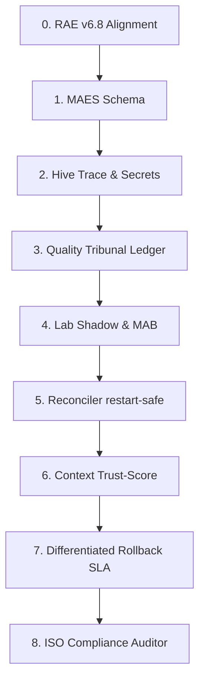

# Strategic Plan: RAE-Suite Autonomy & Absolute Auditability Upgrade (v1.1)
## Target Standard: ISO 27001 & ISO 42001 Auditable Autonomy
**Codename: Oracle Sentinel**

This strategic plan outlines the **8-stage upgrade** to maximize the autonomy of all RAE-Suite modules (`rae-core`, `rae-hive`, `rae-quality`, `rae-lab`, `rae-phoenix`, and `rae-suite`'s orchestrator) while enforcing **absolute auditability**. Under this plan, Oracle Sentinel operates as an auditing overlay integrated with the **RAE Autonomy Blueprint v6.8**, ensuring every module reflects a standardized *Minimum Auditable Event Schema (MAES)* to the `RAE-agentic-memory` cognitive layers before and after any autonomous action.

> [!IMPORTANT]
> **Cardinal RAE-First Rule (No Evidence, No Autonomy):**
> Any action taken by an agent without a corresponding cryptographic trace in `RAE-agentic-memory` is a compliance violation. Autonomy is gated by auditability.

---

## 📊 The 8-Stage Upgrade Path



---

### Stage 0: Alignment with RAE Autonomy Blueprint v6.8
Oracle Sentinel is designed as a strict auditing overlay and diagnostic log generator for the execution engines defined in the **RAE Autonomy Blueprint v6.8**, rather than a parallel or competitive decision framework.

MAES acts as the lightweight, event-based telemetry wrapper emitted at the beginning, middle, and end of any task iteration. Executive deciders and cryptographic receipts remain governed by the formal v6.8 data contracts:
- `RiskAssessment` (Assesses threat metrics and sets boundaries)
- `CapabilityContract` (Ensures executing agent is authorized)
- `PolicyBundle` (Defines the active versioned regulatory matrix)
- `ExecutionReceipt` (Final signed execution transaction receipt)
- `EvidencePack` (Full compressed ISO evidence package)
- `DecisionLedgerEntry` (Permanent, signed immutable ledger record)
- `RollbackPlan` (Tested, structured rollback recipe)
- `QualityGateResult` (Tribunal static and mutation audit score)

*Audit Rule:* Every emitted MAES event must declare strict links to the active `trace_id`, `task_id`, `risk_assessment_id`, `policy_bundle_hash`, `execution_mode`, and, where applicable, `evidence_pack_hash` and `execution_receipt_id`. Absence of these cross-references constitutes a critical compliance gap.

---

### Stage 1: Enforce the Minimum Auditable Event Schema (MAES)
*   **Objective:** Define and enforce a rigid contract for cognitive logging across all RAE-Suite modules.
*   **Technical Specification:** To avoid unsafe unstructured data leaks and prevent `payload: Dict[str, Any]` from becoming a vector for secret exposure, MAES utilizes a secure, hashed payload contract:

```python
from enum import Enum
from datetime import datetime, timezone
from typing import Optional
from pydantic import BaseModel, Field

class AuditableEventType(str, Enum):
    TASK_RECEIVED = "TASK_RECEIVED"
    RISK_CLASSIFIED = "RISK_CLASSIFIED"
    POLICY_CHECKED = "POLICY_CHECKED"
    CAPABILITY_CHECKED = "CAPABILITY_CHECKED"
    TOOL_INVOKED = "TOOL_INVOKED"
    SANDBOX_EXECUTED = "SANDBOX_EXECUTED"
    QUALITY_EVALUATED = "QUALITY_EVALUATED"
    EVIDENCE_PACKED = "EVIDENCE_PACKED"
    LEDGER_COMMITTED = "LEDGER_COMMITTED"
    MEMORY_WRITTEN = "MEMORY_WRITTEN"
    QUARANTINE_TRIGGERED = "QUARANTINE_TRIGGERED"
    APPROVAL_REQUESTED = "APPROVAL_REQUESTED"
    ROLLBACK_EXECUTED = "ROLLBACK_EXECUTED"

class MinimumAuditableEvent(BaseModel):
    schema_version: str = "1.0"
    event_id: str = Field(..., description="Unique event UUID")
    trace_id: str = Field(..., description="Active session trace UUID")
    task_id: Optional[str] = Field(None, description="Active task identifier")
    module_id: str = Field(..., description="Origin module, e.g., 'rae-hive'")
    event_type: AuditableEventType = Field(..., description="Rigid event type classification")
    risk_class: RiskClass = Field(..., description="Active task risk class R0 to R6")
    execution_mode: ExecutionMode = Field(..., description="LIVE, SIMULATION_ONLY, or DRY_RUN_ONLY")
    action: str = Field(..., description="The name of the tool or action being run")
    payload_hash: str = Field(..., description="SHA-256 hash of the raw payload to prevent leaks and ensure integrity")
    redaction_status: RedactionStatus = Field(RedactionStatus.NOT_SCANNED)
    policy_bundle_hash: str = Field(..., description="Hash of active PolicyBundle used to authorize action")
    evidence_pack_hash: Optional[str] = Field(None, description="Linked EvidencePack SHA-256")
    execution_receipt_id: Optional[str] = Field(None, description="Linked final ExecutionReceipt UUID")
    signature: str = Field(..., description="Cryptographic SHA-256 signed by the originating module key")
    timestamp: datetime = Field(default_factory=lambda: datetime.now(timezone.utc))
    human_label: str = Field(..., description="ISO 27001-compliant human scannable action description")
```

---

### Stage 2: RAE-Hive Sandbox & Build Auditing (Secret Scanning & Granular Traces)
*   **Objective:** Capture sandbox builds and tool invocations with zero risk of secret leakage or oversized storage consumption.
*   **Implementation Steps:**
    *   **Secret Scanner Redaction:** Raw `stdout` and `stderr` streams of worktrees and Docker sandboxes must pass through an automated `SecretScanner` (regex-based masking of `.env` files, private keys, and API tokens) before any write action. Raw logs never enter RAE memory without being marked as `RedactionStatus.REDACTED`.
    *   **Size Limits:** Log streams are truncated at a maximum limit of 5MB per execution. Complete outputs are compressed into the `EvidencePack` storage while RAE episodic memory stores only semantic summaries, exit codes, and hashes.
    *   **Tool Invocation Ledger:** Every low-level command run within the sandbox generates a granular `ToolInvocationEvent` stored in the episodic layer:

```python
class ToolInvocationEvent(BaseModel):
    tool_name: str
    arguments_hash: str
    working_directory_hash: str
    container_image_digest: str
    stdout_hash: str
    stderr_hash: str
    exit_code: int
    duration_ms: float
    redaction_status: RedactionStatus = RedactionStatus.REDACTED
```

---

### Stage 3: RAE-Quality Tribunal & AST Governance Auditing
*   **Objective:** Standardize quality score tracking and protect semantic memory from baseline corruption.
*   **Implementation Steps:**
    *   **Rigid Quality Contract:** `rae-quality` must persist all static analysis results conforming strictly to the `QualityGateResult` model, logging code coverage deltas, McCabe complexity indexes, and `TestIntegrityGuard` details.
    *   **Baseline Protection:** Quality metrics are only allowed to be promoted as active `Baseline Profiles` in semantic memory if they have successfully received an `ACCEPT` verdict from the Quality Gate. Unverified, failed, or raw sandbox builds are blocked from modifying semantic templates to prevent "poor standards" from being permanently memorized by the swarm.

---

### Stage 4: RAE-Lab Shadow Mode & MAB Tuning Ledger
*   **Objective:** Ensure candidate rules and Multi-Armed Bandit (MAB) weight adjustments are transparently audited and mathematically sound.
*   **Implementation Steps:**
    *   **Guardrail Lifecycle:** Transition security rules through a rigorous, trackable lifecycle in reflective memory:
        $$\text{CANDIDATE} \rightarrow \text{SHADOW} \rightarrow \text{REPLAY\_VALIDATED} \rightarrow \text{POLICY\_CHECKED} \rightarrow \text{APPROVED\_ACTIVE}$$
    *   **Promotion Gate:** A candidate guardrail is promoted to `APPROVED_ACTIVE` if and only if it has run in `SHADOW` mode for at least 72 hours, its false positive rate is $< 0.1\%$, it triggers zero policy conflicts with active PolicyBundles, and it carries a verified `RollbackPlan`.
    *   **MAB Tuning Ledger:** To avoid untraceable router adjustments, the MAB optimizer must log all router tunings to RAE reflective memory with the following schema:
        ```python
        class MABRouterUpdate(BaseModel):
            update_id: str
            old_weights: Dict[str, float]
            new_weights: Dict[str, float]
            reason: str
            observed_latency_delta: float
            observed_quality_delta: float
            rollback_condition: str
        ```

---

### Stage 5: RAE-Suite CEO Declarative Reconciler Ledger (Restart Safety)
*   **Objective:** Ensure automated infrastructure recovery actions do not cause operational regressions or cascade failures.
*   **Implementation Steps:**
    *   **SLA and Risk-gated Restoration:** Reconciler recovery loops are strictly bound by the active `CapabilityContract` and `RiskAssessment`.
    *   **High-Risk Operations Blocked:** Any corrective actions classified as `R4` or `R5` (e.g. database schema migrations or production secret rotations) are absolutely blocked from automated execution. They must halt and generate an `ApprovalPack` for Human-in-the-Loop authorization.
    *   **Service Recovery Profiles:** Auto-restarts are restricted to containers explicitly verified as restart-safe. The orchestrator queries a service recovery registry:

```python
class ServiceRecoveryProfile(BaseModel):
    service_id: str
    restart_safe: bool = True
    max_restart_attempts: int = 3
    healthcheck_command: str
    rollback_required: bool = False
    data_loss_risk: bool = False
    approval_required: bool = False
```

---

### Stage 6: Contextual Ingestion & Memory Poisoning Defense
*   **Objective:** Enforce double-loop learning while actively protecting the RAE core against cognitive memory poisoning.
*   **Implementation Steps:**
    *   **Trust-score Evaluation:** When the `RAEContextLocator` retrieves historical events to feed the planning loop, it must not return raw unverified strings. It evaluates and scores context along multiple safety vectors:
        - `source_layer` (reflective, episodic, semantic)
        - `relevance_score` (semantic distance)
        - `trust_score` (success rate of the source action)
        - `age` (decay factor)
        - `policy_compatibility` (alignment with active `PolicyBundle`)
    *   **Policy Overrides Memory:** Context retrieved from memory is classified as advisory. The static parameters of `PolicyBundle` and `CapabilityContract` always override any historical memory suggestion.
    *   **Robust Trace Hashes:** The `context_retrieved_hash` payload must mathematically represent the exact sequence of memory IDs, the retriever engine version, and the active `policy_bundle_hash`.

---

### Stage 7: Differentiated Rollback SLA & Segmented Incident Scopes
*   **Objective:** Differentiate recovery guarantees based on operational complexity and prevent global suite freezes on localized errors.
*   **Implementation Steps:**
    *   **Differentiated SLA Matrix:** Rather than claiming a generic "<15s" recovery, rollback targets are structured by complexity:
        *   `container_restart`: SLA $< 15\text{s}$
        *   `config_restore`: SLA $< 60\text{s}$
        *   `git_worktree_revert`: SLA $< 30\text{s}$
        *   `db_schema_rollback`: SLA dynamically set during dry-run validation
        *   `vector_projection_rollback`: Managed asynchronously through the degraded search fallback mode
    *   **Pre-execution SLA Verification:** No `R4`/`R5` action can be approved unless its corresponding `RollbackPlan` has been successfully tested in a sandbox environment and fits its target SLA bounds.
    *   **Segmented Incident Scope:** If a Stop Condition is met, the orchestrator quarantines only the affected context (`incident_scope=local`), keeping other independent agent operations active, unless a global failure requires `incident_scope=global` intervention.

---

### Stage 8: Centralized ISO Compliance Auditor Engine (ISO Map)
*   **Objective:** Build an automated security scanner that continuously crawls cognitive ledgers and generates push-button compliance audits.
*   **Implementation Steps:**
    *   The `ComplianceAuditor` performs continuous verification checks across RAE memory:
        *   `gap_detection` (identifies trace sequences without matching ledger entries)
        *   `signature_verification` (verifies cryptographic keys match payloads)
        *   `trace_chain_verification` (verifies parent-child thread integrity)
        *   `retention_policy_check` (validates deletion/archiving of R0-R6 logs)
        *   `secret_redaction_check` (verifies regex masking compliance)
        *   `simulation_ledger_separation_check` (asserts no simulation entries have polluted production)
    *   **ISO Control Mapping:** Generates formatted audit reports directly mapping RAE actions to standard compliance clauses:

```python
class ISOAuditRecord(BaseModel):
    iso_standard: str = "ISO-27001 / ISO-42001"
    control_id: str = Field(..., description="E.g., A.12.4.1 (Event logging)")
    evidence_source: str = Field(..., description="Linked MAES event trace_id")
    ledger_entries: List[str]
    missing_evidence: List[str]
    risk_exceptions: List[str]
    unresolved_quarantine_events: List[str]
    compliance_status: str = Field("COMPLIANT")
```

---

## 🔒 Module Capability Matrix (Minimum Audit Targets)

| Module RAE | Risk Boundary | Minimum Auditable Memory Target | Required Evidentiary Artifacts |
| :--- | :--- | :--- | :--- |
| **`rae-core`** | R0 / R4-R5 | Semantic & Reflective Layer | `EmbeddingProfile`, `CapabilityContract` |
| **`rae-hive`** | R1-R2 | Episodic Layer | `EvidencePack`, `ToolInvocationEvent` logs |
| **`rae-quality`**| R3 | Episodic & Reflective Layer | `QualityGateResult`, `TestIntegrityGuard` logs |
| **`rae-lab`** | R1 / R6 | Reflective Layer | `MABRouterUpdate`, Candidate FP shadow rates |
| **`rae-phoenix`**| R2 | Episodic Layer | `process_repair_request` loop logs, Rollbacks |
| **`rae-suite`** | R3-R5 | Permanent Decision Ledger | `DecisionLedgerEntry`, `ExecutionReceipt`, `RollbackPlan` |

---

## 🎯 Verification and DoD for Auditability Upgrades
1.  **Zero Unsigned Actions:** 100% of database, file-writing, and network activities must have a matching validated signed entry in `RAE-agentic-memory`.
2.  **No Data Leakage:** Log files, error dumps, and evidence packages must pass automatic regex masking to clean `.env` variables and SSH keys.
3.  **Strict Typing:** All MAES events must be mapped to system Enums (e.g., `RiskClass`, `ExecutionStatus`, `TaskState`).


moje uwagi:

Oracle Sentinel v1.1 jest bardzo dużym krokiem w dobrą stronę. Najważniejsze poprawki zostały wprowadzone: plan jest już jawnie nakładką audytową na RAE Autonomy Blueprint v6.8, MAES nie konkuruje z ExecutionReceipt/EvidencePack, pojawiły się payload_hash, execution_mode, policy_bundle_hash, obrona przed memory poisoning, rozróżnione SLA rollbacków, ServiceRecoveryProfile i mapowanie ISO.

Moja ocena całości:

Oracle Sentinel v1.1: 9.3/10

To jest już bardzo dobry plan audytowej nakładki na RAE-Suite, ale jeszcze nie dałbym 10/10, bo brakuje kilku rzeczy: mocniejszego DoD per stage, eventów dla Phoenix, polityki kluczy/podpisów, jednoznacznego modelu storage dla MAES oraz ostrzejszych kontraktów dla ISO Audit Engine.

Ocena etapów
Etap	Ocena	Komentarz
Stage 0: Alignment with v6.8	10/10	Bardzo dobrze. To już jasno mówi, że Oracle Sentinel jest warstwą audytową nad v6.8, nie konkurencyjnym systemem decyzyjnym.
Stage 1: MAES Schema	9/10	Dużo lepiej: payload_hash zamiast surowego payloadu, execution_mode, policy_bundle_hash, linki do Evidence/Receipt. Brakuje parent_event_id, sequence_no i jawnej walidacji podpisu.
Stage 2: Hive Trace & Secrets	9/10	Dobrze: SecretScanner, limity 5MB, ToolInvocationEvent. Brakuje tool_invocation_id, trace_id, risk_class, execution_mode w samym ToolInvocationEvent.
Stage 3: Quality Tribunal Ledger	9.5/10	Bardzo dobre. Baseline może być promowany tylko po ACCEPT. Brakuje tylko formalnego baseline_profile_id i ochrony przed „baseline drift”.
Stage 4: Lab Shadow & MAB	9.5/10	Mocny etap. Lifecycle guardraili i MAB ledger są dobre. Brakuje modelu GuardrailAuditRecord.
Stage 5: Reconciler restart-safe	9/10	Dobrze zablokowane R4/R5 i ServiceRecoveryProfile. Brakuje last_successful_healthcheck_at, dependencies, blast_radius.
Stage 6: Context Trust-Score	9.5/10	Bardzo dobre ujęcie memory poisoning. Dodałbym minimalny próg trust_score i regułę odrzucania kontekstu z R6/quarantine.
Stage 7: Rollback SLA	9.5/10	Bardzo dobra poprawka: SLA per typ operacji i lokalny/globalny incident scope. Brakuje modelu IncidentScope.
Stage 8: ISO Auditor	9/10	Bardzo dobry kierunek. Brakuje jawnej obsługi NON_COMPLIANT, PARTIAL, MISSING_EVIDENCE jako enumu oraz raportu exception management.
Co poprawić, żeby całość była 10/10
1. Wzmocnić MAES o łańcuch zdarzeń

Obecny MAES ma event_id, trace_id, task_id, ale brakuje mechanizmu łączenia eventów w nieprzerwany łańcuch. Dla „absolute auditability” to ważne, bo audytor musi wykrywać nie tylko brak ledger entry, ale też dziury w kolejności zdarzeń.

Dodałbym do MinimumAuditableEvent:

parent_event_id: Optional[str] = Field(None, description="Previous event in this trace chain")
sequence_no: int = Field(..., ge=0, description="Monotonic event sequence number within trace_id")
signature_algorithm: str = Field("sha256", description="Signature/hash algorithm")
signing_key_id: str = Field(..., description="Key identity used by originating module")

Wtedy Stage 1 staje się 10/10, bo MAES może być walidowany jako łańcuch, a nie tylko pojedyncze zdarzenia.

2. Uszczelnić ToolInvocationEvent

Teraz ToolInvocationEvent jest dobry, ale za mało powiązany z resztą systemu. Dodałbym:

class ToolInvocationEvent(BaseModel):
    schema_version: str = "1.0"
    tool_invocation_id: str
    trace_id: str
    task_id: Optional[str] = None
    module_id: str = "rae-hive"
    risk_class: RiskClass
    execution_mode: ExecutionMode
    tool_name: str
    arguments_hash: str
    working_directory_hash: str
    container_image_digest: str
    stdout_hash: str
    stderr_hash: str
    exit_code: int
    duration_ms: float = Field(..., ge=0)
    redaction_status: RedactionStatus = RedactionStatus.REDACTED
    evidence_pack_hash: Optional[str] = None
    created_at: datetime = Field(default_factory=lambda: datetime.now(timezone.utc))

To zamyka Stage 2 na 10/10.

3. Dodać osobne ślady audytowe dla Phoenix

W module capability matrix pojawia się rae-phoenix, ale w ośmiu etapach nie ma osobnego stage’u albo podsekcji dla Phoenix. A Phoenix jest krytyczny, bo robi rekurencyjne naprawy kodu.

Dodałbym do Stage 3 albo osobną sekcję po Stage 3:

### Phoenix Repair Loop Audit

Każda iteracja pętli Phoenix musi emitować:
- repair_iteration_id,
- trace_id,
- attempt_no,
- input_error_hash,
- patch_diff_hash,
- quality_gate_result_id,
- rollback_plan_id,
- stop_condition_triggered,
- final_decision.

Phoenix nie może rozpocząć kolejnej iteracji, jeśli poprzednia nie ma MAES eventu, QualityGateResult i EvidencePack.

To bardzo ważne, bo bez tego autonaprawa kodu może mieć luki audytowe.

4. Wzmocnić Stage 6 o progi zaufania

Stage 6 jest bardzo dobry, ale powinien mówić, kiedy kontekst z pamięci wolno użyć.

Dodałbym:

Context Retrieval Gate:
- trust_score < 0.4: context rejected
- 0.4 <= trust_score < 0.7: context advisory only, requires corroboration
- trust_score >= 0.7: context usable as planning input
- any memory linked to R6/quarantine: never used as recommendation, only as warning signal

I jeszcze:

Reflective memories may influence planning, but cannot override PolicyBundle, CapabilityContract, RiskAssessment or QualityGateResult.

To zamyka problem memory poisoning.

5. Dodać statusy ISO jako enum

ISOAuditRecord ma compliance_status: str = "COMPLIANT". To powinno być enumem.

class ComplianceStatus(str, Enum):
    COMPLIANT = "COMPLIANT"
    PARTIAL = "PARTIAL"
    NON_COMPLIANT = "NON_COMPLIANT"
    MISSING_EVIDENCE = "MISSING_EVIDENCE"
    NEEDS_REVIEW = "NEEDS_REVIEW"

I model:

class ISOAuditRecord(BaseModel):
    schema_version: str = "1.0"
    iso_standard: str
    control_id: str
    evidence_source: str
    ledger_entries: List[str]
    missing_evidence: List[str]
    risk_exceptions: List[str]
    unresolved_quarantine_events: List[str]
    compliance_status: ComplianceStatus
    generated_at: datetime = Field(default_factory=lambda: datetime.now(timezone.utc))

Stage 8 wtedy ma pełniejszy charakter audytowy.

6. Dodać DoD per stage

Na końcu masz DoD globalne: Zero Unsigned Actions, No Data Leakage, Strict Typing. To dobre, ale za mało, żeby plan był 10/10 wykonawczo.

Dodałbym krótkie DoD dla każdego etapu:

## Stage Acceptance Criteria

Stage 0 is complete when every MAES event references v6.8 contracts or is flagged as AUDIT_GAP.

Stage 1 is complete when invalid MAES events are rejected by RAEMemoryBridge and missing parent_event_id / sequence gaps are detected.

Stage 2 is complete when every Hive tool invocation creates ToolInvocationEvent and no raw stdout/stderr reaches memory without redaction.

Stage 3 is complete when every QualityGateResult is persisted and failed builds cannot update semantic baselines.

Stage 4 is complete when every guardrail promotion has 72h shadow evidence, FP < 0.1%, no policy conflict and RollbackPlan.

Stage 5 is complete when only restart-safe services can be restarted autonomously and R4/R5 always produce ApprovalPack.

Stage 6 is complete when memory context retrieval includes trust_score, policy_compatibility and context_retrieved_hash.

Stage 7 is complete when every rollback class has tested SLA and affected contexts are quarantined locally unless global scope is required.

Stage 8 is complete when ComplianceAuditor detects missing receipts, signature gaps, simulation ledger pollution, retention violations and redaction failures.

To podnosi cały dokument do poziomu wdrożeniowego.

Proponowana poprawiona sekcja do wklejenia

Dodałbym na końcu dokumentu:

## 🧪 Stage Acceptance Criteria & Final Hardening

### Event Chain Integrity
Every MAES event must include `parent_event_id`, `sequence_no`, `signing_key_id`, and `signature_algorithm`.
The ComplianceAuditor must detect missing events, non-monotonic sequence numbers, broken parent-child links, and orphaned events.

### Phoenix Repair Loop Audit
Every Phoenix repair attempt must emit an auditable event chain:
`REPAIR_REQUESTED → PATCH_GENERATED → QUALITY_EVALUATED → PATCH_ACCEPTED/REJECTED → ROLLBACK_EXECUTED/PR_CREATED`.

Each repair iteration must include:
- repair_iteration_id,
- attempt_no,
- input_error_hash,
- patch_diff_hash,
- quality_gate_result_id,
- evidence_pack_hash,
- rollback_plan_id,
- stop_condition_triggered.

### Context Retrieval Trust Gate
RAEContextLocator must apply trust thresholds:
- trust_score < 0.4: reject context,
- 0.4–0.7: advisory only,
- >0.7: usable planning input,
- quarantine/R6-linked memories: warning only, never recommendation.

Memory can advise planning, but cannot override PolicyBundle, CapabilityContract, RiskAssessment or QualityGateResult.

### ISO Compliance Status Enum
Compliance results must use strict enum statuses:
`COMPLIANT`, `PARTIAL`, `NON_COMPLIANT`, `MISSING_EVIDENCE`, `NEEDS_REVIEW`.

### Stage Acceptance Criteria
Each stage must define machine-verifiable acceptance criteria.
A stage cannot be marked complete unless its events, receipts, evidence packs, signatures, redaction checks, and ledger references pass automated validation.
Finalna ocena

Po poprawkach v1.1 jest już bardzo blisko ideału:

obecnie: 9.3/10
po dopisaniu powyższych zmian: 10/10

Najkrócej: plan jest już bardzo dobry, ale do 10/10 brakuje mu ostatniego „hardeningu audytowego”: łańcucha MAES, audytu pętli Phoenix, progów zaufania kontekstu, enumów zgodności ISO i DoD per stage.

Najważniejsze: ta wersja dobrze ustawia relację:

RAE Autonomy Blueprint v6.8 = silnik kontrolowanej autonomii
Oracle Sentinel v1.1 = audytowa nakładka i kompilator zgodności

To jest właściwa architektura.
