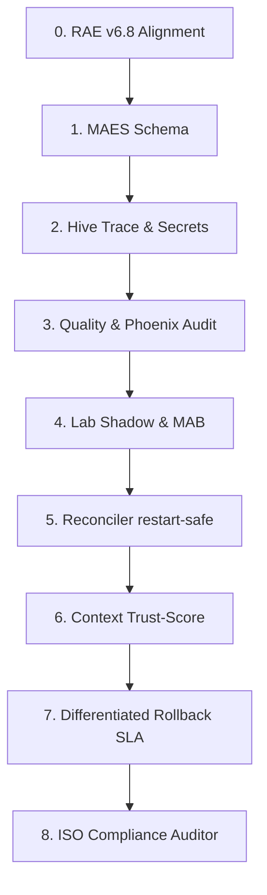

# Strategic Plan: RAE-Suite Autonomy & Absolute Auditability Upgrade (v1.2)
## Target Standard: ISO 27001 & ISO 42001 Auditable Autonomy
**Codename: Oracle Sentinel**

This strategic plan outlines the **8-stage upgrade** to maximize the autonomy of all RAE-Suite modules (`rae-core`, `rae-hive`, `rae-quality`, `rae-lab`, `rae-phoenix`, and `rae-suite`'s orchestrator) while enforcing **absolute auditability**. Under this plan, Oracle Sentinel operates as an auditing overlay integrated with the **RAE Autonomy Blueprint v6.8**, ensuring every module reflects a standardized *Minimum Auditable Event Schema (MAES)* to the `RAE-agentic-memory` cognitive layers before and after any autonomous action.

> [!IMPORTANT]
> **Cardinal RAE-First Rule (No Evidence, No Autonomy):**
> Any action taken by an agent without a corresponding cryptographic trace in `RAE-agentic-memory` is a compliance violation. Autonomy is gated by auditability.

---

## 📊 The 8-Stage Upgrade Path



---

### Stage 0: Alignment with RAE Autonomy Blueprint v6.8
Oracle Sentinel is designed as a strict auditing overlay and diagnostic log generator for the execution engines defined in the **RAE Autonomy Blueprint v6.8**, rather than a parallel or competitive decision framework.

MAES acts as the lightweight, event-based telemetry wrapper emitted at the beginning, middle, and end of any task iteration. Executive deciders and cryptographic receipts remain governed by the formal v6.8 data contracts:
- `RiskAssessment` (Assesses threat metrics and sets boundaries)
- `CapabilityContract` (Ensures executing agent is authorized)
- `PolicyBundle` (Defines the active versioned regulatory matrix)
- `ExecutionReceipt` (Final signed execution transaction receipt)
- `EvidencePack` (Full compressed ISO evidence package)
- `DecisionLedgerEntry` (Permanent, signed immutable ledger record)
- `RollbackPlan` (Tested, structured rollback recipe)
- `QualityGateResult` (Tribunal static and mutation audit score)

*Audit Rule:* Every emitted MAES event must declare strict links to the active `trace_id`, `task_id`, `risk_assessment_id`, `policy_bundle_hash`, `execution_mode`, and, where applicable, `evidence_pack_hash` and `execution_receipt_id`. Absence of these cross-references constitutes a critical compliance gap.

---

### Stage 1: Enforce the Minimum Auditable Event Schema (MAES)
*   **Objective:** Define and enforce a rigid contract for cognitive logging across all RAE-Suite modules, enabling complete sequence trace integrity verification.
*   **Technical Specification:** To avoid unsafe unstructured data leaks and prevent `payload: Dict[str, Any]` from becoming a vector for secret exposure, MAES utilizes a secure, hashed payload contract and embeds explicit sequence links:

```python
from enum import Enum
from datetime import datetime, timezone
from typing import Optional
from pydantic import BaseModel, Field

class AuditableEventType(str, Enum):
    TASK_RECEIVED = "TASK_RECEIVED"
    RISK_CLASSIFIED = "RISK_CLASSIFIED"
    POLICY_CHECKED = "POLICY_CHECKED"
    CAPABILITY_CHECKED = "CAPABILITY_CHECKED"
    TOOL_INVOKED = "TOOL_INVOKED"
    SANDBOX_EXECUTED = "SANDBOX_EXECUTED"
    QUALITY_EVALUATED = "QUALITY_EVALUATED"
    EVIDENCE_PACKED = "EVIDENCE_PACKED"
    LEDGER_COMMITTED = "LEDGER_COMMITTED"
    MEMORY_WRITTEN = "MEMORY_WRITTEN"
    QUARANTINE_TRIGGERED = "QUARANTINE_TRIGGERED"
    APPROVAL_REQUESTED = "APPROVAL_REQUESTED"
    ROLLBACK_EXECUTED = "ROLLBACK_EXECUTED"
    REPAIR_REQUESTED = "REPAIR_REQUESTED"
    PATCH_GENERATED = "PATCH_GENERATED"
    PATCH_ACCEPTED = "PATCH_ACCEPTED"
    PATCH_REJECTED = "PATCH_REJECTED"

class MinimumAuditableEvent(BaseModel):
    schema_version: str = "1.0"
    event_id: str = Field(..., description="Unique event UUID")
    parent_event_id: Optional[str] = Field(None, description="Previous event UUID in this trace chain to verify chronology")
    sequence_no: int = Field(..., ge=0, description="Monotonic event sequence number within trace_id")
    trace_id: str = Field(..., description="Active session trace UUID")
    task_id: Optional[str] = Field(None, description="Active task identifier")
    module_id: str = Field(..., description="Origin module, e.g., 'rae-hive'")
    event_type: AuditableEventType = Field(..., description="Rigid event type classification")
    risk_class: RiskClass = Field(..., description="Active task risk class R0 to R6")
    execution_mode: ExecutionMode = Field(..., description="LIVE, SIMULATION_ONLY, or DRY_RUN_ONLY")
    action: str = Field(..., description="The name of the tool or action being run")
    payload_hash: str = Field(..., description="SHA-256 hash of the raw payload to prevent leaks and ensure integrity")
    redaction_status: RedactionStatus = Field(RedactionStatus.NOT_SCANNED)
    policy_bundle_hash: str = Field(..., description="Hash of active PolicyBundle used to authorize action")
    evidence_pack_hash: Optional[str] = Field(None, description="Linked EvidencePack SHA-256")
    execution_receipt_id: Optional[str] = Field(None, description="Linked final ExecutionReceipt UUID")
    signature_algorithm: str = Field("sha256", description="Signature/hash algorithm used for signing")
    signing_key_id: str = Field(..., description="Key identity used by originating module")
    signature: str = Field(..., description="Cryptographic signature signed by the originating module key")
    timestamp: datetime = Field(default_factory=lambda: datetime.now(timezone.utc))
    human_label: str = Field(..., description="ISO 27001-compliant human scannable action description")
```

---

### Stage 2: RAE-Hive Sandbox & Build Auditing (Secret Scanning & Granular Traces)
*   **Objective:** Capture sandbox builds and tool invocations with zero risk of secret leakage or oversized storage consumption.
*   **Implementation Steps:**
    *   **Secret Scanner Redaction:** Raw `stdout` and `stderr` streams of worktrees and Docker sandboxes must pass through an automated `SecretScanner` (regex-based masking of `.env` files, private keys, and API tokens) before any write action. Raw logs never enter RAE memory without being marked as `RedactionStatus.REDACTED`.
    *   **Size Limits:** Log streams are truncated at a maximum limit of 5MB per execution. Complete outputs are compressed into the `EvidencePack` storage while RAE episodic memory stores only semantic summaries, exit codes, and hashes.
    *   **Tool Invocation Ledger:** Every low-level command run within the sandbox generates a granular, fully integrated `ToolInvocationEvent` stored in the episodic layer:

```python
class ToolInvocationEvent(BaseModel):
    schema_version: str = "1.0"
    tool_invocation_id: str = Field(..., description="Unique tool invocation UUID")
    trace_id: str = Field(..., description="Active trace UUID to bind context")
    task_id: Optional[str] = Field(None, description="Active task identifier")
    module_id: str = Field("rae-hive", description="Originating module")
    risk_class: RiskClass = Field(..., description="Risk class rating of the command execution")
    execution_mode: ExecutionMode = Field(..., description="Active execution state")
    tool_name: str = Field(..., description="The low-level binary or command name")
    arguments_hash: str = Field(..., description="SHA-256 hash of execution arguments")
    working_directory_hash: str = Field(..., description="SHA-256 of active sandbox path")
    container_image_digest: str = Field(..., description="Docker registry digest verification")
    stdout_hash: str = Field(..., description="SHA-256 hash of execution stdout stream")
    stderr_hash: str = Field(..., description="SHA-256 hash of execution stderr stream")
    exit_code: int = Field(..., description="Process exit status")
    duration_ms: float = Field(..., ge=0, description="Measured execution time in milliseconds")
    redaction_status: RedactionStatus = Field(RedactionStatus.REDACTED, description="Strict enforcement flag")
    evidence_pack_hash: Optional[str] = Field(None, description="Linked EvidencePack SHA-256 containing raw artifacts")
    created_at: datetime = Field(default_factory=lambda: datetime.now(timezone.utc))
```

---

### Stage 3: RAE-Quality Tribunal & Phoenix Self-Repair Auditing
*   **Objective:** Standardize quality score tracking, protect semantic memory from baseline corruption, and enforce absolute audit trails on recursive code modification loops.
*   **Implementation Steps:**
    *   **Rigid Quality Contract:** `rae-quality` must persist all static analysis results conforming strictly to the `QualityGateResult` model, logging code coverage deltas, McCabe complexity indexes, and `TestIntegrityGuard` details.
    *   **Baseline Protection:** Quality metrics are only allowed to be promoted as active `Baseline Profiles` in semantic memory under a specific `baseline_profile_id` if they have successfully received an `ACCEPT` verdict from the Quality Gate, actively preventing "baseline drift" and permanent swarm degradation.
    *   **Phoenix Repair Loop Audit:** Because recursive self-repair contains inherent drift risks, every Phoenix iteration must emit a sequential, machine-verifiable MAES event chain:
        $$\text{REPAIR\_REQUESTED} \rightarrow \text{PATCH\_GENERATED} \rightarrow \text{QUALITY\_EVALUATED} \rightarrow \text{PATCH\_ACCEPTED/REJECTED} \rightarrow \text{ROLLBACK\_EXECUTED/PR\_CREATED}$$
        
        Phoenix is absolutely blocked from starting any subsequent iteration unless the preceding run has persisted its matching `MinimumAuditableEvent`, `QualityGateResult`, and `EvidencePack`.

        Each iteration must register:
        - `repair_iteration_id`: Unique identifier of the repair run.
        - `trace_id`: Active session trace UUID.
        - `attempt_no`: Monotonic retry/iteration counter.
        - `input_error_hash`: SHA-256 hash of the target build error stack trace.
        - `patch_diff_hash`: SHA-256 hash of the proposed unified patch diff.
        - `quality_gate_result_id`: Associated static/mutation audit score ID.
        - `evidence_pack_hash`: Compressed diagnostic artifacts package SHA-256.
        - `rollback_plan_id`: Associated automated rollback recipe ID.
        - `stop_condition_triggered`: Boolean indicating if termination limits were hit.
        - `final_decision`: Final state classification (ACCEPTED, REJECTED, or DEGRADED).

---

### Stage 4: RAE-Lab Shadow Mode & MAB Tuning Ledger
*   **Objective:** Ensure candidate rules and Multi-Armed Bandit (MAB) weight adjustments are transparently audited and mathematically sound.
*   **Implementation Steps:**
    *   **Guardrail Lifecycle:** Transition security rules through a rigorous, trackable lifecycle in reflective memory:
        $$\text{CANDIDATE} \rightarrow \text{SHADOW} \rightarrow \text{REPLAY\_VALIDATED} \rightarrow \text{POLICY\_CHECKED} \rightarrow \text{APPROVED\_ACTIVE}$$
    *   **Promotion Gate:** A candidate guardrail is promoted to `APPROVED_ACTIVE` if and only if it has run in `SHADOW` mode for at least 72 hours, its false positive rate is $< 0.1\%$, it triggers zero policy conflicts with active PolicyBundles, and it carries a verified `RollbackPlan`. Every evaluation cycle generates a persistent `GuardrailAuditRecord` inside reflective memory.
    *   **MAB Tuning Ledger:** To avoid untraceable router adjustments, the MAB optimizer must log all router tunings to RAE reflective memory with the following schema:
        ```python
        class MABRouterUpdate(BaseModel):
            update_id: str
            old_weights: Dict[str, float]
            new_weights: Dict[str, float]
            reason: str
            observed_latency_delta: float
            observed_quality_delta: float
            rollback_condition: str
        ```

---

### Stage 5: RAE-Suite CEO Declarative Reconciler Ledger (Restart Safety)
*   **Objective:** Ensure automated infrastructure recovery actions do not cause operational regressions or cascade failures.
*   **Implementation Steps:**
    *   **SLA and Risk-gated Restoration:** Reconciler recovery loops are strictly bound by the active `CapabilityContract` and `RiskAssessment`.
    *   **High-Risk Operations Blocked:** Any corrective actions classified as `R4` or `R5` (e.g. database schema migrations or production secret rotations) are absolutely blocked from automated execution. They must halt and generate an `ApprovalPack` for Human-in-the-Loop authorization.
    *   **Service Recovery Profiles:** Auto-restarts are restricted to containers explicitly verified as restart-safe. The orchestrator queries a service recovery registry containing service interdependencies, maximum retry counts, and estimated blast radiuses:

```python
class ServiceRecoveryProfile(BaseModel):
    service_id: str
    restart_safe: bool = True
    max_restart_attempts: int = 3
    healthcheck_command: str
    last_successful_healthcheck_at: datetime
    dependencies: List[str] = Field(default_factory=list, description="Services that must be online first")
    blast_radius: str = Field("local", description="Socio-technical impact classification: local, service_group, global")
    rollback_required: bool = False
    data_loss_risk: bool = False
    approval_required: bool = False
```

---

### Stage 6: Contextual Ingestion & Memory Poisoning Defense
*   **Objective:** Enforce double-loop learning while actively protecting the RAE core against cognitive memory poisoning.
*   **Implementation Steps:**
    *   **Trust-score Evaluation:** When the `RAEContextLocator` retrieves historical events to feed the planning loop, it must not return raw unverified strings. It evaluates and scores context along multiple safety vectors (source layer, semantic distance, success rate, decay, and policy compatibility) against strict trust gate thresholds:
        - **`trust_score < 0.4`**: Context rejected; blocked from entering the active planning loop.
        - **`0.4 <= trust_score < 0.7`**: Context advisory only; requires corroboration by a separate trusted semantic source.
        - **`trust_score >= 0.7`**: Context usable as planning input.
        - **`quarantine/R6-linked memories`**: Never used as planning recommendation; strictly treated as warning signals.
    *   **Policy Overrides Memory:** Context retrieved from memory is classified as advisory. The static parameters of `PolicyBundle` and `CapabilityContract` always override any historical memory suggestion.
    *   **Robust Trace Hashes:** The `context_retrieved_hash` payload must mathematically represent the exact sequence of memory IDs, the retriever engine version, and the active `policy_bundle_hash`.

---

### Stage 7: Differentiated Rollback SLA & Segmented Incident Scopes
*   **Objective:** Differentiate recovery guarantees based on operational complexity and prevent global suite freezes on localized errors.
*   **Implementation Steps:**
    *   **Differentiated SLA Matrix:** Rather than claiming a generic "<15s" recovery, rollback targets are structured by complexity:
        *   `container_restart`: SLA $< 15\text{s}$
        *   `config_restore`: SLA $< 60\text{s}$
        *   `git_worktree_revert`: SLA $< 30\text{s}$
        *   `db_schema_rollback`: SLA dynamically set during dry-run validation
        *   `vector_projection_rollback`: Managed asynchronously through the degraded search fallback mode
    *   **Pre-execution SLA Verification:** No `R4`/`R5` action can be approved unless its corresponding `RollbackPlan` has been successfully tested in a sandbox environment and fits its target SLA bounds.
    *   **Segmented Incident Scope:** If a Stop Condition is met, the orchestrator quarantines only the affected context (`incident_scope=local`), keeping other independent agent operations active, unless a global failure requires `incident_scope=global` intervention.

```python
class IncidentScope(str, Enum):
    LOCAL = "local"
    SERVICE_GROUP = "service_group"
    GLOBAL = "global"
```

---

### Stage 8: Centralized ISO Compliance Auditor Engine (ISO Map)
*   **Objective:** Build an automated security scanner that continuously crawls cognitive ledgers and generates push-button compliance audits.
*   **Implementation Steps:**
    *   The `ComplianceAuditor` performs continuous verification checks across RAE memory:
        *   `gap_detection` (identifies trace sequences without matching ledger entries)
        *   `signature_verification` (verifies cryptographic keys match payloads)
        *   `trace_chain_verification` (verifies parent-child thread integrity and chronological monotonic sequence numbers)
        *   `retention_policy_check` (validates deletion/archiving of R0-R6 logs)
        *   `secret_redaction_check` (verifies regex masking compliance)
        *   `simulation_ledger_separation_check` (asserts no simulation entries have polluted production)
    *   **ISO Control Mapping:** Generates formatted audit reports directly mapping RAE actions to standard compliance clauses with strict compliance status enums:

```python
class ComplianceStatus(str, Enum):
    COMPLIANT = "COMPLIANT"
    PARTIAL = "PARTIAL"
    NON_COMPLIANT = "NON_COMPLIANT"
    MISSING_EVIDENCE = "MISSING_EVIDENCE"
    NEEDS_REVIEW = "NEEDS_REVIEW"

class ISOAuditRecord(BaseModel):
    schema_version: str = "1.0"
    iso_standard: str = "ISO-27001 / ISO-42001"
    control_id: str = Field(..., description="E.g., A.12.4.1 (Event logging)")
    evidence_source: str = Field(..., description="Linked MAES event trace_id")
    ledger_entries: List[str] = Field(..., description="List of validated sequence hashes")
    missing_evidence: List[str] = Field(default_factory=list, description="Detected chronological trace gaps")
    risk_exceptions: List[str] = Field(default_factory=list, description="Approved risk level bypasses")
    unresolved_quarantine_events: List[str] = Field(default_factory=list, description="Context blocks still in quarantine")
    compliance_status: ComplianceStatus = Field(..., description="Rigid evaluation enum")
    generated_at: datetime = Field(default_factory=lambda: datetime.now(timezone.utc))
```

---

## 🔒 Module Capability Matrix (Minimum Audit Targets)

| Module RAE | Risk Boundary | Minimum Auditable Memory Target | Required Evidentiary Artifacts |
| :--- | :--- | :--- | :--- |
| **`rae-core`** | R0 / R4-R5 | Semantic & Reflective Layer | `EmbeddingProfile`, `CapabilityContract` |
| **`rae-hive`** | R1-R2 | Episodic Layer | `EvidencePack`, `ToolInvocationEvent` logs |
| **`rae-quality`**| R3 | Episodic & Reflective Layer | `QualityGateResult`, `TestIntegrityGuard` logs |
| **`rae-lab`** | R1 / R6 | Reflective Layer | `MABRouterUpdate`, `GuardrailAuditRecord`, Candidate FP rates |
| **`rae-phoenix`**| R2 | Episodic Layer | Phoenix repair attempt logs, `QualityGateResult`, `EvidencePack` |
| **`rae-suite`** | R3-R5 | Permanent Decision Ledger | `DecisionLedgerEntry`, `ExecutionReceipt`, `RollbackPlan` |

---

## 🧪 Stage Acceptance Criteria & Final Hardening

### Event Chain Integrity
Every MAES event must include `parent_event_id`, `sequence_no`, `signing_key_id`, and `signature_algorithm`. The `ComplianceAuditor` must continuously detect missing events, non-monotonic sequence numbers, broken parent-child links, and orphaned events.

### Phoenix Repair Loop Audit
Every Phoenix repair attempt must emit an auditable event chain:
`REPAIR_REQUESTED → PATCH_GENERATED → QUALITY_EVALUATED → PATCH_ACCEPTED/REJECTED → ROLLBACK_EXECUTED/PR_CREATED`

Each repair iteration must include:
- `repair_iteration_id`
- `attempt_no`
- `input_error_hash`
- `patch_diff_hash`
- `quality_gate_result_id`
- `evidence_pack_hash`
- `rollback_plan_id`
- `stop_condition_triggered`

### Context Retrieval Trust Gate
The `RAEContextLocator` must apply trust thresholds:
- `trust_score < 0.4`: Reject context.
- `0.4 <= trust_score < 0.7`: Advisory only, requires corroboration.
- `trust_score >= 0.7`: Usable planning input.
- `quarantine/R6-linked memories`: Warning only, never recommendation.

*Memory can advise planning, but cannot override PolicyBundle, CapabilityContract, RiskAssessment or QualityGateResult.*

### ISO Compliance Status Enum
Compliance results must use strict enum statuses: `COMPLIANT`, `PARTIAL`, `NON_COMPLIANT`, `MISSING_EVIDENCE`, `NEEDS_REVIEW`.

### Stage Acceptance Criteria
Each stage is governed by machine-verifiable Definition of Done (DoD) criteria. A stage cannot be marked complete unless its events, receipts, evidence packs, signatures, redaction checks, and ledger references pass automated validation:
*   **Stage 0:** Complete when every MAES event references valid active v6.8 contracts (`RiskAssessment`, `CapabilityContract`, `PolicyBundle`) or is flagged as an active `AUDIT_GAP`.
*   **Stage 1:** Complete when invalid or malformed MAES events are immediately rejected by `RAEMemoryBridge`, and missing `parent_event_id` or sequence gaps are automatically detected.
*   **Stage 2:** Complete when every Hive tool invocation successfully creates a validated `ToolInvocationEvent` and zero raw `stdout`/`stderr` streams reach memory without scanning and redaction.
*   **Stage 3:** Complete when every `QualityGateResult` is persisted in reflective memory, and failed builds are strictly blocked from promoting semantic baselines.
*   **Stage 4:** Complete when every guardrail promotion carries verified 72h shadow evidence, false positive rates are below 0.1%, zero policy conflicts exist, and a verified `RollbackPlan` is attached.
*   **Stage 5:** Complete when only container instances explicitly whitelisted in `ServiceRecoveryProfile` are allowed to undergo automated recovery, and high-risk R4/R5 operations always block execution to generate an `ApprovalPack`.
*   **Stage 6:** Complete when memory context retrieval evaluates and logs `trust_score`, `policy_compatibility`, and `context_retrieved_hash`.
*   **Stage 7:** Complete when every rollback class adheres to a tested SLA threshold and affected context objects are localized using segmented incident scopes.
*   **Stage 8:** Complete when `ComplianceAuditor` successfully parses the episodic ledgers and asserts zero missing receipts, signature gaps, simulation data leakage, retention violations, or redaction failures.

---

## 🎯 Verification and DoD for Auditability Upgrades
1.  **Zero Unsigned Actions:** 100% of database, file-writing, and network activities must have a matching validated signed entry in `RAE-agentic-memory`.
2.  **No Data Leakage:** Log files, error dumps, and evidence packages must pass automatic regex masking to clean `.env` variables and SSH keys.
3.  **Strict Typing:** All MAES events must be mapped to system Enums (e.g., `RiskClass`, `ExecutionStatus`, `TaskState`).

moje uwagi:

Oracle Sentinel v1.2 jest już bardzo blisko 10/10. W praktyce poprawiłeś dokładnie te elementy, które wcześniej blokowały ocenę maksymalną: dodałeś łańcuch MAES przez parent_event_id i sequence_no, uszczelniłeś ToolInvocationEvent, włączyłeś Phoenix do audytu, dodałeś progi trust-score dla pamięci, IncidentScope, enum ComplianceStatus oraz maszynowo weryfikowalne kryteria DoD dla Stage 0–8.

Moja ocena:

Oracle Sentinel v1.2: 9.7/10

To jest już bardzo dojrzała audytowa nakładka na RAE Autonomy Blueprint v6.8. Nie daję jeszcze pełnego 10/10 tylko dlatego, że widzę kilka ostatnich luk kontraktowych, ale nie są to zmiany strategiczne — raczej finalny hardening.

Ocena etapów
Etap	Ocena	Komentarz
Stage 0: Alignment with v6.8	10/10	Bardzo dobrze ustawiona relacja: Oracle Sentinel jest overlayem audytowym, nie osobnym systemem decyzyjnym.
Stage 1: MAES Schema	9.7/10	Bardzo mocne. Jest łańcuch zdarzeń, payload_hash, execution_mode, signing_key_id. Brakuje tylko jawnego statusu walidacji zdarzenia.
Stage 2: Hive Trace & Secrets	9.7/10	Bardzo dobrze: redakcja, limit 5 MB, hash stdout/stderr, digest obrazu. Dodałbym redacted_stdout_uri / redacted_stderr_uri jako opcjonalne artefakty.
Stage 3: Quality & Phoenix Audit	9.8/10	Bardzo dobry etap. Phoenix został poprawnie spięty z audytem. Dodałbym formalny model PhoenixRepairIteration.
Stage 4: Lab Shadow & MAB	9.6/10	Guardrail lifecycle i MAB ledger są dobre. Brakuje definicji GuardrailAuditRecord, choć jest wymieniony.
Stage 5: Reconciler restart-safe	9.6/10	Dużo lepiej: ServiceRecoveryProfile, zależności, blast radius. Dodałbym enum dla blast_radius, a nie str.
Stage 6: Context Trust-Score	10/10	To jest już bardzo dobre: progi zaufania, R6 jako warning-only, pamięć nie nadpisuje polityk.
Stage 7: Rollback SLA	10/10	Dobrze rozróżnione SLA i IncidentScope.
Stage 8: ISO Compliance Auditor	9.7/10	Bardzo mocne. Brakuje tylko modelu AuditGap/AuditFinding, czyli formalnego obiektu naruszenia.
Stage Acceptance Criteria	10/10	To bardzo podniosło dokument — teraz każdy etap ma maszynowo weryfikowalne DoD.
Co poprawić, żeby było pełne 10/10
1. Dodaj MAESValidationStatus

Obecnie MAES ma podpis, sekwencję i parent event, ale nie ma pola pokazującego, czy zdarzenie przeszło walidację audytową.

Dodałbym:

class MAESValidationStatus(str, Enum):
    VALID = "VALID"
    INVALID_SIGNATURE = "INVALID_SIGNATURE"
    BROKEN_CHAIN = "BROKEN_CHAIN"
    MISSING_PARENT = "MISSING_PARENT"
    NON_MONOTONIC_SEQUENCE = "NON_MONOTONIC_SEQUENCE"
    REDACTION_REQUIRED = "REDACTION_REQUIRED"
    AUDIT_GAP = "AUDIT_GAP"

I do MinimumAuditableEvent:

validation_status: MAESValidationStatus = MAESValidationStatus.VALID

To ułatwi pracę ComplianceAuditor, bo zdarzenie będzie mogło zostać zapisane jako dowód naruszenia, a nie tylko odrzucone.

2. Zdefiniuj GuardrailAuditRecord

W Stage 4 piszesz, że każdy cykl guardraila generuje GuardrailAuditRecord, ale model nie jest zdefiniowany. To mała luka.

Proponuję:

class GuardrailLifecycleState(str, Enum):
    CANDIDATE = "CANDIDATE"
    SHADOW = "SHADOW"
    REPLAY_VALIDATED = "REPLAY_VALIDATED"
    POLICY_CHECKED = "POLICY_CHECKED"
    APPROVED_ACTIVE = "APPROVED_ACTIVE"
    REJECTED = "REJECTED"
    ROLLED_BACK = "ROLLED_BACK"

class GuardrailAuditRecord(BaseModel):
    schema_version: str = "1.0"
    guardrail_id: str
    trace_id: str
    lifecycle_state: GuardrailLifecycleState
    false_positive_rate: float = Field(..., ge=0.0, le=1.0)
    logs_replayed: int = Field(..., ge=0)
    policy_conflicts: int = Field(0, ge=0)
    rollback_plan_id: Optional[str] = None
    evidence_pack_hash: Optional[str] = None
    promoted: bool = False
    created_at: datetime = Field(default_factory=lambda: datetime.now(timezone.utc))
3. Zdefiniuj PhoenixRepairIteration

Stage 3 jest mocny, ale skoro Phoenix jest krytyczny, warto mieć formalny model.

class PhoenixRepairDecision(str, Enum):
    ACCEPTED = "ACCEPTED"
    REJECTED = "REJECTED"
    DEGRADED = "DEGRADED"
    ESCALATED = "ESCALATED"

class PhoenixRepairIteration(BaseModel):
    schema_version: str = "1.0"
    repair_iteration_id: str
    trace_id: str
    attempt_no: int = Field(..., ge=1)
    input_error_hash: str
    patch_diff_hash: str
    quality_gate_result_id: str
    evidence_pack_hash: str
    rollback_plan_id: Optional[str] = None
    stop_condition_triggered: bool = False
    final_decision: PhoenixRepairDecision
    created_at: datetime = Field(default_factory=lambda: datetime.now(timezone.utc))

To zamyka audyt pętli autonaprawy.

4. Zmień blast_radius na enum

W ServiceRecoveryProfile masz:

blast_radius: str = Field("local", ...)

Lepiej:

class BlastRadius(str, Enum):
    LOCAL = "local"
    SERVICE_GROUP = "service_group"
    GLOBAL = "global"

I:

blast_radius: BlastRadius = BlastRadius.LOCAL

To uszczelnia Stage 5.

5. Dodaj model AuditFinding

Stage 8 wykrywa luki, ale przyda się formalny obiekt wyniku audytu.

class AuditFindingSeverity(str, Enum):
    INFO = "INFO"
    LOW = "LOW"
    MEDIUM = "MEDIUM"
    HIGH = "HIGH"
    CRITICAL = "CRITICAL"

class AuditFinding(BaseModel):
    schema_version: str = "1.0"
    finding_id: str
    trace_id: Optional[str] = None
    control_id: Optional[str] = None
    severity: AuditFindingSeverity
    finding_type: str
    description: str
    related_event_ids: List[str] = Field(default_factory=list)
    remediation_required: bool = True
    created_at: datetime = Field(default_factory=lambda: datetime.now(timezone.utc))

Dzięki temu ComplianceAuditor nie tylko tworzy raport, ale także generuje maszynowo obsługiwalne naruszenia.

Poprawka końcowa do wklejenia

Dodałbym na końcu sekcji „Final Hardening”:

### Missing Contract Closure

Before v1.2 is frozen as Oracle Sentinel Baseline, the following auxiliary contracts must be added:

- `MAESValidationStatus` for event-chain validation results.
- `GuardrailAuditRecord` for RAE-Lab guardrail lifecycle audit.
- `PhoenixRepairIteration` for recursive repair loop audit.
- `BlastRadius` enum for service recovery impact classification.
- `AuditFinding` for machine-actionable ISO compliance violations.

Oracle Sentinel is considered complete only when the ComplianceAuditor can produce both:
1. human-readable ISO audit reports,
2. machine-readable `AuditFinding` records linked to MAES event chains.
Finalna ocena

Po tych drobnych dopięciach:

obecnie: 9.7/10
po poprawkach: 10/10

Najważniejsze: plan v1.2 jest już architektonicznie poprawny. Nie wymaga zmiany kierunku. Wymaga tylko domknięcia kilku modeli pomocniczych, żeby audyt był nie tylko opisowy, ale w pełni maszynowo egzekwowalny.

Właściwa relacja między dokumentami jest teraz bardzo dobra:

RAE Autonomy Blueprint v6.8 = silnik bezpiecznej autonomii
Oracle Sentinel v1.2 = audytowy overlay i kompilator zgodności ISO

To jest bardzo mocny układ.
