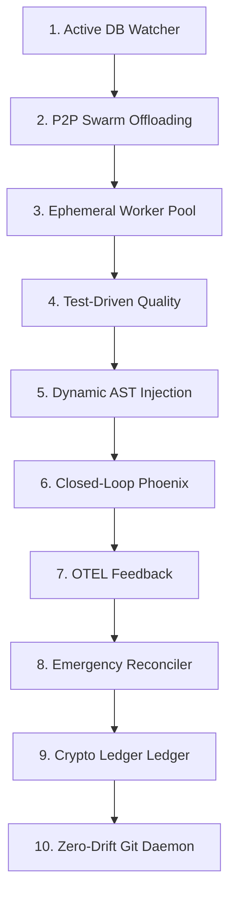

# RAE Autonomy Evolution & Self-Healing Blueprint (v6.0)

Ten dokument przedstawia strategiczną architekturę oraz **10-krokową ewolucję** ekosystemu RAE (`rae-core`, `rae-hive`, `rae-quality`, `rae-lab` oraz `rae-suite`). Celem jest wzniesienie dojrzałości modułów z poziomu reaktywnej automatyzacji (v5.0) na poziom **pełnej, rozproszonej i proaktywnej ultra-autonomii (OpenClaw-Grade Special Forces)** z zabezpieczeniami **Antigravity-Fidelity**.

---

## 📊 1. Analiza Dojrzałości Modułów (Stan Obecny v5.0)

| Moduł RAE | Poziom Autononii w v5.0 | Główne Ograniczenie w v5.0 | Kierunek Ewolucyjny (Autonomia Klasy 6) |
| :--- | :--- | :--- | :--- |
| **`rae-core`** | Średni-Wysoki | Autonaprawa bazodanowa (`AlembicSelfHealer`) wyzwala się wyłącznie przy starcie systemu. | **Ciągły monitoring anomalii i runtime'owa normalizacja:** Przejście na ciągłe śledzenie spójności i dynamiczne odtwarzanie Qdrant z migawek. |
| **`rae-hive`** | Średni | Pętla planisty (`HiveCronScheduler`) działa jednowątkowo na jednym węźle. | **Rozproszona orkiestracja zadań (P2P Load Balancing):** Dynamiczne delegowanie obciążeń do Node 2 (JULKA) i Node 3 (Piotrek). |
| **`rae-quality`** | Wysoki | Sentinel sprawdza kod statycznie. Brak weryfikacji dynamicznej (testów). | **Test-Driven Sentinel Sandboxing:** Automatyczne generowanie i uruchamianie testów jednostkowych w kontenerze przed akceptacją kodu. |
| **`rae-lab`** | Średni | Strojenie MAB routera opiera się wyłącznie na statystykach. Brak wpływu na zabezpieczenia. | **Closed-Loop Guardrail Injection:** Lab automatycznie generuje nowe filtry AST i wstrzykuje je do Hive'a po wykryciu awarii. |
| **`rae-suite`** | Średni-Wysoki | Reconciler wykrywa dryfy, ale ich naprawa wymaga restartu całego stosu. | **Zdecentralizowana Samonaprawa Infrastruktury:** Autonomiczne mikro-restarty usług, automatyczne przełączanie awaryjne (Failover). |

---

## 🛠️ 2. 10-Krokowa Ewolucja w Kierunku Skrajnej Samodzielności

### Krok 1: Ciągły, Aktywny Sentinel Bazodanowy i Wektorowy (Core)
*   **Architektura:** Przebudowa `AlembicSelfHealer` z pętli jednorazowej (startup) na ciągły proces w tle (daemon) monitorujący spójność tabel bazodanowych oraz wymiarów wektorów Qdrant w czasie rzeczywistym.
*   **Autonomia:** Jeśli podczas zapytań API wykryty zostanie błąd niezgodności wymiarowości modelu (np. zmiana lokalnego modelu z 384d na 768d), core automatycznie zainicjuje przebudowę kolekcji z backupu wektorowego w tle bez przerywania obsługi klienta.

### Krok 2: Rozproszone Przełączanie Zadań w Klastrze (P2P Swarm Load Balancing)
*   **Architektura:** Wyposażenie `HiveExecutionSwarm` w mechanizm rozpoznawania obciążenia klastra (CPU/GPU) na maszynie Lumina (Node 1).
*   **Autonomia:** Jeśli utylizacja zasobów na Node 1 przekracza 85%, planista Hive automatycznie przekieruje zadanie (przez bezpieczny mostek MCP/SSH) na maszynę Node 2 (JULKA - RTX 4080 SUPER) lub wywoła inferencję na Node 3 (Piotrek - Mixtral/Qwen), balansując pracę klastra bez udziału dewelopera.

### Krok 3: Dynamicznie Skalowana Piaskownica Docker i Kolejkowanie Celery
*   **Architektura:** Migracja Hive'a z prostego Crona na zaawansowaną kolejkę zadań (Celery/Redis) z dynamicznie powoływaną pulą sterylnych piaskownic wykonawczych.
*   **Autonomia:** Hive samodzielnie skaluje liczbę współbieżnych kontenerów wykonawczych w zależności od gęstości backlogu, automatycznie ubijając procesy przekraczające twarde limity RAM (np. 4GB) lub czasu wykonania (np. 120s).

### Krok 4: Sentinel Jakości oparty na Zautomatyzowanych Testach Dynamicznych (Quality)
*   **Architektura:** Rozbudowa Sentinel Watchera w Quality o moduł automatycznego generowania i uruchamiania testów dynamicznych w kontenerze.
*   **Autonomia:** Po wykryciu zapisu pliku `.py`, Sentinel nie tylko sprawdza statyczną strukturę AST, ale w locie generuje testy `pytest` przy użyciu lokalnego LLM, uruchamia je w sterylnej piaskownicy i akceptuje modyfikację wyłącznie przy 100% zielonych testach.

### Krok 5: Zamknięta Pętla Wstrzykiwania Zabezpieczeń (Closed-Loop AST Guardrail Injection)
*   **Architektura:** Integracja modułu `FailureMiningEngine` w Lab bezpośrednio z `ASTSafetyGuard` w Hive.
*   **Autonomia:** Po wykryciu powtarzających się awarii lub prób przełamania zabezpieczeń w logach wykonawczych, Lab generuje nową regułę blokady (np. zakaz importu określonej biblioteki) i wstrzykuje ją proaktywnie do jądra AST Safety Guard w locie bez restartu serwerów.

### Krok 6: Rekurencyjna Pętla Autonaprawy z Phoenixem (Closed-Loop Refactoring)
*   **Architektura:** Wprowadzenie sprzężenia zwrotnego pomiędzy Sentinel Quality, Phoenixem a piaskownicą testową.
*   **Autonomia:** Jeśli kod zostanie odrzucony przez Quality Sentinel, wyzwalany jest Phoenix. Wygenerowana poprawka trafia bezpośrednio do kontenera testowego. Jeśli testy zawiodą, wynik błędu trafia ponownie do Phoenixa. Pętla wykonuje do 5 rekurencyjnych prób naprawy w tle, prezentując deweloperowi wyłącznie w 100% działający kod klasy "Advanced Senior".

### Krok 7: Sub-sekundowa Pętla Sprzężenia Zwrotnego MAB (Lab Telemetry)
*   **Architektura:** Wdrożenie asynchronicznego eksportu metryk OpenTelemetry z jądra decyzyjnego routera bezpośrednio do daemona MAB.
*   **Autonomia:** Lab analizuje zachowanie API w czasie rzeczywistym i dostraja wagi routera w interwałach sub-sekundowych (real-time stream tuning), błyskawicznie reagując na nagłe skoki opóźnień (latency spikes) modeli zewnętrznych.

### Krok 8: Autonomiczny Reconciler Infrastruktury z Funkcją Emergency Failover
*   **Architektura:** Rozszerzenie CEO Orchestratora o pełną wiedzę topologiczną kontenerów i stanów portów TCP klastra.
*   **Autonomia:** W przypadku braku odpowiedzi z Ollama na Node 3 lub bazy danych PostgreSQL, orkiestrator automatycznie realizuje sekwencję ratunkową: wymusza mikro-restart kontenera, normalizuje wolumeny dyskowe i w razie trwałej awarii, przełącza ruch API na węzeł zapasowy (Emergency Failover), raportując zaistniałą sytuację jako podpisany cyfrowo rekord zdarzenia.

### Krok 9: P2P Cryptographic Decision Ledger (Konsensus Klastra)
*   **Architektura:** Implementacja rozproszonego rejestru decyzji strategicznych pomiędzy CEO Orchestratorami na Node 1, Node 2 i laptopem.
*   **Autonomia:** Wszystkie decyzje i podpisy SHA-256 są synchronizowane w rozproszonej bazie (np. SQLite z replikacją Litestream), co uniemożliwia sabotaż lub modyfikację historii audytowej, zapewniając pełną zgodność z normami ISO 27001 i ISO 42001 nawet w przypadku utraty łączności z jednym z węzłów.

### Krok 10: Zero-Drift Git Hook & Auto-Push Daemon (Bezobsługowe CI/CD)
*   **Architektura:** Wdrożenie demona synchronizacyjnego stale dbającego o brak rozjazdów kodu pomiędzy lokalnymi workspace'ami a zdalnym GitHubem.
*   **Autonomia:** Każda pomyślnie zweryfikowana i przetestowana przez Sentinel jakość kodu jest automatycznie commitowana, tagowana cyfrowo i wypychana na GitHub w dedykowanych gałęziach deweloperskich. System samoczynnie dba o to, by produkcja na maszynie Lumina była zawsze w 100% zsynchronizowana ze stanem repozytorium (GitOps-Grade Continuous Deployment).

---

## 🛡️ 3. Definicja Sukcesu (DoD) dla Autonomii Klasy 6 (Autonomy Level 6)

System RAE zostanie uznany za ewolucyjnie dojrzały do poziomu v6.0, jeśli:
1.  **Działa bez HITL (Zero Human-in-the-Loop):** Kod przechodzi pełną pętlę modyfikacji, generowania testów, refaktoryzacji Phoenixa i wdrożenia na Node 1 bez jakiejkolwiek interakcji z człowiekiem.
2.  **Kompilacja i Testy w Ephemeric Sandbox:** Każde uruchomienie kodu i testów odbywa się w odizolowanym, tymczasowym kontenerze z automatycznym sprzątaniem zasobów.
3.  **Cluster-Aware Load Balancing:** Klaster samodzielnie deleguje zadania obliczeniowe i inferencyjne pomiędzy Node 1, Node 2 i Node 3 w oparciu o telemetrię zasobów w czasie rzeczywistym.

Moje uwagi
estaw RAE-Suite: rae-core, rae-hive, rae-quality, rae-lab, rae-suite oraz warstwę Phoenix/Feniks jako silnik refaktoryzacji i naprawy. Plan z załącznika idzie w dobrym kierunku, ale wymaga kilku korekt, żeby nie zrobić „autonomicznego potwora”, który działa dużo, lecz niekoniecznie bezpiecznie i zgodnie z duchem RAE.

Najważniejsza poprawka: RAE-Suite nie powinien dążyć do ślepego Zero Human-in-the-Loop, tylko do policy-controlled autonomy: pełna autonomia dla działań odwracalnych, piaskownicowych i niskiego ryzyka; zatwierdzenie człowieka albo rady agentów dla zmian produkcyjnych, migracji, auto-pushy, zmian guardraili i operacji na danych. W planie DoD jako sukces wpisano „Zero Human-in-the-Loop” oraz automatyczne wdrożenie na Node 1, co jest bardzo mocne, ale z punktu widzenia ISO i jakości powinno być rozbite na poziomy ryzyka.

1. Krytyczna zmiana: automatyczna obsługa dowolnej długości wektorów

Masz rację: punkt o „błędzie niezgodności wymiarowości modelu 384d → 768d” nie powinien być traktowany jako awaria wymagająca przebudowy Qdrant. To powinno działać jak w RAE-agentic-memory: wektor nie jest globalnym formatem systemu, tylko artefaktem konkretnego providera/modelu/wersji/konfiguracji.

Proponowana zasada dla całego RAE-Suite:

Memory != Vector
Vector = Projection(memory, embedding_provider, model, dimension, version, normalization)

Czyli trzeba dodać wspólny kontrakt:

EmbeddingProfile:
    provider: str              # ollama, openai, - (żadnego - sentence-transformers), onnx, custom
    model: str                 # np. bge-small, qwen-embed, text-embedding-3
    dimension: int             # wykrywane automatycznie
    distance: str              # cosine / dot / euclidean
    normalization: str         # none / l2 / provider-default
    version: str               # wersja modelu albo hash
    created_at: datetime
    active: bool

I zamiast jednej kolekcji:

memories

powinieneś mieć automatyczne kolekcje/projekcje:

memories__ollama__bge_small__384
memories__qwen__embed__768
memories__openai__text_embedding_3_large__3072

albo jeden storage abstrakcyjny, który pod spodem mapuje kolekcje po embedding_profile_id.

Wtedy zmiana modelu z 384 na 768 wymiarów nie jest „anomalią”, tylko nową projekcją pamięci. System może działać tak:

zapytanie przychodzi z aktywnym EmbeddingProfile;
RAE sprawdza, czy istnieje projekcja dla tego profilu;
jeśli nie istnieje, uruchamia background embedding job;
do czasu pełnego przeliczenia używa fallbacku: text search, starsza kolekcja, hybrid degraded mode;
po osiągnięciu progu pokrycia, np. 95%, przełącza profil na aktywny;
stara kolekcja zostaje jako cold index albo do usunięcia po retencji.

To jest dużo lepsze niż „dynamiczne odtwarzanie Qdrant z migawek”, bo backupy nie rozwiązują zmiany semantyki embeddingu. Snapshot starego 384d nie da poprawnego 768d. Trzeba przeliczać projekcję z pamięci źródłowej.

2. Ocena planu pod kątem autonomii modułów
rae-core

W planie rae-core ma stać się aktywnym watcherem bazy i wektorów. Kierunek jest dobry, ale trzeba zmienić nazwę i odpowiedzialność. To nie powinien być tylko AlembicSelfHealer, bo Alembic dotyczy migracji schematu, a nie zdrowia całego systemu pamięci.

Lepszy podział:

rae-core
 ├── SchemaHealthMonitor
 ├── EmbeddingProfileRegistry
 ├── VectorProjectionManager
 ├── MemoryConsistencyChecker
 ├── IndexRebuildOrchestrator
 └── DegradedModeController

Autonomia rae-core powinna obejmować:

wykrywanie brakujących projekcji embeddingów;
automatyczne tworzenie kolekcji pod nową długość wektora;
reindeksację w tle;
fallback do hybrydowego wyszukiwania;
kontrolę spójności warstw pamięci;
wykrywanie driftu modelu embeddingowego;
audyt każdej zmiany profilu embeddingowego.

Nie powinno robić automatycznie bez kontroli:

destrukcyjnych migracji;
kasowania starych kolekcji;
cichego przełączania modelu w produkcji bez rekordu decyzji;
naprawy danych, której nie da się odwrócić.
rae-hive

Plan słusznie przesuwa Hive z Crona w stronę rozproszonego wykonania i Celery/Redis. To jest konieczne, jeżeli chcesz autonomię porównywalną z OpenClaw albo lepszą. OpenClaw jest pozycjonowany jako lokalny, wieloplatformowy asystent AI, a jego ekosystem ma pluginy do prowadzenia sesji Claude Code/Codex z izolacją worktree, zatwierdzaniem planu i pętlami celu.

Ale RAE-Hive powinien mieć przewagę: nie tylko wykonywać zadania, lecz wykonywać je przez pamięć, polityki, audyt i jakość.

Docelowo Hive powinien mieć taki model:

Task Intake
 → Intent Classification
 → Risk Classification
 → Plan Generation
 → Policy Check
 → Resource Routing
 → Sandbox Execution
 → Evidence Collection
 → Quality Gate
 → Memory Writeback
 → Audit Event
 → Optional PR / Patch / Deployment

W planie brakuje jawnego Risk Classifiera. Bez niego Hive będzie niebezpieczny, bo „napraw plik README” i „zmień migrację bazy produkcyjnej” wyglądają dla kolejki podobnie.

Proponuję klasy ryzyka:

R0 – read-only analiza
R1 – zmiana lokalna w sandboxie
R2 – zmiana kodu w branchu roboczym
R3 – PR / merge request
R4 – zmiana infrastruktury lub migracja
R5 – produkcja / dane klienta / sekrety / bezpieczeństwo

Autonomicznie można dopuścić R0–R2. R3 warunkowo po przejściu Quality. R4–R5 tylko przez zatwierdzenie lub bardzo twarde policy gates.

rae-quality

To jest najważniejszy moduł, jeśli chcesz „OpenClaw lub lepiej”. Sam OpenClaw-style agent może pracować długo i autonomicznie, ale jakość musi być wymuszona zewnętrznie, nie przez deklarację modelu.

W planie Sentinel ma generować testy pytest lokalnym LLM i akceptować tylko 100% zielonych testów. Kierunek dobry, ale „100% zielonych testów” może być fałszywym poczuciem bezpieczeństwa. Agent może wygenerować testy zbyt płytkie albo dopasowane do własnej poprawki.

Lepszy model rae-quality:

Quality Gate = Existing Tests
             + Generated Tests
             + Mutation Testing / Contract Tests
             + Static Analysis
             + Security Scan
             + Architecture Rules
             + Regression Snapshot
             + Coverage Delta
             + Behavior Contracts

Czyli Sentinel nie powinien tylko generować testów. Powinien przede wszystkim chronić istniejące kontrakty zachowania. Dla Twoich projektów to jest kluczowe, bo masz PHP/AngularJS/Next/Python i dużo logiki produkcyjnej.

Dla RAE-Suite dodałbym:

rae-quality
 ├── StaticSentinel
 ├── DynamicSentinel
 ├── ContractSentinel
 ├── SecuritySentinel
 ├── ArchitectureSentinel
 ├── ISOEvidenceCollector
 └── QualityDecisionEngine

I decyzja nie powinna brzmieć „testy zielone”, tylko:

ACCEPT / REJECT / NEEDS_REVIEW / QUARANTINE
rae-lab

W planie rae-lab ma sam generować guardraile AST i wstrzykiwać je do Hive. To jest potężny pomysł, ale bardzo niebezpieczny, jeżeli będzie robił to bez trybu eksperymentalnego.

Guardrail to nie zwykła poprawka. Błędny guardrail może zablokować legalne operacje, zepsuć pipeline albo ukryć problem. Dlatego proponuję taki tryb:

Observed Failure
 → Failure Clustering
 → Candidate Guardrail
 → Shadow Mode
 → Replay on Historical Events
 → False Positive Estimation
 → Approval / Auto-Promote if Low Risk
 → Signed Guardrail Release

Czyli rae-lab może autonomicznie generować reguły, ale najpierw powinny działać w shadow mode. Dopiero jeśli przez określony czas nie powodują fałszywych alarmów, mogą przejść do aktywnego trybu.

To jest bardzo zgodne z duchem RAE: refleksja, pamięć błędów, uczenie się z porażek, ale bez magicznego „model powiedział, więc wdrażamy”.

rae-suite

W planie rae-suite ma robić mikro-restarty, failover, synchronizację i auto-push. Tu trzeba rozdzielić dwa światy:

Autonomia infrastruktury ≠ autonomia zmiany kodu

Mikro-restart kontenera po wykryciu awarii jest OK, jeśli jest audytowany i ma limit. Auto-push do GitHuba po zmianach kodu jest dużo bardziej ryzykowny.

Proponuję rozbić krok 10:

10A. Zero-Drift Detector
10B. Auto-Branch Daemon
10C. Signed Commit Daemon
10D. Pull Request Daemon
10E. Deployment Gate

Czyli system może sam:

wykryć dryf;
utworzyć branch;
zrobić commit;
podpisać artefakt;
stworzyć PR;
dołączyć raport jakości;
poprosić o review lub uruchomić radę agentów.

Nie powinien domyślnie sam wypychać na produkcję. Produkcja powinna być osobną decyzją polityki.

3. Największe ryzyka w obecnym planie
Ryzyko 1: zbyt silne „Zero HITL”

W dokumencie sukces definiuje się jako brak człowieka w pętli. To pasuje do eksperymentów, ale nie do ISO-grade systemu operującego na repozytoriach, infrastrukturze i pamięci.

Lepsze sformułowanie:

RAE-Suite osiąga Autonomy Level 6, gdy potrafi samodzielnie planować,
wykonywać, testować, poprawiać i dokumentować działania w granicach polityk,
a dla działań wysokiego ryzyka automatycznie przechodzi w tryb zatwierdzenia.

To nadal jest autonomia, ale bez nieodpowiedzialności.

Ryzyko 2: auto-naprawa bazy jako daemon

Ciągły daemon naprawiający bazę może być groźny. Powinien mieć dwa tryby:

observe-only
safe-repair
destructive-repair-blocked

Domyślnie:

wykrywa;
raportuje;
robi snapshot;
proponuje naprawę;
sam wykonuje tylko operacje odwracalne.
Ryzyko 3: dynamiczne guardraile bez walidacji

Closed-Loop AST Guardrail Injection jest świetny, ale musi mieć wersjonowanie, testy regresyjne i shadow mode. Inaczej Lab może sam sobie „odciąć ręce”.

Ryzyko 4: sub-sekundowe strojenie MAB

Sub-sekundowa pętla MAB brzmi ambitnie, ale może prowadzić do niestabilności. Dla RAE lepszy jest model:

fast telemetry collection
slow policy update
bounded adaptation

Czyli metryki można zbierać bardzo często, ale decyzje routingu aktualizować ostrożnie, np. w oknach 30–300 sekund, z histerezą i rollbackiem.

Ryzyko 5: ledger jako „zgodność z ISO”

SHA-256 i ledger pomagają w integralności, ale same nie zapewniają zgodności z ISO 27001/42001. Potrzebujesz jeszcze:

klasyfikacji ryzyka;
kontroli dostępu;
rejestru decyzji;
właściciela procesu;
dowodów testów;
retencji;
polityki zmian;
możliwości audytu;
wyjaśnialności decyzji AI.

Ledger powinien być dowodem, nie „magicznie zgodnością”.

4. Proponowana architektura autonomii: RAE Autonomy Kernel

Do planu dodałbym wspólny komponent dla całego Suite:

RAE Autonomy Kernel
 ├── Goal Manager
 ├── Planner
 ├── Risk Classifier
 ├── Policy Engine
 ├── Tool Router
 ├── Sandbox Manager
 ├── Verifier
 ├── Evidence Collector
 ├── Decision Ledger
 ├── Memory Writeback
 └── Escalation Controller

Każdy moduł korzysta z tego samego rdzenia autonomii, ale ma inne narzędzia.

Przykład:

rae-core:
  tools: db_check, vector_projection, migration_dry_run, consistency_scan

rae-hive:
  tools: shell_sandbox, docker_runner, git_worktree, mcp_bridge, ssh_bridge

rae-quality:
  tools: pytest, mypy, ruff, bandit, semgrep, coverage, mutation_tests

rae-lab:
  tools: experiment_runner, failure_miner, guardrail_generator, replay_engine

rae-suite:
  tools: docker_compose, healthcheck, failover, gitops, deployment_gate

To jest ważniejsze niż sama kolejka Celery. Kolejka daje wykonanie, ale Autonomy Kernel daje odpowiedzialność.

5. Jak osiągnąć autonomię „OpenClaw lub lepiej”

RAE-Suite nie powinien kopiować OpenClaw 1:1. OpenClaw-style przewaga to żywe agenty, pluginy, długie sesje, obsługa repozytoriów, PR-ów, terminala, integracji i „goal loops”. RAE może być lepszy przez to, że ma pamięć, audyt, polityki, ISO, jakość i warstwę refleksyjną.

Porównanie docelowe:

Obszar	OpenClaw-style	RAE-Suite powinien mieć
Długie zadania	agent wykonuje cel	agent wykonuje cel przez pamięć i polityki
Kodowanie	generuje/zmienia kod	generuje, testuje, porównuje kontrakty, robi PR
Narzędzia	pluginy/skills	skills + risk policy + audit
Pamięć	zależna od agenta	RAE jako centralna pamięć operacyjna
Bezpieczeństwo	permissions/sandbox	Hard Frames, RBAC, audit, ISO evidence
Jakość	zależna od workflow	Quality Gate jako osobny organ
Autonomia	szeroka	szeroka, ale kontrolowana ryzykiem

Najważniejsza różnica: RAE-Suite powinien mieć autonomię organizacyjną, nie tylko narzędziową. Agent nie tylko „robi task”, ale wie:

dlaczego robi;
na jakiej podstawie;
jakie ryzyko;
jakie dowody zebrał;
jakie testy przeszły;
co zapisać do pamięci;
kiedy się zatrzymać;
kiedy eskalować.
6. Zmieniona mapa 10 kroków

Twoje 10 kroków zostawiłbym jako bazę, ale zmieniłbym kolejność i semantykę:

1. Embedding Profile Registry + Vector Projection Manager

To musi wejść jako pierwsze. Dowolna długość wektora, wiele modeli, wiele kolekcji, automatyczne wykrywanie wymiaru, fallback i reindeksacja w tle.

2. Autonomy Kernel + Risk Classifier

Bez tego kolejne kroki będą chaotyczne. Każde zadanie musi mieć poziom ryzyka i politykę wykonania.

3. Ephemeral Sandbox + Worktree Isolation

Każda zmiana kodu w osobnym worktree i kontenerze. Żadnych zmian bezpośrednio w głównym workspace.

4. Celery/Redis Worker Pool + Resource Router

Dopiero po sandboxie warto skalować wykonanie. Inaczej skalujesz chaos.

5. RAE-Quality Dynamic Gate

Testy istniejące, generowane, kontraktowe, regresyjne, security i architecture checks.

6. Phoenix Closed-Loop Repair

Phoenix naprawia tylko w sandboxie, a wynik przechodzi przez Quality. Maksymalna liczba iteracji, koszt, timeout i warunek zatrzymania.

7. Lab Failure Mining + Guardrail Shadow Mode

Lab generuje reguły, ale najpierw waliduje je na historii i w shadow mode.

8. OpenTelemetry Feedback + Slow Adaptive Routing

Zbieranie metryk szybkie, zmiana strategii ostrożna, z rollbackiem.

9. Infrastructure Reconciler + Emergency Playbooks

Mikro-restarty, failover, healthchecki, ale z limitami i audytem.

10. Signed GitOps PR Daemon, nie Auto-Push na produkcję

System sam tworzy branch, commit, raport, PR i rekomendację. Produkcja przez gate.

7. Poprawiona definicja sukcesu

Zamiast:

Zero Human-in-the-Loop

dałbym:

Zero Uncontrolled Action

To jest dużo bardziej RAE.

Proponowane DoD:

Każde zadanie ma klasyfikację ryzyka R0–R5.
Każde wykonanie odbywa się w sandboxie lub przez zatwierdzony tool adapter.
Każda zmiana kodu powstaje w izolowanym worktree.
Każda zmiana przechodzi przez Quality Gate.
Każda decyzja ma audit event, trace_id i evidence pack.
Każda projekcja embeddingów jest opisana przez EmbeddingProfile.
Zmiana długości wektora nie psuje systemu, tylko tworzy nową projekcję.
Guardraile są wersjonowane, testowane i wdrażane przez shadow mode.
Autonomia infrastruktury jest odwracalna i limitowana.
Produkcja nie jest modyfikowana bez polityki wdrożeniowej.
8. Najważniejsza rekomendacja strategiczna

Plan jest dobry jako manifest ambicji, ale wymaga zmiany filozofii:

z:  "pełna autonomia bez człowieka"
na: "pełna autonomia w ramach polityk, dowodów i pamięci"

To jest bardziej zgodne z RAE, ISO i realną jakością. RAE-Suite nie musi być „OpenClaw-Grade Special Forces” przez agresywność. Może być lepszy, bo będzie miał coś, czego zwykłe agentowe systemy często nie mają: pamięć operacyjną, ślad decyzyjny, kontrolę ryzyka, dowody jakości i zdolność uczenia się z błędów bez utraty sterowności.

Najpilniejsze zmiany w dokumencie:

Dopisać EmbeddingProfileRegistry i VectorProjectionManager.
Zastąpić „vector dimension mismatch = awaria” przez „nowa projekcja embeddingowa”.
Dodać Risk Classifier do każdego zadania.
Zmienić Zero HITL na Policy-Controlled Autonomy.
Zmienić Auto-Push Daemon na Signed PR / GitOps Gate.
Dodać shadow mode dla guardraili.
Dodać Evidence Pack jako warunek każdej decyzji.
Dodać osobne poziomy autonomii dla kodu, infrastruktury, danych i bezpieczeństwa.

W takiej wersji ten plan zaczyna wyglądać nie jak „kolejny agent do klikania i kodowania”, tylko jak autonomiczna fabryka pracy programistyczno-operacyjnej z pamięcią, audytem i jakością — i to jest dokładnie duch RAE.
