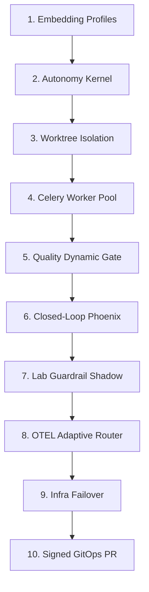

# RAE Autonomy Evolution & Self-Healing Blueprint (v6.1)
## Silicon Oracle Enterprise Autonomy Edition

Ten dokument przedstawia strategiczną architekturę oraz **10-krokową ewolucję** ekosystemu RAE (`rae-core`, `rae-hive`, `rae-quality`, `rae-lab` oraz `rae-suite`). Celem jest wzniesienie dojrzałości modułów z poziomu reaktywnej automatyzacji (v5.0) na poziom **kontrolowanej politykami, w pełni audytowalnej autonomii (Policy-Controlled Autonomy)** z twardymi standardami **Antigravity-Fidelity**.

Zamiast dążyć do niekontrolowanej, ryzykownej pętli "Zero Human-in-the-Loop", wdrażamy paradygmat **"Zero Uncontrolled Action"** – pełnej samodzielności w granicach zdefiniowanych reguł bezpieczeństwa, klasyfikacji ryzyka oraz kryptograficznego dowodu decyzji (Evidence-First Architecture).

---

## 📊 1. Analiza Dojrzałości Modułów (Stan Obecny v5.0)

| Moduł RAE | Poziom Autonomii | Główne Ograniczenie w v5.0 | Kierunek Ewolucyjny (Klasa Autonomii 6.1) |
| :--- | :--- | :--- | :--- |
| **`rae-core`** | Średni-Wysoki | `AlembicSelfHealer` działa startupowo; zmiana długości wektora (np. 384d $\rightarrow$ 768d) traktowana jest jako błąd i wymaga ręcznej migracji. | **Embedding Profile Registry & Vector Projection Manager:** Obsługa nieskończonej liczby modeli i automatyczne przeliczanie projekcji wektorowych w tle bez przestojów. |
| **`rae-hive`** | Średni | Pętla planisty działa jednowątkowo na jednym węźle bez weryfikacji ryzyka. | **Risk-Controlled P2P Task Swarm:** Wdrożenie klasyfikatora ryzyka (R0-R5) i automatyczne delegowanie bezpiecznych zadań w bezpiecznym sandboxie. |
| **`rae-quality`** | Wysoki | Sentinel sprawdza kod czysto statycznie (w locie), co daje złudną pewność poprawności. | **Multi-Tier Quality Gate:** Dynamiczna i kontraktowa weryfikacja (Existing Tests, Generated, Mutation, Security) jako osobny organ akceptacyjny. |
| **`rae-lab`** | Średni | Strojenie MAB routera bez trybu cienia. Ryzyko blokad przy błędnych dynamicznych guardrailach. | **Shadow-Mode Failure Mining:** Lab generuje guardraile i testuje je najpierw w trybie cienia (Shadow Mode) przed ostateczną aktywacją. |
| **`rae-suite`** | Średni-Wysoki | Reconciler yekrywa dryfy, ale ich naprawa wymaga restartu całego stosu. | **Signed GitOps PR Daemon:** Automatyczna detekcja dryfu, commitowanie z podpisem cyfrowym i tworzenie PR, bez auto-pushy produkcyjnych. |

---

## 🏗️ 2. Architektura RAE Autonomy Kernel

Aby zapewnić spójność logiki decyzyjnej i zapobiec powstawaniu "autonomicznych potworów", wdrażamy **RAE Autonomy Kernel** – wspólny silnik decyzyjny współdzielony przez wszystkie moduły.

```
                      +----------------------------------+
                      |       RAE AUTONOMY KERNEL        |
                      +----------------------------------+
                      |  - Goal Manager                  |
                      |  - Planner                       |
                      |  - Risk Classifier (R0-R5)       |
                      |  - Policy Engine                 |
                      |  - Tool Router                   |
                      |  - Sandbox Manager               |
                      |  - Verifier                      |
                      |  - Evidence Collector (ISO)      |
                      |  - Decision Ledger               |
                      |  - Escalation Controller         |
                      +----------------------------------+
```

Każdy moduł korzysta z jądra autonomii, lecz dysponuje własnymi adapterami narzędziowymi:
*   **`rae-core` Tools:** `db_check`, `vector_projection`, `migration_dry_run`, `consistency_scan`
*   **`rae-hive` Tools:** `shell_sandbox`, `docker_runner`, `git_worktree`, `mcp_bridge`, `ssh_bridge`
*   **`rae-quality` Tools:** `pytest`, `mypy`, `ruff`, `bandit`, `semgrep`, `mutation_tests`, `architecture_checks`
*   **`rae-lab` Tools:** `experiment_runner`, `failure_miner`, `guardrail_generator`, `replay_engine`
*   **`rae-suite` Tools:** `docker_compose`, `healthcheck`, `failover`, `gitops`, `deployment_gate`

---

## 🛠️ 3. Nowa Mapa 10 Kroków Ewolucji Autonomii



### Krok 1: Rejestr Profili Embeddingowych i Menedżer Projekcji (`rae-core`)
*   **Filozofia:** Zgadzamy się w 100%: **Memory != Vector**. Wektor to wyłącznie projekcja pamięci źródłowej.
*   **Architektura:** Wprowadzenie `EmbeddingProfileRegistry` i `VectorProjectionManager`. Zmiana długości wektora nie jest awarią, lecz aktywacją nowej projekcji wektorowej: `memories__provider__model__dimension`.
*   **Autonomia:** RAE-Core automatycznie wykrywa nowy profil, uruchamia reindeksację w tle (Background Indexer Job), a podczas reindeksacji (gdy pokrycie < 95%) płynnie korzysta z fallbacków: tekstowych, starszych kolekcji lub hybrydowego trybu degraded.

### Krok 2: Wdrożenie Klasyfikatora Ryzyka i Jądra Autonomii (`rae-hive`)
*   **Filozofia:** Bezpieczeństwo i odpowiedzialność decyzyjna.
*   **Architektura:** Wprowadzenie `RiskClassifier` przypisującego każdemu zadaniu klasę ryzyka:
    *   **R0:** Czysty odczyt i analiza danych.
    *   **R1:** Zmiany wyłącznie lokalne w sterylnej piaskownicy.
    *   **R2:** Zmiana kodu w gałęzi roboczej.
    *   **R3:** Tworzenie PR / Merge Requestu.
    *   **R4:** Zmiany schematów DB lub topologii infrastruktury.
    *   **R5:** Produkcja, dane klienta, sekrety i konfiguracja bezpieczeństwa.
*   **Autonomia:** Hive samodzielnie podejmuje decyzje i wykonuje działania wyłącznie dla klas R0–R2. Zadania klasy R3 wymagają tribunal Quality Gate, a R4–R5 są zablokowane i wymagają zatwierdzenia człowieka (Human-in-the-Loop) lub eskalacji.

### Krok 3: Ephemeric Sandbox i Izolacja Worktree
*   **Filozofia:** Całkowite odseparowanie środowisk wykonawczych.
*   **Architektura:** Każde zadanie wywołania kodu generowanego przez model jest uruchamiane wyłącznie w wydzielonym, efemerycznym kontenerze Docker oraz w odizolowanym katalogu roboczym (Git Worktree). Żadne modyfikacje kodu nie są dokonywane bezpośrednio na żywej bazie kodu deweloperskiego.

### Krok 4: Skalowalna Pula Celery Workers i Inteligentny Router Zasobów
*   **Filozofia:** Efektywne, kontrolowane rozproszenie obciążeń.
*   **Architektura:** Dopiero po zaimplementowaniu piaskownic wdrażamy Celery/Redis Worker Pool z dynamicznym balancingiem obciążeń pomiędzy Node 1 (Lumina), Node 2 (JULKA) a Node 3 (Piotrek). Resource Router kieruje zadania ML i ciężkie kompilacje na Lumina/Julia, a inferencję LLM na Piotrek.

### Krok 5: Dynamiczny, Wielopoziomowy Quality Gate (`rae-quality`)
*   **Filozofia:** Prawdziwe bezpieczeństwo kodu, a nie ślepe ufanie zielonym testom wygenerowanym przez LLM.
*   **Architektura:** Quality Gate staje się samodzielnym, restrykcyjnym organem weryfikacyjnym. Wskaźnik jakości opiera się na sumie:
    $$\text{Quality Gate} = \text{Existing Tests} + \text{Generated Tests} + \text{Mutation Tests} + \text{Static Analysis} + \text{Security Scan} + \text{Architecture Rules}$$
*   **Autonomia:** Sentinel Quality odrzuca próby płytkiego maskowania błędów testami przez AI. Zwraca cztery stany decyzji: `ACCEPT`, `REJECT`, `NEEDS_REVIEW`, `QUARANTINE`.

### Krok 6: Closed-Loop Phoenix Refactoring w Sandboxie
*   **Filozofia:** Samonaprawa bez uszkadzania głównego repozytorium.
*   **Architektura:** Pętla Phoenix naprawia kod wyłącznie wewnątrz wydzielonego sandboxa roboczego. Każda próba naprawy jest rekurencyjnie ewaluowana przez dynamiczny Quality Gate. Phoenix ma twarde limity: kosztu (Token budget), czasu (Timeout) oraz prób (Max 5), po których system automatycznie zatrzymuje pętlę i eskaluje problem do człowieka.

### Krok 7: Failure Mining i Wdrożenie Guardraili w Trybie Cienia (`rae-lab`)
*   **Filozofia:** Zgoda 100%: Lab nie może cicho wstrzykiwać barier do produkcji.
*   **Architektura:** Po zidentyfikowaniu powtarzających się błędów, Lab generuje regułę `Candidate Guardrail`.
*   **Autonomia:** Nowa bariera trafia najpierw do **Shadow Mode** (Tryb Cienia), gdzie w tle testuje historyczne logi i zdarzenia live pod kątem fałszywych alarmów (False Positive). Dopiero po przejściu okresu próbnego (np. 48h) i wykazaniu 0% fałszywych blokad, reguła może zostać automatycznie awansowana (Auto-Promote) do aktywnego parsera AST.

### Krok 8: Spowolniony, Adaptacyjny Routing i Monitor OpenTelemetry
*   **Filozofia:** Stabilność systemu ponad agresywną optymalizacją.
*   **Architektura:** Metryki OTEL są zbierane stale z sub-sekundową dokładnością, ale decyzje o dostrojeniu Routera decyzyjnego są podejmowane w bezpiecznych oknach czasowych (30–300 sekund) z zastosowaniem histerezy. Zapobiega to oscylacjom sieciowym i nieprzewidywalnym przełączeniom modeli przy chwilowych wahaniach sieci.

### Krok 9: Reconciler Infrastruktury z Ograniczoną Autonaprawą (`rae-suite`)
*   **Filozofia:** Bezpieczeństwo i odwracalność działań DevOps.
*   **Architektura:** CEO Orchestrator monitoruje porty TCP i kontenery klastra. Realizuje mikro-restarty usług i migracje bazodanowe wyłącznie dla działań odwracalnych i z twardym limitem prób (Max 3). Destrukcyjne naprawy danych są bezwzględnie zablokowane i wymagają manualnego zatwierdzenia.

### Krok 10: Signed GitOps PR Daemon zamiast Auto-Pusha
*   **Filozofia:** Zmiana mapy z auto-pusha na kontrolowany CI/CD PR.
*   **Architektura:** Eliminujemy automatyczne wrzucanie zmian kodu na produkcję.
*   **Autonomia:** System samodzielnie:
    1.  Wykrywa dryf lub przygotowuje poprawkę.
    2.  Tworzy bezpieczny branch.
    3.  Commituje i podpisuje kryptograficznie (Signed Commit).
    4.  Generuje paczkę dowodów (ISO Evidence Pack: raporty z testów, podatności, AST).
    5.  Tworzy Pull Request (PR) z dołączonym audytem i rekomendacją dla programisty, wstrzymując wdrożenie do ostatecznego zatwierdzenia (Deployment Gate).

---

## 🛡️ 4. Poprawiona Definicja Sukcesu (DoD) - Autonomy Level 6.1

Miarą sukcesu nie jest brak człowieka w pętli decyzyjnej, lecz **"Zero Uncontrolled Action"** (Zero Niekontrolowanych Akcji). DoD obejmuje:

*   **Klasyfikacja Ryzyka:** Każde zadanie posiada formalną klasyfikację ryzyka (R0-R5) z twardą blokadą autonomii powyżej R2.
*   **Izolacja Środowiska:** Każda modyfikacja kodu odbywa się w dedykowanym sandboxie i osobnym worktree.
*   **Embedding Agnosticism:** System działa stabilnie niezależnie od wymiarów wektorów (Named Collections), a zmiana modelu tworzy nową projekcję bez psucia starych baz danych.
*   **ISO Evidence Pack:** Każde działanie i decyzja są opatrzone cyfrowym podpisem, trace_id oraz metrykami wyjaśnialności AI zapisanymi w Decision Ledgerze.
*   **Shadow Mode Validation:** Wszystkie dynamiczne reguły bezpieczeństwa (Guardraile) przechodzą testy false-positive przed wdrożeniem.
*   **Odwracalność Infrastruktury:** Każda autonaprawa DevOps jest odwracalna, limitowana i raportowana w formie audytu.
