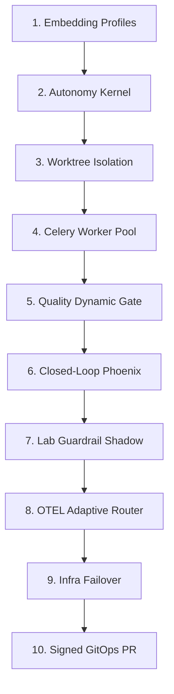

# RAE Autonomy Evolution & Self-Healing Blueprint (v6.3)
## Policy-Controlled Autonomy Edition
**Code name: Silicon Oracle**

Ten dokument przedstawia strategiczną architekturę oraz **10-krokową ewolucję** ekosystemu RAE (`rae-core`, `rae-hive`, `rae-quality`, `rae-lab` oraz `rae-suite`). Celem jest wzniesienie dojrzałości modułów z poziomu reaktywnej automatyzacji (v5.0) na poziom **kontrolowanej politykami, w pełni audytowalnej autonomii (Policy-Controlled Autonomy)** z twardymi standardami **Antigravity-Fidelity**.

Wdrażamy paradygmat **"Zero Uncontrolled Action"** – pełnej samodzielności w granicach zdefiniowanych reguł bezpieczeństwa, klasyfikacji ryzyka, uprawnień oraz kryptograficznego dowodu decyzji w myśl zasady: **No Evidence, No Autonomy**.

---

## 📊 1. Analiza Dojrzałości i Poziomów Autonomii (Autonomy Levels)

Wprowadzamy zróżnicowane docelowe poziomy autonomii (Autonomy Levels - AL) przypisane do poszczególnych modułów, aby uniknąć mylenia autonomii kodowania z autonomią produkcyjną:

| Moduł RAE | Poziom Autonomii | Główne Ograniczenie w v5.0 | Kierunek Ewolucyjny (Klasa Autonomii v6.3) |
| :--- | :--- | :--- | :--- |
| **`rae-core`** | **AL4 / AL5** | Zmiana długości wektora jest błędem schematu wymagającym migracji. | **Embedding Profile Registry & Vector Projection Manager:** Obsługa wielu modeli, automatyczna reindeksacja w tle bez usuwania starych danych. |
| **`rae-hive`** | **AL5** | Brak weryfikacji ryzyka (R0-R6) przed wykonaniem. | **Risk & Capability Controlled Swarm:** Izolacja sandbox/worktree, P2P load balancing i weryfikacja dopuszczalności operacji. |
| **`rae-quality`** | **AL5 / AL6** | Złudne zaufanie do zielonych testów wygenerowanych przez LLM. | **Multi-Tier Quality Gate & TestIntegrityGuard:** Weryfikacja mutacyjna, statyczna i chroniąca przed osłabianiem asercji testowych. |
| **`rae-lab`** | **AL4** | Zmiany guardraili wdrażane na żywo bez trybu cienia. | **Shadow-Mode Failure Mining:** Lab generuje reguły i testuje je w Shadow Mode przed ostatecznym awansowaniem. |
| **`rae-suite`** | **AL4** | Ryzyko auto-pusha na produkcję; brak odwracalności. | **Signed GitOps PR Daemon & Branch Policy:** Automatyczne PR-y z cyfrowo podpisanymi commitami i Evidence Pack, bez pusha na produkcję. |

---

## 🏗️ 2. Architektura RAE Autonomy Kernel

Jądro decyzyjne RAE Autonomy Kernel jest **centralnym modułem sterującym** współdzielonym przez wszystkie elementy suity, zapewniającym spójność polityk bezpieczeństwa i operacji.

```
                      +----------------------------------+
                      |       RAE AUTONOMY KERNEL        |
                      +----------------------------------+
                      |  - Goal Manager                  |
                      |  - Planner                       |
                      |  - Central Risk Classifier (R0-R6|
                      |  - Policy Engine                 |
                      |  - Capability Contracts          |
                      |  - Tool Router                   |
                      |  - Sandbox Manager (Worktree)    |
                      |  - Verifier                      |
                      |  - Evidence Collector (ISO)      |
                      |  - Decision Ledger               |
                      |  - Escalation Controller         |
                      +----------------------------------+
```

### Centralna Klasyfikacja Ryzyka (Risk Classifier R0-R6):
Wszystkie moduły kategoryzują planowane operacje według poniższych klas ryzyka:
*   **R0:** Czysty odczyt, statyczna analiza kodu i badanie danych (Read-Only).
*   **R1:** Zmiany wyłącznie lokalne w sterylnej piaskownicy.
*   **R2:** Zmiana kodu w wydzielonej lokalnej gałęzi roboczej (Git Worktree).
*   **R3:** Tworzenie Pull Requestu / Merge Requestu do gałęzi `develop`.
*   **R4:** Zmiany schematów bazy danych (operacje odwracalne) lub topologii kontenerów.
*   **R5:** Zmiany infrastruktury produkcyjnej, naprawa danych klientów, modyfikacje sekretów i kluczy szyfrujących.
*   **R6:** Działania bezwzględnie zabronione (działania nieautoryzowane, destrukcyjne operacje na danych, naruszanie polityk bezpieczeństwa, próby wyciągnięcia sekretów poza allowlistę). **R6 nigdy nie może zostać wykonany przez system, nawet na bezpośrednie żądanie modelu.**

#### Autonomia Decyzyjna:
*   **R0–R2:** Pełna autonomia wykonawcza systemu.
*   **R3:** Wykonanie warunkowe po przejściu dynamicznej bramki Quality Gate.
*   **R4–R5:** Blokada automatyzacji; system przechodzi w tryb zatwierdzania (Human-in-the-Loop) lub eskalacji.
*   **R6:** Natychmiastowe odrzucenie zadania i wpis do rejestru kwarantanny (`Quarantine Event`).

---

## 🛠️ 3. Nowa Mapa 10 Kroków Ewolucji Autonomii



### Krok 1: Rejestr Profili Embeddingowych i Menedżer Projekcji (`rae-core`)
*   **Zasada:** **Memory != Vector**. Wektor to wyłącznie projekcja pamięci źródłowej. Dwa modele o tym samym wymiarze mogą mieć zupełnie inną semantykę.
*   **Kontrakt `EmbeddingProfile`:**
    ```python
    class EmbeddingProfile:
        id: str
        provider: str              # ollama, openai, onnx, custom
        model: str                 # np. qwen-embed, text-embedding-3
        dimension: int             # automatycznie wykrywany wymiar
        distance: str              # cosine, dot, euclidean
        normalization: str         # l2, none, provider-default
        model_hash: str | None     # hash wag modelu
        tokenizer_hash: str | None # hash konfiguracji tokenizera
        created_at: datetime
        active: bool
    ```
*   **Autonomia:** Zmiana profilu nie wywołuje awarii. `VectorProjectionManager` tworzy nową kolekcję (np. `memories__provider__model__dimension`) i w tle wyzwala `Background Indexer Job`. Do czasu osiągnięcia progu pokrycia >95%, system działa w **trybie degraded** (fallback do tekstowego wyszukiwania lub starszej kolekcji).

### Krok 2: Centralne Jądro Autonomii i Risk Classifier (`rae-hive`)
*   **Architektura:** Wprowadzenie wspólnego `RAE Autonomy Kernel` na poziomie całej suity, z centralnym mechanizmem klasyfikacji ryzyka (R0-R6) przed wywołaniem jakiegokolwiek narzędzia.

### Krok 3: Efemeryczny Sandbox (Ephemeral Sandbox) i Izolacja Worktree
*   **Architektura:** Każde zadanie wywołania kodu generowanego przez model jest uruchamiane wyłącznie w wydzielonym kontenerze Docker (Ephemeral Sandbox) oraz w odizolowanym katalogu roboczym (Git Worktree). Żadne modyfikacje kodu nie są dokonywane bezpośrednio na żywej bazie kodu deweloperskiego.

### Krok 4: Skalowalna Pula Celery Workers i Inteligentny Router Zasobów
*   **Architektura:** Dopiero po zaimplementowaniu piaskownic wdrażamy Celery/Redis Worker Pool z dynamicznym balancingiem obciążeń pomiędzy Node 1 (Lumina), Node 2 (JULKA) a Node 3 (Piotrek). Resource Router kieruje zadania ML i ciężkie kompilacje na Lumina/Julia, a inferencję LLM na Piotrek.

### Krok 5: Dynamiczny, Wielopoziomowy Quality Gate (`rae-quality`)
*   **Architektura:** Sentinel Quality ocenia kod według precyzyjnych progów decyzyjnych (`ACCEPT`, `REJECT`, `NEEDS_REVIEW`, `QUARANTINE`) bazujących na asercjach testów, McCabes, podatnościach SAST oraz architekturze.
*   **TestIntegrityGuard:** Nowy, dedykowany moduł dbający o to, by agent nie próbował „naprawić” kodu poprzez osłabianie asercji testowych, kasowanie trudnych testów regresyjnych czy modyfikację plików testowych. Każde pogorszenie jakości lub pokrycia testów automatycznie odrzuca zmianę (`REJECT/QUARANTINE`).

### Krok 6: Closed-Loop Phoenix Refactoring w Sandboxie
*   **Architektura:** Phoenix naprawia kod wyłącznie wewnątrz wydzielonego sandboxa roboczego. Każda próba naprawy jest rekurencyjnie ewaluowana przez dynamiczny Quality Gate. Phoenix ma twarde limity: kosztu (Token budget), czasu (Timeout) oraz prób (Max 5), po których system automatycznie zatrzymuje pętlę i eskaluje problem do człowieka.

### Krok 7: Dynamiczny Shadow Mode dla Guardraili (`rae-lab`)
*   **Architektura:** Zapobieganie blokowaniu pipeline'u przez fałszywe alarmy (False Positive). Nowy guardrail przechodzi okres próbny w trybie cienia.
*   **Autonomia:** Promocja reguły AST z `Candidate Guardrail` do wersji aktywnej następuje po spełnieniu kryteriów:
    *   Wskaźnik False Positive na bazie historycznych replayów logów mieści się poniżej ustalego progu.
    *   Reguła nie blokuje żadnej operacji o statusie krytycznym.
    *   Posiada wersję, proweniencję (autora) i wbudowany plan automatycznego wycofania (`Rollback Plan`).

### Krok 8: Spowolniony, Adaptacyjny Routing i Monitor OpenTelemetry
*   **Architektura:** Metryki OTEL są zbierane stale z sub-sekundową dokładnością, ale decyzje o dostrojeniu Routera decyzyjnego są podejmowane w bezpiecznych oknach czasowych (30–300 sekund) z zastosowaniem histerezy. Zapobiega to oscylacjom sieciowym i nieprzewidywalnym przełączeniom modeli przy chwilowych wahaniach sieci.

### Krok 9: Reconciler Infrastruktury z Ograniczoną Autonaprawą (`rae-suite`)
*   **Architektura:** CEO Orchestrator monitoruje porty TCP i kontenery klastra. Realizuje mikro-restarty usług i migracje bazodanowe wyłącznie dla działań odwracalnych i z twardym limitem prób (Max 3). Destrukcyjne naprawy danych są bezwzględnie zablokowane i wymagają manualnego zatwierdzenia.

### Krok 10: Signed GitOps PR Daemon i Branch Policies
*   **Wdrożenie Polityk Branchy (Branch Policies):**
    *   `main/master`: Bezpośredni push bezwzględnie zablokowany. Wymaga udokumentowanego przejścia bramki wdrożeniowej (Deployment Gate).
    *   `develop`: Akceptuje Pull Requesty wygenerowane przez agenty po uzyskaniu statusu `ACCEPT` z Quality Gate.
    *   `agent/*`: Gałęzie tworzone automatycznie przez RAE-Suite. Każdy commit musi być cyfrowo podpisany, powiązany z `trace_id` oraz paczką dowodów `Evidence Pack`.
    *   `experiment/*`: Gałęzie robocze dla RAE-Lab – bez prawa do wdrożenia.

---

## 🔒 4. Governance, ISO Evidence & RAE Principles

Wprowadzamy kardynalną zasadę ekosystemu: **No Evidence, No Autonomy** (Brak dowodów = brak autonomii). Każde działanie systemu musi wygenerować kompletny kryptograficzny pakiet dowodowy (**ISO Evidence Pack**) oraz lekki wpis w **Decision Ledger**.

### Rozdzielenie Rejestrów:
*   **ISO Evidence Pack (Pełny pakiet dowodowy):** Bogaty, szczegółowy zrzut logów wykonawczych, testów, pokrycia, wywołań narzędzi i podatności (zapisywany w bezpiecznym storage'u lokalnym lub chmurowym).
*   **Decision Ledger (Lekki append-only rejestr):** Szybki i odporny rejestr zawierający wyłącznie metadane decyzji, podpisy cyfrowe oraz hash pakietu dowodowego.
    ```json
    {
      "ledger_entry_id": "led_...",
      "trace_id": "trace_...",
      "risk_class": "R2",
      "decision": "ACCEPT",
      "evidence_pack_hash": "sha256:...",
      "evidence_pack_uri": "s3/local/path/...",
      "signed_by": "rae-autonomy-kernel",
      "timestamp": "2026-05-24T..."
    }
    ```

Każda autonomiczna akcja rejestruje:
1.  `goal_id` / `task_id` / `trace_id`
2.  `risk_class` (R0-R6)
3.  `policy_decision`
4.  `sandbox_id` / `worktree_id`
5.  `quality_result` (TestIntegrityGuard)
6.  `evidence_pack_uri`
7.  `decision_ledger_entry`
8.  `rollback_plan` (wymagany dla R3+)
9.  `memory_writeback_status`

---

## 🛡️ 5. Capability Contracts, Dry Run & Stop Conditions

### Capability Contracts (Kontrakty Uprawnień)
Każdy agent, moduł i adapter narzędziowy posiada formalny kontrakt uprawnień określający:
*   Dozwolone klasy ryzyka.
*   Dozwolone narzędzia (allowlist) oraz zakazane operacje (denylist).
*   Politykę dostępu do sieci (outbound deny_by_default).
*   Politykę dostępu do sekretów systemowych.
*   Wymagane dowody (evidence requirements).
*   Maksymalny budżet czasu i kosztu.

*Risk Classifier określa ryzyko zadania, ale Capability Contract określa, czy dany wykonawca ma prawo to zadanie wykonać, stanowiąc drugą linię obrony.*

### Mandatory Dry Run for R3+ (Obowiązkowa Symulacja)
Każda operacja klasy R3 lub wyższej musi przejść etap symulacji przed faktycznym wykonaniem:
*   **Kod:** Testy, lint, coverage, mutation scan, sandbox execution.
*   **Baza danych:** Migracja na kopii schematu lub snapshotu.
*   **Infrastruktura:** Walidacja konfiguracji, healthcheck planu, symulacja rollbacku.
*   **GitOps:** PR preview i CI.

*Brak raportu dry-run blokuje ostateczne wykonanie.*

### Global Stop Conditions (Globalne Warunki Zatrzymania)
System natychmiastowo przerywa autonomiczną pętlę i eskaluje problem do człowieka, gdy wystąpi:
*   Przekroczenie budżetu czasu, kosztu lub prób.
*   Powtarzający się ten sam błąd (looping anomaly).
*   Spadek jakości kodu między iteracjami.
*   Konflikt polityk lub niepewna klasyfikacja ryzyka.
*   Brak pełnego `Evidence Pack` lub brak `Rollback Planu` dla R3+.
*   Wykrycie działania klasy R6.
*   Wykrycie próby osłabienia testów, manipulacji zależnościami lub ukrycia regresji.

### Memory Writeback Policy (Zasady Zapisu Refleksyjnego)
Po zakończeniu zadania system klasyfikuje informacje i decyduje o ich zapisie do odpowiednich warstw pamięci RAE, zapobiegając zaśmiecaniu bazy zdarzeniami technicznymi:
*   **Working Memory:** Wyłącznie aktywne zadania i krótkotrwały kontekst operacyjny.
*   **Episodic Memory:** Kompletny przebieg wykonania, błędy, decyzje i rollbacki.
*   **Semantic Memory:** Stabilne, zaakceptowane kontrakty, wzorce i reguły architektoniczne.
*   **Reflective Memory:** Wnioski z failure mining, odrzucone warianty i długoterminowe wnioski strategiczne.

*Brak poprawnej klasyfikacji pamięci blokuje zapis refleksyjny.*

---

## 🛡️ 6. Definicja Sukcesu (DoD) - Autonomy Level 6.3

Miarą sukcesu jest **"Zero Uncontrolled Action"** (Zero Niekontrolowanych Akcji). Kryteria DoD:

*   **Risk & Capability Governance:** Każde zadanie posiada formalną klasyfikację ryzyka (R0-R6) z twardą blokadą powyżej klasy R2 wzbogaconą o weryfikację Capability Contract.
*   **Sterylna Izolacja:** Każda modyfikacja kodu powstaje wyłącznie w kontenerze Ephemeral Sandbox i osobnym worktree.
*   **Embedding Agnosticism:** System działa stabilnie niezależnie od wymiarów wektorów (Named Collections), a zmiana modelu tworzy nową projekcję bez psucia starych baz danych.
*   **Kryptograficzna Audytowalność:** Każda decyzja posiada paczkę dowodów `Evidence Pack` oraz lekki wpis SHA-256 w Decision Ledgerze.
*   **Shadow Mode Validation:** Dynamiczne reguły bezpieczeństwa (Guardraile) przechodzą testy false-positive na logach historycznych przed wdrożeniem.
*   **Odwracalność Infrastruktury:** Każda autonaprawa DevOps jest odwracalna, limitowana i raportowana w formie audytu z przygotowanym planem rollbacku.
