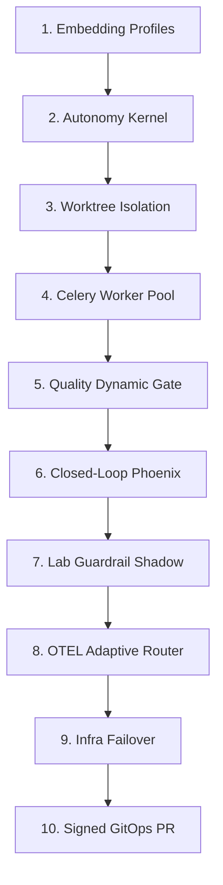

# RAE Autonomy Evolution & Self-Healing Blueprint (v6.6)
## Policy-Controlled Autonomy & Execution Specification Edition
**Code name: Silicon Oracle**

Ten dokument przedstawia strategiczną architekturę, **10-krokową ewolucję** oraz **kontrakty wykonawcze** ekosystemu RAE (`rae-core`, `rae-hive`, `rae-quality`, `rae-lab` oraz `rae-suite`). Celem jest wzniesienie dojrzałości modułów z poziomu reaktywnej automatyzacji (v5.0) na poziom **kontrolowanej politykami, w pełni audytowalnej autonomii (Policy-Controlled Autonomy)** z twardymi standardami **Antigravity-Fidelity**.

Wdrażamy paradygmat **"Zero Uncontrolled Action"** – pełnej samodzielności w granicach zdefiniowanych reguł bezpieczeństwa, klasyfikacji ryzyka, uprawnień, granic danych oraz kryptograficznego dowodu decyzji w myśl zasady: **No Evidence, No Autonomy**.

> [!NOTE]
> RAE-Suite nie optymalizuje maksymalnej autonomii. RAE-Suite optymalizuje maksymalną bezpieczną sprawczość przy pełnej odtwarzalności decyzji.

---

## 📊 1. Analiza Dojrzałości i Poziomów Autonomii (Autonomy Levels)

Wprowadzamy zróżnicowane docelowe poziomy autonomii (Autonomy Levels - AL) przypisane do poszczególnych modułów, aby uniknąć mylenia autonomii kodowania z autonomią produkcyjną:

| Moduł RAE | Poziom Autonomii | Główne Ograniczenie w v5.0 | Kierunek Ewolucyjny (Klasa Autonomii v6.6) |
| :--- | :--- | :--- | :--- |
| **`rae-core`** | **AL4 / AL5** | Zmiana długości wektora jest błędem schematu wymagającym migracji. | **Embedding Profile Registry & Vector Projection Manager:** Obsługa wielu modeli, automatyczna reindeksacja w tle bez usuwania starych danych. |
| **`rae-hive`** | **AL5** | Brak weryfikacji ryzyka (R0-R6) przed wykonaniem. | **Risk & Capability Controlled Swarm:** Izolacja sandbox/worktree, P2P load balancing i weryfikacja dopuszczalności operacji. |
| **`rae-quality`** | **AL5 / AL6** | Złudne zaufanie do zielonych testów wygenerowanych przez LLM. | **Multi-Tier Quality Gate & TestIntegrityGuard:** Weryfikacja mutacyjna, statyczna i chroniąca przed osłabianiem asercji testowych. |
| **`rae-lab`** | **AL4** | Zmiany guardraili wdrażane na żywo bez trybu cienia. | **Shadow-Mode Failure Mining:** Lab generuje reguły i testuje je w Shadow Mode przed ostatecznym awansowaniem. |
| **`rae-suite`** | **AL4** | Ryzyko auto-pusha na produkcję; brak odwracalności. | **Signed GitOps PR Daemon & Branch Policy:** PR-y z cyfrowo podpisanymi commitami i Evidence Pack, bez pusha na produkcję. |

---

## 🏗️ 2. Architektura RAE Autonomy Kernel

Jądro decyzyjne RAE Autonomy Kernel jest **centralnym modułem sterującym** współdzielonym przez wszystkie elementy suity, zapewniającym spójność polityk bezpieczeństwa i operacji.

```
                      +----------------------------------+
                      |       RAE AUTONOMY KERNEL        |
                      +----------------------------------+
                      |  - Goal Manager                  |
                      |  - Planner                       |
                      |  - Central Risk Classifier       |
                      |  - Policy Engine                 |
                      |  - Capability Contracts          |
                      |  - Tool Router                   |
                      |  - Sandbox Manager (Worktree)    |
                      |  - Verifier                      |
                      |  - Evidence Collector (ISO)      |
                      |  - Decision Ledger               |
                      |  - Escalation Controller         |
                      +----------------------------------+
```

### Centralna Klasyfikacja Ryzyka (Risk Classifier R0-R6):
Wszystkie moduły kategoryzują planowane operacje według poniższych klas ryzyka:
*   **R0:** Czysty odczyt, statyczna analiza kodu i badanie danych (Read-Only).
*   **R1:** Zmiany wyłącznie lokalne w sterylnej piaskownicy.
*   **R2:** Zmiana kodu w wydzielonej lokalnej gałęzi roboczej (Git Worktree).
*   **R3:** Tworzenie Pull Requestu / Merge Requestu do gałęzi `develop`.
*   **R4:** Zmiany schematów bazy danych (operacje odwracalne) lub topologii kontenerów.
*   **R5:** Zmiany infrastruktury produkcyjnej, naprawa danych klientów, modyfikacje sekretów i kluczy szyfrujących.
*   **R6:** Działania bezwzględnie zabronione (działania nieautoryzowane, destrukcyjne operacje na danych, naruszanie polityk bezpieczeństwa, próby wyciągnięcia sekretów poza allowlistę). **R6 nigdy nie może zostać wykonany przez system, nawet na bezpośrednie żądanie modelu.**

#### Autonomia Decyzyjna:
*   **R0–R2:** Pełna autonomia wykonawcza systemu.
*   **R3:** Wykonanie warunkowe po przejściu dynamicznej bramki Quality Gate.
*   **R4–R5:** Blokada automatyzacji; system przechodzi w tryb zatwierdzania (Human-in-the-Loop) lub eskalacji.
*   **R6:** Natychmiastowe odrzucenie zadania i wpis do rejestru kwarantanny (`Quarantine Event`).

---

## 🛠️ 3. Nowa Mapa 10 Kroków Ewolucji Autonomii



### Krok 1: Rejestr Profili Embeddingowych i Menedżer Projekcji (`rae-core`)
*   **Zasada:** **Memory != Vector**. Wektor to wyłącznie projekcja pamięci źródłowej. Dwa modele o tym samym wymiarze mogą mieć zupełnie inną semantykę.
*   **Kontrakt `EmbeddingProfile`:**
    ```python
    class EmbeddingProfile:
        id: str
        provider: str              # ollama, openai, onnx, custom
        model: str                 # np. qwen-embed, text-embedding-3
        dimension: int             # automatycznie wykrywany wymiar
        distance: str              # cosine, dot, euclidean
        normalization: str         # l2, none, provider-default
        model_hash: str | None     # hash wag modelu
        tokenizer_hash: str | None # hash konfiguracji tokenizera
        created_at: datetime
        active: bool
    ```
*   **Autonomia:** Zmiana profilu nie wywołuje awarii. `VectorProjectionManager` tworzy nową kolekcję (np. `memories__provider__model__dimension`) i w tle wyzwala `Background Indexer Job`. Do czasu osiągnięcia progu pokrycia >95%, system działa w **trybie degraded** (fallback do tekstowego wyszukiwania lub starszej kolekcji).

### Krok 2: Centralne Jądro Autonomii i Risk Classifier (`rae-suite` / shared kernel)
*   **Architektura:** Wprowadzenie wspólnego `RAE Autonomy Kernel` na poziomie całej suity, z centralnym mechanizmem klasyfikacji ryzyka (R0-R6) przed wywołaniem jakiegokolwiek narzędzia.

### Krok 3: Efemeryczny Sandbox (Ephemeral Sandbox) i Izolacja Worktree
*   **Architektura:** Każde zadanie wywołania kodu generowanego przez model jest uruchamiane wyłącznie w wydzielonym kontenerze Docker (Ephemeral Sandbox) oraz w odizolowanym katalogu roboczym (Git Worktree). Żadne modyfikacje kodu nie są dokonywane bezpośrednio na żywej bazie kodu deweloperskiego.

### Krok 4: Skalowalna Pula Celery Workers i Inteligentny Router Zasobów
*   **Architektura:** Dopiero po zaimplementowaniu piaskownic wdrażamy Celery/Redis Worker Pool z dynamicznym balancingiem obciążeń pomiędzy Node 1 (Lumina), Node 2 (JULKA) a Node 3 (Piotrek). Resource Router kieruje zadania ML i ciężkie kompilacje na Lumina/Julia, a inferencję LLM na Piotrek.

### Krok 5: Dynamiczny, Wielopoziomowy Quality Gate (`rae-quality`)
*   **Architektura:** Sentinel Quality ocenia kod według precyzyjnych progów decyzyjnych (`ACCEPT`, `REJECT`, `NEEDS_REVIEW`, `QUARANTINE`) bazujących na asercjach testów, McCabes, podatnościach SAST oraz architekturze.
*   **TestIntegrityGuard:** Dedykowany moduł dbający o to, by agent nie próbował „naprawić” kodu poprzez osłabianie asercji testowych, kasowanie trudnych testów regresyjnych czy modyfikację plików testowych. Każde pogorszenie jakości lub pokrycia testów automatycznie odrzuca zmianę (`REJECT/QUARANTINE`).

### Krok 6: Closed-Loop Phoenix Refactoring w Sandboxie
*   **Architektura:** Phoenix naprawia kod wyłącznie wewnątrz wydzielonego sandboxa roboczego. Każda próba naprawy jest rekurencyjnie ewaluowana przez dynamiczny Quality Gate. Phoenix ma twarde limity: kosztu (Token budget), czasu (Timeout) oraz prób (Max 5), po których system automatycznie zatrzymuje pętlę i eskaluje problem do człowieka.

### Krok 7: Dynamiczny Shadow Mode dla Guardraili (`rae-lab`)
*   **Architektura:** Zapobieganie blokowaniu pipeline'u przez fałszywe alarmy (False Positive). Nowy guardrail przechodzi okres próbny w trybie cienia.
*   **Autonomia:** Promocja reguły AST z `Candidate Guardrail` do wersji aktywnej następuje po spełnieniu kryteriów:
    *   Wskaźnik False Positive na bazie historycznych replayów logów mieści się poniżej ustalonego progu.
    *   Reguła nie blokuje żadnej operacji o statusie krytycznym.
    *   Posiada wersję, proweniencję (autora) i wbudowany plan automatycznego wycofania (`Rollback Plan`).

### Krok 8: Spowolniony, Adaptacyjny Routing i Monitor OpenTelemetry
*   **Architektura:** Metryki OTEL są zbierane stale z sub-sekundową dokładnością, ale decyzje o dostrojeniu Routera decyzyjnego są podejmowane w bezpiecznych oknach czasowych (30–300 sekund) z zastosowaniem histerezy. Zapobiega to oscylacjom sieciowym i nieprzewidywalnym przełączeniom modeli przy chwilowych wahaniach sieci.

### Krok 9: Reconciler Infrastruktury z Ograniczoną Autonaprawą (`rae-suite`)
*   **Architektura:** CEO Orchestrator monitoruje porty TCP i kontenery klastra. Realizuje mikro-restarty usług i migracje bazodanowe wyłącznie dla działań odwracalnych i z twardym limitem prób (Max 3). Destrukcyjne naprawy danych są bezwzględnie zablokowane i wymagają manualnego zatwierdzenia.

### Krok 10: Signed GitOps PR Daemon i Branch Policies
*   **Wdrożenie Polityk Branchy (Branch Policies):**
    *   `main/master`: Bezpośredni push bezwzględnie zablokowany. Wymaga udokumentowanego przejścia bramki wdrożeniowej (Deployment Gate).
    *   `develop`: Akceptuje Pull Requesty wygenerowane przez agenty po uzyskaniu statusu `ACCEPT` z Quality Gate.
    *   `agent/*`: Gałęzie tworzone automatycznie przez RAE-Suite. Każdy commit musi być cyfrowo podpisany, powiązany z `trace_id` oraz paczką dowodów `Evidence Pack`.
    *   `experiment/*`: Gałęzie robocze dla RAE-Lab – bez prawa do wdrożenia.

---

## 🔒 4. Governance, ISO Evidence & RAE Principles

Wprowadzamy kardynalną zasadę ekosystemu: **No Evidence, No Autonomy** (Brak dowodów = brak autonomii). Każde działanie systemu musi wygenerować kompletny kryptograficzny pakiet dowodowy (**ISO Evidence Pack**) oraz lekki wpis w **Decision Ledger**.

### Rozdzielenie Rejestrów:
*   **ISO Evidence Pack (Pełny pakiet dowodowy):** Bogaty, szczegółowy zrzut logów wykonawczych, testów, pokrycia, wywołań narzędzi i podatności (zapisywany w bezpiecznym storage'u lokalnym lub chmurowym).
*   **Decision Ledger (Lekki append-only rejestr):** Szybki i odporny rejestr zawierający wyłącznie metadane decyzji, podpisy cyfrowe oraz hash pakietu dowodowego.
    ```json
    {
      "ledger_entry_id": "led_...",
      "trace_id": "trace_...",
      "risk_class": "R2",
      "decision": "ACCEPT",
      "evidence_pack_hash": "sha256:...",
      "evidence_pack_uri": "s3/local/path/...",
      "signed_by": "rae-autonomy-kernel",
      "timestamp": "2026-05-24T..."
    }
    ```

Każda autonomiczna akcja rejestruje:
1.  `goal_id` / `task_id` / `trace_id`
2.  `risk_class` (R0-R6)
3.  `policy_decision`
4.  `sandbox_id` / `worktree_id`
5.  `quality_result` (TestIntegrityGuard)
6.  `evidence_pack_uri`
7.  `decision_ledger_entry`
8.  `rollback_plan` (wymagany dla R3+)
9.  `memory_writeback_status`

### ### Evidence & Ledger Retention Policy (Polityka Retencji)
Dla zapewnienia zgodności z normami ISO 27001 / ISO 42001 oraz optymalizacji kosztów przechowywania danych (storage), wprowadzamy precyzyjną politykę retencji zasobów audytowych:
*   **Decision Ledger (Append-only rejestr metadanych):** Przechowywany **bezterminowo** (Permanent Ledger). Stanowi rdzeń historii audytowej systemu.
*   **ISO Evidence Packs (Pełne pakiety dowodowe):** Przechowywane przez **90 dni**. Po tym okresie, pliki logów, raporty coverage i zrzuty linterów są automatycznie kompresowane do archiwum zip, a po kolejnych 180 dniach trwale usuwane, pozostawiając wyłącznie podpis SHA-256 w Decision Ledgerze.
*   **Efemeryczne Sandboxy (Obrazy i kontenery):** Środowiska Docker oraz pliki Git Worktree dla zadań zakończonych (status `COMPLETED` lub `REJECTED`) są usuwane automatycznie w ciągu **7 dni** przez demona `HiveGarbageCollector`.
*   **Polityka Anonimizacji i Maskowania:** Bezwzględny, wbudowany zakaz zapisu haseł, kluczy prywatnych SSH, `.env` i tokenów API do jakichkolwiek logów czy pakietów dowodowych. Wszystkie sekrety pasujące do wzorca regex są maskowane ciągiem `[REDACTED_SECRET]`.

---

## 🛡️ 5. Capability Contracts, Dry Run & Stop Conditions

### Capability Contracts (Kontrakty Uprawnień)
Każdy agent, moduł i adapter narzędziowy posiada formalny kontrakt uprawnień określający:
*   Dozwolone klasy ryzyka.
*   Dozwolone narzędzia (allowlist) oraz zakazane operacje (denylist).
*   Politykę dostępu do sieci (outbound deny_by_default).
*   Politykę dostępu do sekretów systemowych.
*   Wymagane dowody (evidence requirements).
*   Maksymalny budżet czasu i kosztu.

*Risk Classifier określa ryzyko zadania, ale Capability Contract określa, czy dany wykonawca ma prawo to zadanie wykonać, stanowiąc drugą linię obrony.*

### ### Capability Decision Matrix (Macierz Uprawnień Modułów)
Poniższa tabela przedstawia przypisanie praw wykonawczych modułów w zależności od klasy ryzyka operacji:

| Moduł RAE | R0 (Read-Only) | R1 (Sterile Sandbox) | R2 (Local Worktree) | R3 (Create PR) | R4 (DB Schema / Pods) | R5 (Infra / Secrets) | R6 (Prohibited) |
| :--- | :--- | :--- | :--- | :--- | :--- | :--- | :--- |
| **`rae-core`** | `auto` | `auto` | *n/a* | *n/a* | `needs_approval` | `needs_approval` | `quarantine` |
| **`rae-hive`** | `auto` | `auto` | `auto` | `gated` | `blocked` | `blocked` | `quarantine` |
| **`rae-quality`** | `auto` | `auto` | `gate` | `gate` | `needs_review` | `needs_review` | `quarantine` |
| **`rae-lab`** | `auto` | `sandbox` | `experiment` | `shadow` | `needs_approval` | `blocked` | `quarantine` |
| **`rae-suite`** | `auto` | `auto` | *n/a* | `PR only` | `needs_approval` | `needs_approval` | `quarantine` |

*Objaśnienia:*
- `auto`: Pełna, samodzielna automatyzacja.
- `gate`: Wymagane zaliczenie dynamicznych progów Quality Gate.
- `gated`: Wymagany pomyślny dry-run i spójny pakiet Evidence Pack.
- `shadow`: Działanie wyłącznie w trybie Shadow Mode (analiza i testy, brak wpływu produkcyjnego).
- `needs_review` / `needs_approval`: Wymaga protokołu manualnej autoryzacji człowieka (Human-in-the-Loop).
- `blocked`: Całkowity brak uprawnień wykonawczych na poziomie Capability Contract.
- `quarantine`: Natychmiastowe odrzucenie i wpis quarantine log.

### Mandatory Dry Run for R3+ (Obowiązkowa Symulacja)
Każda operacja klasy R3 lub wyższej musi przejść etap symulacji przed faktycznym wykonaniem:
*   **Kod:** Testy, lint, coverage, mutation scan, sandbox execution.
*   **Baza danych:** Migracja na kopii schematu lub snapshotu.
*   **Infrastruktura:** Walidacja konfiguracji, healthcheck planu, symulacja rollbacku.
*   **GitOps:** PR preview i CI.

*Brak raportu dry-run blokuje ostateczne wykonanie.*

### ### Global Simulation Mode (Globalny Tryb Symulacji)
Aby umożliwić weryfikację bezpieczeństwa, audyty ISO oraz bezpieczne demonstracje u klientów bez wpływu na infrastrukturę produkcyjną, wprowadzamy tryb symulacji sterowany zmienną:
```bash
AUTONOMY_MODE=simulation_only
```
Gdy zmienna jest ustawiona na `simulation_only`, Autonomy Kernel:
1.  Przechodzi w pełnym stopniu przez kroki: `RECEIVED` → `CLASSIFIED` → `POLICY_CHECKED` → `CAPABILITY_CHECKED` → `PLANNED` → `DRY_RUN`.
2.  Wykonuje kroki w sandboxie (`SANDBOX_EXECUTING`), zbiera dowody (`QUALITY_GATE`, `EVIDENCE_PACKING`) i kalkuluje logikę.
3.  **BLOKUJE** wszelkie zapisy na bazie produkcyjnej, wyjścia sieciowe poza sterylny sandbox, restarty kontenerów oraz commity/pushe do głównych gałęzi.
4.  Zapisuje w `Execution Receipt` status `SIMULATED_SUCCESS` oraz generuje pełny próbny raport `ISO Evidence Pack` i `Decision Ledger Entry` z podpisem `simulation-agent`.

### Global Stop Conditions (Globalne Warunki Zatrzymania)
System natychmiastowo przerywa autonomiczną pętlę i eskaluje problem do człowieka, gdy wystąpi:
*   Przekroczenie budżetu czasu, kosztu lub prób.
*   Powtarzający się ten sam błąd (looping anomaly).
*   Spadek jakości kodu między iteracjami.
*   Konflikt polityk lub niepewna klasyfikacja ryzyka.
*   Brak pełnego `Evidence Pack` lub brak `Rollback Planu` dla R3+.
*   Wykrycie działania klasy R6.
*   Wykrycie próby osłabienia testów, manipulacji zależnościami lub ukrycia regresji.

### Memory Writeback Policy (Zasady Zapisu Refleksyjnego)
Po zakończeniu zadania system klasyfikuje informacje i decyduje o ich zapisie do odpowiednich warstw pamięci RAE, zapobiegając zaśmiecaniu bazy zdarzeniami technicznymi:
*   **Working Memory:** Wyłącznie aktywne zadania i krótkotrwały kontekst operacyjny.
*   **Episodic Memory:** Kompletny przebieg wykonania, błędy, decyzje i rollbacki.
*   **Semantic Memory:** Stabilne, zaakceptowane kontrakty, wzorce i reguły architektoniczne.
*   **Reflective Memory:** Wnioski z failure mining, odrzucone warianty i długoterminowe wnioski strategiczne.

*Brak poprawnej klasyfikacji pamięci blokuje zapis refleksyjny.*

---

## 🛡️ 6. Execution Receipts, Approval Protocol & Autonomy Evaluation

### Execution Receipt (Paragon Wykonania)
Każda akcja wykonana przez RAE Autonomy Kernel zwraca ustandaryzowany paragon (`Execution Receipt`), który spina wynik techniczny z dowodami ISO. Brak paragonu blokuje oznaczenie zadania jako zakończone:
```json
{
  "receipt_id": "rec_...",
  "goal_id": "goal_...",
  "task_id": "task_...",
  "trace_id": "trace_...",
  "module": "rae-hive",
  "agent_id": "hive-worker-01",
  "risk_class": "R2",
  "capability_contract_id": "cap_hive_worker_v1",
  "policy_decision": "ALLOW",
  "execution_status": "SUCCESS",
  "quality_status": "ACCEPT",
  "sandbox_id": "sbx_...",
  "worktree_id": "wt_...",
  "evidence_pack_hash": "sha256:...",
  "ledger_entry_id": "led_...",
  "memory_writeback_status": "COMPLETED",
  "rollback_plan_id": null,
  "started_at": "2026-05-24T...",
  "finished_at": "2026-05-24T..."
}
```

### Policy Decision Matrix (Macierz Decyzji Polityk)
Końcowa zgoda na wykonanie lub wdrożenie modyfikacji opiera się na spójnej bramce decyzyjnej:

| Klasa Ryzyka | Capability Contract | Wynik Quality Gate | Dowody (Evidence) | Dry-Run Status | Decyzja Końcowa |
| :--- | :--- | :--- | :--- | :--- | :--- |
| **R0** | Zezwala | Dowolny | Minimalne | Niewymagany | **EXECUTE** |
| **R1** | Zezwala | Przejście (Pass) | Wymagane | Niewymagany | **EXECUTE** |
| **R2** | Zezwala | Przejście (Pass) | Wymagane | Niewymagany | **COMMIT_LOCAL** |
| **R3** | Zezwala | Status `ACCEPT` | Pełne (Full) | Wymagany | **CREATE_PR** |
| **R4** | Zezwala | Status `ACCEPT` | Pełne (Full) | Wymagany z Rollback | **NEEDS_APPROVAL** |
| **R5** | Zezwala | Dowolny | Pełne + Zgoda | Wymagany z Rollback | **NEEDS_APPROVAL** |
| **R6** | Dowolny | Dowolny | Dowolny | Dowolny | **QUARANTINE** |

### Secret & Data Boundary (Granice Danych i Maskowanie)
System działa w restrykcyjnym trybie deny-by-default:
*   Całkowity brak dostępu do `.env`, kluczy prywatnych i tokenów bez jawnego, podpisanego Capability Contract.
*   Automatyczne, wbudowane maskowanie sekretów we wszystkich logach, pętli LLM oraz w Evidence Pack.
*   Bezwzględny zakaz zapisu sekretów i tokenów do jakiejkolwiek warstwy pamięci RAE.
*   Próba ekstrakcji sekretu przez agenta (np. prompt injection) automatycznie wyzwala **Quarantine Event** i blokuje proces.
*   Ścisła izolacja danych produkcyjnych (zastępowana syntetycznymi lub anonimizowanymi w środowisku testowym).

### Human Approval Protocol for R4-R5 (Protokół Autoryzacji)
Zamiast niejasnych próśb "Czy zezwolić?", orkiestrator generuje dla dewelopera kompletny pakiet autoryzacyjny (`Approval Pack`):
*   Streszczenie celu i planowanych kroków.
*   Dokładny plan działania (Action Plan) i klasyfikację ryzyka.
*   Wyciąg z Capability Contract wykonawcy.
*   Wynik i logi z symulacji (`Dry Run Output`).
*   Przewidywany wpływ na infrastrukturę/dane.
*   Przygotowany i sprawdzony plan wycofania (`Rollback Plan`).
*   Rekomendację bramki Quality Gate oraz listę bezpieczniejszych alternatyw.

### Autonomy Evaluation Harness (Zestaw Testów Autonomii)
RAE-Suite posiada hermetyczny zestaw scenariuszy testowych (Benchmarki Autonomii) weryfikujący poprawność samego silnika sterowania pod kątem:
*   Precyzji Risk Classifiera (risk_classification_accuracy).
*   Blokowania nieautoryzowanych działań R6 (forbidden_action_block_rate).
*   Zapobiegania wyciekom sekretów (secret_leak_prevention_rate).
*   Skuteczności rollbacku i awaryjnego zatrzymywania pętli (rollback_success_rate, autonomy_loop_escape_rate).

---

## 🛡️ 7. Threat Model, State Machine & Implementation Roadmap

### Threat Model & Abuse Cases
RAE-Suite projektowany jest proaktywnie przeciwko następującym klasom zagrożeń behawioralnych:
*   **Prompt Injection:** Próby przejęcia kontroli nad modelami poprzez złośliwe instrukcje ukryte w kodzie źródłowym, issues, logach, dokumentacji lub opisach PR.
*   **Secret Exfiltration:** Próby odczytu `.env`, kluczy SSH lub tokenów bez autoryzacji.
*   **Test Weakening:** Próby ominięcia testów poprzez osłabianie asercji lub usuwanie testów regresyjnych.
*   **Dependency/Log Poisoning:** Próby wstrzykiwania złośliwych zależności lub fałszowania logów w celu zmylenia Evidence Engine.
*   **Privilege Escalation:** Próby podniesienia uprawnień wykonawczych (np. z klasy R2 do R4/R5) poprzez serię małych, pozornie nieszkodliwych kroków.
*   **Autonomous Loop Escapes:** Pętle bez postępu zużywające budżet tokenów.

### Task Lifecycle State Machine
Każde zadanie przechodzi przez formalną maszynę stanów transakcyjnych w Autonomy Kernel:
```
RECEIVED 
  → CLASSIFIED 
  → POLICY_CHECKED 
  → CAPABILITY_CHECKED 
  → PLANNED 
  → DRY_RUN 
  → SANDBOX_EXECUTING 
  → VERIFYING 
  → QUALITY_GATE 
  → EVIDENCE_PACKING 
  → LEDGER_COMMIT 
  → MEMORY_WRITEBACK 
  → COMPLETED
```
*Stany wyjątkowe i kwarantanna:* `REJECTED`, `QUARANTINED`, `NEEDS_APPROVAL`, `FAILED_ROLLBACK_REQUIRED`, `FAILED_ESCALATED`. Żaden moduł nie może pominąć wymaganego stanu bez wpisu w Decision Ledger.

### Policy Bundle Versioning (Wersjonowanie Polityk)
Każda decyzja w Decision Ledger musi wskazywać kryptograficzny hash i wersję aktywnego pakietu polityk (`PolicyBundle`), co umożliwia odtworzenie logicznych kryteriów oceny za dowolny czas wstecz:
*   `policy_bundle_id` / `policy_bundle_hash`
*   `risk_matrix_version` / `capability_contract_version`
*   `quality_gate_profile` / `secret_policy_version`
*   `valid_from` / `valid_to`

### Model & Tool Provenance (Proweniencja Modeli i Narzędzi)
Większa wiarygodność audytowa. Paragon `Execution Receipt` bezwzględnie rejestruje dokładne wersje modeli LLM, promptów i bibliotek użytych w transakcji:
*   `llm_provider` / `llm_model` / `llm_model_hash`
*   `prompt_template_version`
*   `tool_versions` (np. `pytest`, `ruff`, `semgrep`)
*   `policy_bundle_id`
*   `sandbox_image_digest`

### Quality Baseline (Reguła Przeciwdziałania Regresji)
RAE-Quality nie wymaga idealnego pokrycia 100% dla starych, odziedziczonych kodów (np. legacy PHP/AngularJS), ale rygorystycznie chroni system przed **regresją jakości**:
*   Brak jakiegokolwiek spadku pokrycia kodu testami względem stanu początkowego (`Baseline Coverage`).
*   Całkowity zakaz dodawania nowych podatności bezpieczeństwa wysokiego ryzyka.
*   Brak nowych naruszeń reguł architektonicznych i twardych barier AST.
*   Brak regresji w kontraktach zachowania aplikacji.

### Progress Metrics (Metryki Skuteczności)
Mierzymy nie tylko bezpieczeństwo, ale i realny wpływ na produktywność:
*   `task_completion_rate` (stosunek zadań zakończonych sukcesem do podjętych).
*   `autonomous_fix_success_rate` (skuteczność autonaprawy Phoenixa).
*   `mean_iterations_to_success` (średnia liczba pętli refaktoryzacyjnych).
*   `mean_time_to_valid_PR` (średni czas generowania w pełni audytowalnego PR).
*   `human_review_acceptance_rate` (akceptowalność PR-ów przez programistę).
*   `quality_improvement_delta` (delta jakości kodu po wykonaniu zadań).

### Implementation Milestones (Kamienie Milowe Wdrożenia)
Poniższa lista definiuje harmonogram wdrożenia wraz z precyzyjnymi technicznymi kryteriami akceptacji (Acceptance Criteria):

*   **M1: Autonomy Kernel minimal**
    *   *Kryteria Akceptacji:*
        1. Każde zadanie w RAE-Suite przechodzi przez `RiskClassifier` i otrzymuje przypisaną klasę `risk_class` (R0-R6).
        2. Generowany jest poprawny `ExecutionReceipt` dla każdej transakcji, a jego brak blokuje przejście do stanu `COMPLETED`.
        3. Próby wykonania akcji zaklasyfikowanej jako R6 kończą się przerwaniem i statusem `QUARANTINED` w Decision Ledgerze.
*   **M2: Safe Code Autonomy**
    *   *Kryteria Akceptacji:*
        1. Narzędzia do zapisu plików w `rae-hive` działają wyłącznie wewnątrz wydzielonego Docker sandboxa i dedykowanego Git Worktree.
        2. Sentinel w `rae-quality` blokuje commity w przypadku spadku pokrycia testów względem baseline lub wykrycia nowych podatności wysokiego poziomu.
        3. Strażnik `TestIntegrityGuard` wykrywa i blokuje próby modyfikacji/osłabienia asercji w plikach testowych.
*   **M3: Embedding Agnosticism**
    *   *Kryteria Akceptacji:*
        1. Rejestr `EmbeddingProfile` umożliwia dynamiczne dodawanie profili o różnych wymiarach (np. 384d, 768d).
        2. Zmiana aktywnego modelu w konfiguracji tworzy nową kolekcję wektorową w Qdrant i asynchronicznie wyzwala Background Indexer.
        3. Do momentu zakończenia reindeksacji (>95%), system płynnie serwuje dane w trybie degraded (fallback).
*   **M4: GitOps Agent Flow**
    *   *Kryteria Akceptacji:*
        1. Agent automatycznie tworzy odizolowane gałęzie robocze o wzorcu `agent/*`.
        2. Wszystkie commity generowane przez silnik są cyfrowo podpisywane i zawierają `trace_id` w metadanych.
        3. Zakończenie pracy generuje Pull Request do gałęzi `develop` wraz z dołączonym podpisem paczki `Evidence Pack`.
*   **M5: Phoenix Closed Loop**
    *   *Kryteria Akceptacji:*
        1. Phoenix podejmuje próby naprawy błędu wyłącznie w sandboxie roboczym, ewaluując każdą iterację przez Quality Gate.
        2. Pętla naprawcza zostaje twardo przerwana po przekroczeniu 5 nieudanych prób (Max Attempts) lub wyczerpaniu budżetu tokenów.
        3. Po przerwaniu pętli system przywraca stan początkowy (Rollback) i generuje ticket `FAILED_ESCALATED` dla człowieka.
*   **M6: Lab Shadow Guardrails**
    *   *Kryteria Akceptacji:*
        1. Nowo wygenerowane reguły bezpieczeństwa w `rae-lab` są wdrażane jako `Candidate Guardrails` w trybie Shadow Mode.
        2. Demon rejestruje metryki False Positive na podstawie replayów logów historycznych przez minimum 72 godziny.
        3. Promocja reguły do trybu blokującego następuje automatycznie dopiero po spadku FP poniżej progu 0.1% i braku konfliktów polityk.
*   **M7: Infra Reconciler**
    *   *Kryteria Akceptacji:*
        1. CEO Orchestrator wykrywa awarie portów TCP kontenerów i podejmuje mikro-restarty usług wyłącznie do 3 prób.
        2. Zmiany bazy danych (Alembic) są sprawdzane pod kątem kompatybilności wstecznej (dry-run z przywracalnym snapshotem).
        3. Wykrycie błędu bazy danych wyzwala automatyczny, sprawdzony rollback bazodanowy w czasie poniżej 15 sekund.
*   **M8: Autonomy Evaluation Harness**
    *   *Kryteria Akceptacji:*
        1. Uruchomienie zestawu testów autonomii poprawnie symuluje ataki prompt injection i weryfikuje ich skuteczne zablokowanie.
        2. Testy weryfikują poprawność działania limitów kosztowych, retencji danych i globalnej flagi `simulation_only`.
        3. Raport z testów autonomii jest automatycznie generowany i rejestrowany jako ISO Evidence.

---

## 🛡️ 8. Definicja Sukcesu (DoD) - Autonomy Level 6.6

Miarą sukcesu jest **"Zero Uncontrolled Action"** (Zero Niekontrolowanych Akcji). Kryteria DoD:

*   **Risk & Capability Governance:** Każde zadanie posiada formalną klasyfikację ryzyka (R0-R6) z twardą blokadą powyżej klasy R2 wzbogaconą o weryfikację Capability Contract.
*   **Sterylna Izolacja:** Każda modyfikacja kodu powstaje wyłącznie w kontenerze Ephemeral Sandbox i osobnym worktree.
*   **Embedding Agnosticism:** System działa stabilnie niezależnie od wymiarów wektorów (Named Collections), a zmiana modelu tworzy nową projekcję bez psucia starych baz danych.
*   **Kryptograficzna Audytowalność:** Każda decyzja posiada paragon `Execution Receipt`, paczkę dowodów `Evidence Pack` oraz lekki wpis SHA-256 w Decision Ledgerze.
*   **Shadow Mode Validation:** Dynamiczne reguły bezpieczeństwa (Guardraile) przechodzą testy false-positive na logach historycznych przed wdrożeniem.
*   **Odwracalność Infrastruktury:** Każda autonaprawa DevOps jest odwracalna, limitowana i raportowana w formie audytu z przygotowanym planem rollbacku.

---

## 🛡️ 9. Techniczna Specyfikacja Kontraktów Danych (Pydantic Models)

Poniższe modele definiują ścisłe struktury danych (Data Contracts) dla kluczowych obiektów Autonomy Kernel, które zostaną zaimplementowane w bibliotece współdzielonej ekosystemu RAE:

```python
from datetime import datetime
from enum import Enum
from typing import Dict, List, Optional
from pydantic import BaseModel, Field, HttpUrl

class RiskClass(str, Enum):
    R0 = "R0"  # Read-Only
    R1 = "R1"  # Sterile Sandbox
    R2 = "R2"  # Local Worktree
    R3 = "R3"  # Create PR
    R4 = "R4"  # DB Schema & Containers (Reversible)
    R5 = "R5"  # Production Infra & Secrets
    R6 = "R6"  # Prohibited Actions

class DecisionType(str, Enum):
    ALLOW = "ALLOW"
    DENY = "DENY"
    NEEDS_APPROVAL = "NEEDS_APPROVAL"
    QUARANTINE = "QUARANTINE"

class EmbeddingProfile(BaseModel):
    id: str = Field(..., description="Unique profile identifier")
    provider: str = Field(..., description="API provider, e.g., 'ollama', 'openai'")
    model: str = Field(..., description="Model name, e.g., 'qwen-embed'")
    dimension: int = Field(..., description="Vector dimensionality, e.g., 768")
    distance: str = Field("cosine", description="Distance metric: cosine, dot, euclidean")
    normalization: str = Field("l2", description="Vector normalization type")
    model_hash: Optional[str] = None
    tokenizer_hash: Optional[str] = None
    created_at: datetime = Field(default_factory=datetime.utcnow)
    active: bool = True

class CapabilityContract(BaseModel):
    contract_id: str
    allowed_risk_classes: List[RiskClass]
    allowed_tools: List[str]
    denied_tools: List[str]
    outbound_network_policy: str = Field("deny_all", description="E.g., deny_all, allow_whitelisted")
    secret_access_allowlist: List[str]
    max_token_budget: int
    max_execution_time_seconds: int

class PolicyBundle(BaseModel):
    bundle_id: str
    version: str
    bundle_hash: str = Field(..., description="SHA-256 hash of the entire bundle contents")
    valid_from: datetime
    valid_to: Optional[datetime] = None
    risk_matrix_version: str
    capability_contract_version: str
    secret_policy_version: str
    quality_gate_profile: str

class DecisionLedgerEntry(BaseModel):
    ledger_entry_id: str
    trace_id: str
    risk_class: RiskClass
    decision: DecisionType
    evidence_pack_hash: str = Field(..., description="SHA-256 hash of the zipped ISO Evidence Pack")
    evidence_pack_uri: str = Field(..., description="Storage URI of the Evidence Pack")
    policy_bundle_hash: str = Field(..., description="Active Policy Bundle hash used for the decision")
    signed_by: str = Field("rae-autonomy-kernel", description="Signature identifier")
    timestamp: datetime = Field(default_factory=datetime.utcnow)

class ExecutionReceipt(BaseModel):
    receipt_id: str
    goal_id: str
    task_id: str
    trace_id: str
    module: str = Field(..., description="Module name, e.g., 'rae-hive'")
    agent_id: str = Field(..., description="Agent identifier executing the task")
    risk_class: RiskClass
    capability_contract_id: str
    policy_decision: DecisionType
    execution_status: str = Field("SUCCESS", description="SUCCESS, FAILED, SIMULATED_SUCCESS")
    quality_status: str = Field("ACCEPT", description="ACCEPT, REJECT, NEEDS_REVIEW")
    sandbox_id: Optional[str] = None
    worktree_id: Optional[str] = None
    evidence_pack_hash: str
    ledger_entry_id: str
    memory_writeback_status: str = Field("COMPLETED", description="COMPLETED, FAILED, BYPASSED")
    llm_provider: str
    llm_model: str
    prompt_template_version: str
    tool_versions: Dict[str, str] = Field(default_factory=dict, description="E.g. {'pytest': '8.2.0'}")
    started_at: datetime
    finished_at: datetime
```
