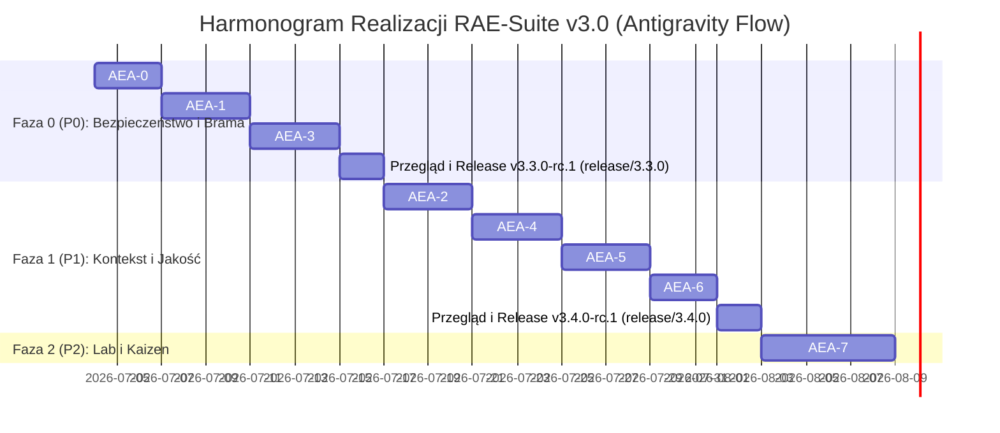

# Iteracyjny Plan Rozwoju i Stabilizacji RAE-Suite v3.0 (Wdrożenie przez Antigravity)
## Silicon Oracle Enterprise Autonomy Edition - AEA Program (Agentic Engineering Addendum)

Ten dokument opisuje zaktualizowany plan utwardzania i stabilizacji jądra autonomii `RAE-Suite` na podstawie wytycznych z [stabilizacja-rozwój-autonomii-01.txt](file:///home/grzegorz-lesniowski/cloud/RAE-Suite/docs/stabilizacja-rozwój-autonomii-01.txt). Harmonogram oraz podział prac zostały przeprojektowane pod kątem **samodzielnej, iteracyjnej realizacji przez Agenta Antigravity**, z bezwzględnym przestrzeganiem polityki wersjonowania i branchowania opisanej w [git_flow_semver_branching_plan.md](file:///home/grzegorz-lesniowski/cloud/RAE-Suite/docs/git_flow_semver_branching_plan.md).

---

## 📊 1. Audyt Miejsc Zamakowanych (Mocks vs Reality)

Audyt kodu RAE-Suite wykazuje istotną rozbieżność między zaawansowanymi założeniami w dokumentacji a uproszczoną (często zamakowaną) logiką wykonawczą. Wszystkie te punkty zostaną usunięte w kolejnych iteracjach przez Agenta Antigravity.

| Komponent / Funkcja | Stan w Kodzie (Mocki / Uproszczenia) | Cel Docelowy (AEA Program) | Metoda Weryfikacji (Antigravity) |
| :--- | :--- | :--- | :--- |
| **`PolicyChecker.check_compliance()`** | Zawsze zwraca `True` ([policy_checker.py](file:///home/grzegorz-lesniowski/cloud/RAE-Suite/core/policy_checker.py#L14-L15)). | Ewaluacja reguł w oparciu o zestaw reguł (Constitution & Policy Bundles). | Testy jednostkowe sprawdzające blokowanie zabronionych komend (np. `R6`). |
| **`Capability Check`** | Mock z logowaniem w [autonomy_kernel.py](file:///home/grzegorz-lesniowski/cloud/RAE-Suite/core/autonomy_kernel.py#L101). | Walidacja kompetencji agenta na podstawie wersjonowanego i podpisanego kontraktu. | Weryfikacja zgodności z `AgentProfile` przed wywołaniem narzędzia. |
| **`RiskClassifier`** | Słownikowe dopasowanie fraz, zahardkodowana pewność `0.98` ([policy_checker.py](file:///home/grzegorz-lesniowski/cloud/RAE-Suite/core/policy_checker.py#L84)). | Klasyfikator cross-referencyjny analizujący intencje, parametry i klasę informacji. | Weryfikacja dynamicznego przypisywania odpowiedniej klasy ryzyka w testach. |
| **`Sandbox Manager`** | W przypadku błędu git-worktree tworzy pusty katalog i kontynuuje działanie ([sandbox_manager.py](file:///home/grzegorz-lesniowski/cloud/RAE-Suite/core/sandbox_manager.py#L50)). | Tryb **Fail-Closed**: błąd alokacji piaskownicy natychmiast przerywa zadanie i eskaluje je (`FAILED_ESCALATED`). | Testy dymne wywołujące błędy git i sprawdzające poprawne przerwanie zadania. |
| **`MCP Execution Path`** | Uruchamianie shella/docker bezpośrednio, z pominięciem Kernel Gateway. | MCP jako cienki adapter transportowy; całe wykonanie musi przejść przez Gateway i Kernel. | Sprawdzenie, czy zapytanie MCP omijające Kernel jest blokowane na bramce sieciowej. |

---

## 🛠️ 2. Zintegrowana Polityka Git Flow i SemVer 2.0.0

Zgodnie z dokumentem [git_flow_semver_branching_plan.md](file:///home/grzegorz-lesniowski/cloud/RAE-Suite/docs/git_flow_semver_branching_plan.md), wdrażamy i egzekwujemy twardy kontrakt zarządzania wersjami w trybie **STRICT**:

1.  **Główne Gałęzie**:
    *   `develop` – Główna gałąź integracyjna. Wszystkie nowe funkcjonalności (AEA) są tu scalane.
    *   `master`/`main` – Produkcja. Trafiają tu wyłącznie stabilne, przetestowane wersje wydań scalane z gałęzi `release/*` lub `hotfix/*`.
2.  **Gałęzie Modyfikacji (Realizacja przez Antigravity)**:
    *   Wszystkie zadania będą realizowane na gałęziach typu `feature/aea-<krok>-<krótki-opis>` (np. `feature/aea-1-tool-gateway`) lub `bugfix/*` odgałęziających się od `develop`.
    *   Żadne bezpośrednie commity do `develop` lub `master` nie są dozwolone.
3.  **Wersjonowanie Wydań (Semantic Versioning)**:
    *   Po zakończeniu danej fazy (np. Faza 0), Antigravity tworzy gałąź release o nazwie `release/<SemVer>` (np. `release/3.3.0`, bez prefiksu "v").
    *   Tagowanie wersji kandydackich (Release Candidates) odbywa się w formacie: `3.3.0-rc.1`, `3.3.0-rc.2`.
    *   Scalenie release do `master` generuje ostateczny tag `3.3.0` i automatycznie synchronizuje zmiany zwrotne (back-merge) do `develop`.
4.  **Twarda Walidacja (Strict Enforcement)**:
    *   Uruchamiamy walidację w trybie **STRICT** za pomocą zmiennej środowiskowej:
        ```bash
        export RAE_STRICT_SEMVER=true
        ```
    *   Dzięki temu każda niezgodność nazewnictwa gałęzi lub struktury wersji wykryta przez `VersioningValidator` podczas uruchamiania testów lub aplikacji zakończy się przerwaniem procesu (`sys.exit(1)`).

---

## 📅 3. Harmonogram Realizacji przez Agenta Antigravity

Zadania są podzielone na iteracje o stałym cyklu: **Branch -> Code -> Test -> Verify -> PR -> Release**.



### Szczegółowy podział kroków i gałęzi deweloperskich:

#### 🔒 Faza 0 (P0) – Utwardzenie Ścieżki Wykonawczej
*   **Krok AEA-0: Przygotowanie i Repozytorium Manifest**
    *   *Gałąź:* `feature/aea-0-repository-manifest`
    *   *Działanie:* Wdrożenie `REPOSITORY_MANIFEST.json`, ujednolicenie struktur nazw (rae-phoenix), zamrożenie `Constitution` (Read-only).
    *   *Weryfikacja:* `python3 scripts/validate_git_flow.py` i testy jednostkowe.
*   **Krok AEA-1: Tool Execution Gateway**
    *   *Gałąź:* `feature/aea-1-tool-gateway`
    *   *Działanie:* Implementacja rzeczywistego ewaluatora reguł w `PolicyChecker`, wdrożenie bramki `Tool Execution Gateway` blokującej nieautoryzowane capabilities, dynamiczny `RiskClassifier` (R0-R6).
    *   *Weryfikacja:* Uruchomienie testów z `RAE_STRICT_SEMVER=true`.
*   **Krok AEA-3: Zabezpieczenie Piaskownic i Integracja MCP**
    *   *Gałąź:* `feature/aea-3-sandbox-mcp-gateway`
    *   *Działanie:* Wprowadzenie trybu `Fail-Closed` dla `SandboxManager` (brak fallbacków do pustych folderów), refaktoryzacja `RAESupervisor` (przekierowanie akcji MCP bezpośrednio do Bramki Autonomy Kernel).
    *   *Weryfikacja:* `pytest core/test_integrity_guard.py tests/` pod kątem obsługi błędów Git.
*   **Wdrożenie Wydania v3.3.0 (Faza 0 Completion)**:
    *   *Działanie:* Utworzenie gałęzi `release/3.3.0`, generowanie wersji kandydackich `3.3.0-rc.1`, uruchomienie testów integracyjnych w kontenerze, scalenie do `master` i back-merge do `develop`.

---

#### 🛡️ Faza 1 (P1) – Kontekst, Jakość i Orkiestracja
*   **Krok AEA-2: Zarządzanie Kontekstem (Context Envelope)**
    *   *Gałąź:* `feature/aea-2-context-envelope`
    *   *Działanie:* Wprowadzenie `ContextEnvelope`, wdrożenie izolacji danych `RESTRICTED` w warstwie `Working`, potok selekcji kontekstu na podstawie `trust_score`.
*   **Krok AEA-4: Workflow Registry & Handoff Envelopes**
    *   *Gałąź:* `feature/aea-4-workflow-registry-handoffs`
    *   *Działanie:* Wdrożenie `WorkflowRegistry` (`WorkflowDefinition`), obudowanie komunikacji między modułami w `Handoff Envelope` z limitami budżetów i tokenów.
*   **Krok AEA-5: Parzystość Quality Gate**
    *   *Gałąź:* `feature/aea-5-quality-gate-parity`
    *   *Działanie:* Ujednolicenie lokalnego pre-commita z bramką jakości w CI, weryfikacja statyczna AST kodu.
*   **Krok AEA-6: OTEL & Metryki Efektów**
    *   *Gałąź:* `feature/aea-6-otel-outcome-metrics`
    *   *Działanie:* Propagacja kontekstu OpenTelemetry (Trace Spans) przez cały cykl życia zadania, logowanie `Outcome Records` (analiza reguł sukcesu biznesowego/PR).
*   **Wdrożenie Wydania v3.4.0 (Faza 1 Completion)**:
    *   *Działanie:* Utworzenie gałęzi `release/3.4.0`, testy dynamiczne, publikacja wersji stabilnej `3.4.0`.

---

#### 🧠 Faza 2 (P2) – Pętle Samodoskonalenia (Kaizen)
*   **Krok AEA-7: Failure Mining & Candidate Rules**
    *   *Gałąź:* `feature/aea-7-failure-mining-shadow-rules`
    *   *Działanie:* Implementacja analizatora błędów w RAE-Lab, generowanie `Candidate Guardrails` (reguł obronnych) i uruchamianie ich w trybie cienia (Shadow Mode), modelowanie wydajności modeli (Model Performance Intelligence).
*   **Wdrożenie Wydania v3.5.0 (Faza 2 Completion)**.

---

## 🛡️ 5. Polityka Zapobiegania Regresom (Zero-Regression Protocol)

Ponieważ suita RAE składa się z modułów o niezależnej architekturze, Antigravity podczas realizacji planu będzie stosować następujące środki ostrożności:

*   **Pieczołowite zachowanie kontraktów API**: Wszystkie modele wejścia/wyjścia są importowane z [rae_contracts](file:///home/grzegorz-lesniowski/cloud/RAE-Suite/rae_contracts). Wszelkie zmiany pól w klasach Pydantic muszą zachować kompatybilność wsteczną (dodawanie pól opcjonalnych / domyślnych).
*   **Zautomatyzowane Testy Przed Scaleniem (Merge Validation)**: Przed scaleniem gałęzi `feature/aea-*` do `develop`, Antigravity uruchomi pełen zestaw testów integracyjnych w czystym środowisku:
    ```bash
    PYTHONPATH=../RAE-core/src .venv/bin/pytest core/ tests/
    ```
    Wszystkie 49 testów jednostkowych i integracyjnych musi być w 100% zielonych.
*   **Walidacja Git Flow i SemVer na każdym etapie**: Każda operacja tworzenia brancha roboczego i wydania będzie sprawdzana przez walidator `scripts/validate_git_flow.py` w celu upewnienia się, że nie zachodzi dryf nazewnictwa.

---

*Plan zatwierdzony do samodzielnego wdrożenia przez Agenta Antigravity.*  
*Podpisano:* `Antigravity CEO Agent` & `ChatGPT v5.6 Codex Auditor`
